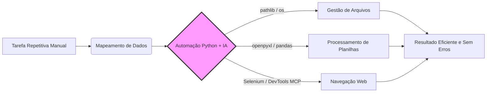

# 📊 Dashboard - Curso Python + IA para Automação

> [!TUTOR] Bem-vindo(a) ao seu Dashboard de Aprendizado
> "A automação de tarefas cotidianas e o uso inteligente da IA são as chaves para a máxima produtividade."
> 
> 📘 **Comece Aqui:** Consulte o [[MANUAL_DO_ALUNO|📘 Manual Oficial do Aluno]] para entender o ciclo de aprendizado em 4 passos.

> [!CAUTION] 🚨 Botão de Pânico / Auto-Recuperação do Obsidian em 1 Segundo
> **Os plugins parecem desativados ou o Obsidian entrou em Modo Restrito?**
> Abra o seu terminal na pasta do projeto e rode:
> ```bash
> python setup_vault.py
> ```
> esse comando força a reativação e restaura instantaneamente todos os **18 plugins**!

---

## 🔰 Guia Visual do Iniciante nos 18 Plugins do Obsidian

Este vault vem com **18 plugins profissionais pré-configurados**. Veja como usá-los no dia a dia:

| Plugin | O que faz no vault? | Como o aluno usa? |
| :--- | :--- | :--- |
| 📁 **Make.md** | Transforma pastas em notas de capa com stickers. | Clique em qualquer pasta (ex: `01_fundamentos`) para abrir a nota de capa. |
| 📊 **Dataview** | Painéis dinâmicos e consultas automáticas. | Exibe automaticamente seu progresso nas tabelas deste Dashboard. |
| 📋 **Kanban** | Quadro de tarefas estilo Trello. | Acesse [[00_central/plano_de_estudos|Plano de Estudos]] para arrastar suas tarefas. |
| 📇 **Spaced Repetition** | Cartões de memória e repetição espaçada. | Acesse [[00_central/central_flashcards|Central de Flashcards]] ou pressione `Ctrl+P` -> *Spaced Repetition*. |
| 🎨 **Excalidraw** | Desenhos e fluxogramas visuais interativos. | Clique em arquivos `.excalidraw` em `08_guias_recursos/` para desenhar. |
| 🛠️ **Editing Toolbar** | Barra de formatação no topo da nota. | Selecione qualquer texto para formatar em negrito, destaques ou callouts. |
| 🎨 **Code Styler** | Realce de sintaxe de código Python. | Blocos de código ` ```python ` ficam coloridos e com numeração de linhas. |
| ⚡ **Various Complements** | Autocompletar inteligente enquanto digita. | Digite `python` ou `[!TUTOR]` e pressione `Tab` para autocompletar. |

---

## ⌨️ Atalhos de Teclado Essenciais (Cheat Sheet)

- `Ctrl + P` (ou `Cmd + P` no Mac): **Paleta de Comandos** (Busca rápida de qualquer ação do Obsidian).
- `Ctrl + O` (ou `Cmd + O` no Mac): **Abrir Arquivo Rápido** (Digite o nome de qualquer aula).
- `Ctrl + E`: Alternar entre **Modo Edição** e **Modo Leitura**.
- `Alt + N` / `Alt + E`: Criar nova nota com o **Template do Curso** via Templater.

---

## 📈 Painel Dinâmico de Progresso (DataviewJS)

```dataviewjs
const pages = dv.pages('"01_fundamentos" or "02_python_essencial" or "03_poo" or "04_bibliotecas_arquivos" or "05_automacao_desktop" or "06_ia_prompt" or "07_bonus_selenium"');
let totalTasks = 0;
let completedTasks = 0;

for (let p of pages) {
    if (p.file.tasks) {
        totalTasks += p.file.tasks.length;
        completedTasks += p.file.tasks.where(t => t.completed).length;
    }
}

let percentage = totalTasks > 0 ? Math.round((completedTasks / totalTasks) * 100) : 0;

dv.header(3, "📊 Progresso Geral das Atividades: " + percentage + "%");
dv.paragraph("✅ Concluídas: **" + completedTasks + "** de **" + totalTasks + "** tarefas mapeadas.");
```

---

## 🧪 Tabela Dinâmica de Exercícios & Avaliação Git (Dataview)

```dataview
TABLE 
    file.folder AS "Módulo",
    choice(completed, "✅ Concluído", "⚡ Pendente") AS "Status",
    "python avaliar_exercicio.py" AS "Comando de Teste"
FROM #exercicio OR #aula
SORT file.name ASC
```

---

## 🗺️ Fluxo de Automação Visual (Mermaid)



---

## 🧪 Validação dos Exercícios via Terminal

Para validar suas implementações localmente:
```bash
# Avaliar exercício específico:
python avaliar_exercicio.py --issue 07

# Ver relatório de progresso do vault:
python avaliar_exercicio.py --progresso

# Avaliar todos os testes do repositório:
python -m unittest discover testes
```
