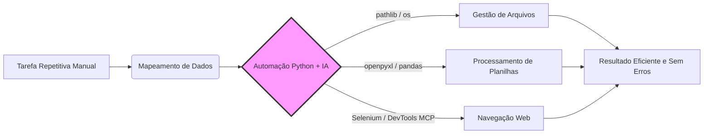

# 📊 Dashboard - Curso Python + IA para Automação

> [!TUTOR] Bem-vindo(a) ao seu Dashboard de Aprendizado
> "A automação de tarefas cotidianas e o uso inteligente da IA são as chaves para a máxima produtividade."
> 
> 📘 **Comece Aqui:** Consulte o [[MANUAL_DO_ALUNO|📘 Manual Oficial do Aluno]] para entender o ciclo de aprendizado em 4 passos.

> [!EXEMPLO] Status do Copiloto de IA & Vault
> **Vault Obsidian (19 Plugins):** Protegido & Ativo 🟢 (`python setup_vault.py`)
> **Antigravity (Modo Tutor):** Online 🟢 - Copiloto de mentoria ativa.

> [!PRATICA] Navegação Rápida & Módulos
> - 📘 [[MANUAL_DO_ALUNO|📘 Manual Oficial do Aluno (Comece Por Aqui)]]
> - 📋 [[00 - Plano de Estudos e Tarefas|📋 Plano de Estudos, Kanban e Tarefas]]
> - 📇 [[00 - Central de Flashcards e Revisao|📇 Central de Flashcards & Active Recall]]
> - 🗺️ [[00 - Indice Geral por Temas (MOC)|🗺️ Índice Geral por Temas (MOC)]]
> - 🔀 [[08_guias_recursos/GUIA_GIT|Guia de Git & Branches]]
> - 🔌 [[08_guias_recursos/GUIA_PLUGINS_OBSIDIAN|Guia de Plugins do Obsidian]]

---

## 📈 Painel Dinâmico de Progresso (DataviewJS)

```dataviewjs
const pages = dv.pages('"01_fundamentos" or "02_python_essencial" or "03_poo" or "04_bibliotecas_arquivos" or "05_automacao_desktop" or "06_ia_prompt" or "07_bonus_selenium"');
let totalTasks = 0;
let completedTasks = 0;

for (let p of pages) {
    if (p.file.tasks) {
        totalTasks += p.file.tasks.length;
        completedTasks += p.file.tasks.where(t => t.completed).length;
    }
}

let percentage = totalTasks > 0 ? Math.round((completedTasks / totalTasks) * 100) : 0;

dv.header(3, "📊 Progresso Geral das Atividades: " + percentage + "%");
dv.paragraph("✅ Concluídas: **" + completedTasks + "** de **" + totalTasks + "** tarefas mapeadas.");
```

---

## 🧪 Tabela Dinâmica de Exercícios & Avaliação Git (Dataview)

```dataview
TABLE 
    file.folder AS "Módulo",
    choice(completed, "✅ Concluído", "⚡ Pendente") AS "Status",
    "python avaliar_exercicio.py" AS "Comando de Teste"
FROM #exercicio OR #aula
SORT file.name ASC
```

---

## 🗺️ Fluxo de Automação Visual (Mermaid)



---

## 🧪 Validação dos Exercícios via Terminal

Para validar suas implementações localmente:
```bash
# Avaliar exercício específico:
python avaliar_exercicio.py --issue 07

# Avaliar todos os testes do repositório:
python -m unittest discover testes
```
