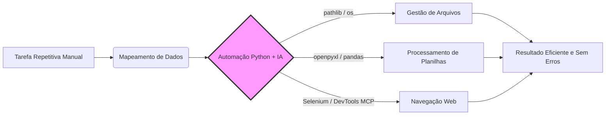

# 📊 Dashboard - Curso Python + IA para Automação

> [!TUTOR] Bem-vindo(a) ao seu Dashboard de Aprendizado
> "A automação de tarefas cotidianas e o uso inteligente da IA são as chaves para a máxima produtividade."

> [!EXEMPLO] Status do Copiloto de IA
> **Google NotebookLM**: Online 🟢 - Base de conhecimento sincronizada.
> **Antigravity (Modo Tutor)**: Online 🟢 - Copiloto de mentoria ativa.

> [!PRATICA] Ferramentas e NAVEGAÇÃO RÁPIDA
> - 📋 [[00 - Plano de Estudos e Tarefas|📋 Plano de Estudos, Kanban e Tarefas]]
> - 📇 [[00 - Central de Flashcards e Revisao|📇 Central de Flashcards & Active Recall]]
> - 🗺️ [[00 - Indice Geral por Temas (MOC)|🗺️ Índice Geral por Temas (MOC)]]
> - 🧭 [[00 - Mapa Visual do Curso.canvas|Canvas Interativo do Curso]]
> - 🔀 [[08 - Guia e Recursos/GUIA_GIT|Guia de Git & Branches]]
> - 🔌 [[08 - Guia e Recursos/GUIA_PLUGINS_OBSIDIAN|Guia de Plugins do Obsidian]]

---

## 📈 Painel Dinâmico de Progresso (DataviewJS)

```dataviewjs
const pages = dv.pages('"01 - Fundamentos" or "02 - Python Essencial" or "03 - POO" or "04 - Bibliotecas e Arquivos" or "05 - Automacao Desktop" or "06 - IA e Prompt" or "07 - Bonus Selenium"');
let totalTasks = 0;
let completedTasks = 0;

for (let p of pages) {
    if (p.file.tasks) {
        totalTasks += p.file.tasks.length;
        completedTasks += p.file.tasks.where(t => t.completed).length;
    }
}

let percentage = totalTasks > 0 ? Math.round((completedTasks / totalTasks) * 100) : 0;

dv.header(3, "📊 Progresso Geral das Atividades: " + percentage + "%");
dv.paragraph("✅ Concluídas: **" + completedTasks + "** de **" + totalTasks + "** tarefas mapeadas.");
```

---

## 🧪 Tabela Dinâmica de Exercícios & Avaliação Git (Dataview)

```dataview
TABLE 
    file.folder AS "Módulo",
    choice(completed, "✅ Concluído", "⚡ Pendente") AS "Status",
    "python avaliar_exercicio.py" AS "Comando de Teste"
FROM #exercicio OR #aula
SORT file.name ASC
```

---

## 📝 Matriz de Callouts & Estilos Disponíveis

> [!TUTOR] Modo Tutor (Dicas de Lógica)
> Utilizado nos arquivos `*_manual.py` para guiar sua lógica sem entregar a resposta pronta.

> [!EXEMPLO] Exemplo Prático do Dia a Dia
> Demonstrações de código aplicadas a cenários do cotidiano (organizar planilhas, enviar e-mails, mover arquivos).

> [!PRATICA] Aplicação no Trabalho
> Exemplos de automação focados em cenários reais de trabalho e produtividade.

> [!EXERCICIO] Desafio de Código
> Atividades práticas com avaliação automatizada via `python avaliar_exercicio.py`.

> [!DICA_IA] Engenharia de Prompt & Copiloto
> Sugestões de prompts e técnicas para acelerar seu código com a IA.

---

## 🗺️ Fluxo de Automação Visual (Mermaid)



---

## 🧪 Validação dos Exercícios via Terminal

Para validar suas implementações localmente:
```bash
# Avaliar exercício específico:
python avaliar_exercicio.py --issue 07

# Avaliar todos os testes do repositório:
python -m unittest discover testes
```
