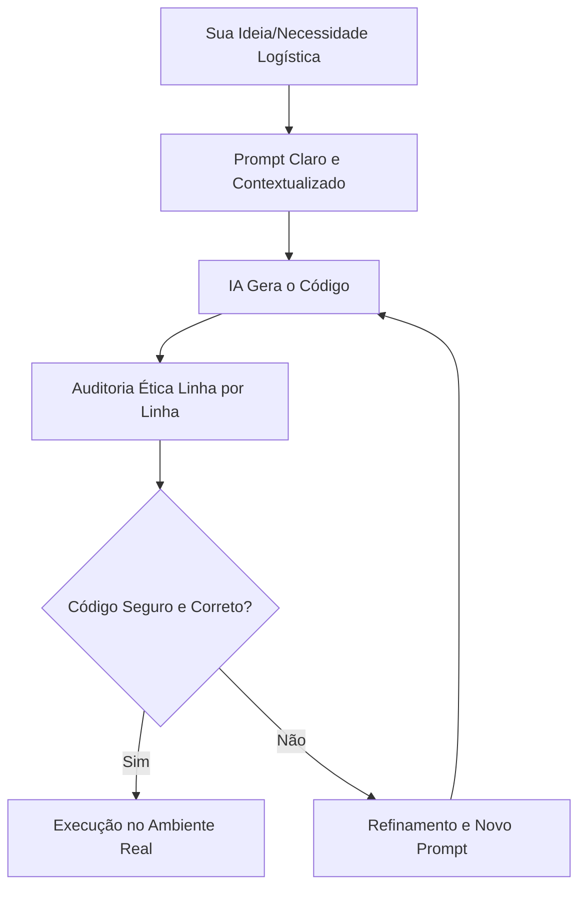

> 💡 **O que você vai aprender:** Entender o Vibe Coding Ético desde o dia zero, usar IA sem ficar preguiçoso e os 3 Mandamentos do Dev Ético.
> ⏱️ **Duração estimada:** 2h | 📅 **Bloco:** 1

---

## 🎯 Objetivos da Aula
- Compreender o que é o movimento Vibe Coding.
- Diferenciar Vibe Coding Cego de Vibe Coding Ético.
- Aprender a interagir com copilotos de IA (Antigravity) de forma segura.
- Conhecer os 3 Mandamentos do Dev Ético.

---

## 🔗 Conexão com os Projetos Reais
> 💼 **AutoMDFText:** A base de código inicial foi acelerada por IA, mas cada clique e tecla simulada foi estritamente auditado para evitar disparos incorretos.
> 📊 **AutoPickingPy:** Extrair dados de planilhas de estoque usando openpyxl pode ser complexo; a IA sugeriu as funções, mas o entendimento do contexto logístico e regras de negócio foi totalmente humano.

---

## 📖 Conceito

### O que é o movimento Vibe Coding
O termo "Vibe Coding", popularizado por figuras como Andrej Karpathy, descreve uma nova forma de programar onde você interage com a IA (como o Antigravity) usando linguagem natural. Você passa a "vibe" (a ideia, a intenção) e a IA gera a estrutura. Para um profissional de logística migrando para a tecnologia, isso é como ter um assistente júnior que digita rápido, mas precisa ser guiado por alguém que entende a operação (você).

### Vibe Coding Cego vs Vibe Coding Ético
- **Vibe Coding Cego:** Copiar e colar código gerado pela IA sem ler ou entender. Na logística, isso é como despachar um caminhão sem conferir a nota fiscal ou o roteiro. O risco de acidente é alto.
- **Vibe Coding Ético:** Usar a IA como acelerador para rascunhar o código, mas auditar linha por linha antes de executar. É a união da sua expertise em processos de negócios (estoque, rotas, ERP) com a capacidade técnica da IA.

### Segurança e os 3 Mandamentos do Dev Ético
1. **Nunca envie dados sensíveis:** Senhas de ERP, dados de clientes ou planilhas confidenciais jamais devem ser colocados em prompts.
2. **Entenda o que vai rodar:** A responsabilidade do código em produção é sua, não do copiloto.
3. **Use a IA para aprender, não para terceirizar o pensamento:** Pergunte "Como isso funciona?" em vez de apenas "Corrija isso".



---

## 💻 Exemplos

### Exemplo 1 — A Vibe (Como explicar para a IA)

```python
# Em vez de tentar escrever todo o código sozinho, você descreve a regra de negócio.
# A IA precisa saber que estamos lidando com 'delivery_routes' (rotas de entrega) 
# e 'driver_status' (status do motorista).

delivery_routes = 5
driver_status = "available" 
```

### Exemplo 2 — Aplicado à Logística (O Código Auditado)

```python
# O código gerado pela IA deve refletir suas regras. 
# Se a IA inventar variáveis obscuras, você as refatora para o seu contexto.
# Exemplo ético: nunca colocar a senha real do sistema no script.

erp_password = "USE_ENVIRONMENT_VARIABLES" # NUNCA coloque 'senha123' aqui
route_id = 4099
```

### Exemplo 3 — Com IA (Antigravity)
> 🤖 **Prompt sugerido:**
> "Atue como um desenvolvedor sênior. Crie um script Python simples que leia uma variável de quantidade de caixas (box_quantity). Adicione comentários em português explicando a lógica. Não use bibliotecas complexas ainda. Quero auditar cada linha."

> 🤖 **Prompt de auditoria:**
> "Eu recebi este trecho de código: `[cole o código]`. Explique para mim, como se eu fosse um iniciante familiarizado apenas com Excel, o que a linha 3 está fazendo."

---

## 📋 Referência Rápida
| Conceito | Prática Antiética | Prática Vibe Coding Ético |
|---|---|---|
| **Senhas/Credenciais** | Colar direto no script para a IA resolver | Usar variáveis de ambiente ou placeholders |
| **Erros no código** | "Corrija esse erro [cola o log gigante]" | "Explique a causa deste erro no contexto de processamento de rotas e sugira a correção" |
| **Entendimento** | Copiar o script inteiro sem ler | Ler, comentar e testar pequenas partes (scaffolding) |

---

## ⚠️ Erros Comuns
| Erro | Causa | Solução |
|---|---|---|
| Vazamento de dados | Enviar planilha real do cliente para a IA analisar | Criar uma planilha dummy (dados fictícios) com a mesma estrutura antes de enviar |
| Script perigoso | Rodar automação de teclado (PyAutoGUI) gerada por IA sem entender os delays | Auditar e testar as coordenadas e pausas com cautela extrema |

---

## 🏋️ Exercícios
> 📁 Arquivos de prática: 
> `aula_00_exercicios_manual.py`
> `aula_00_exercicios_ia.py`
> `aula_00_exercicios_gabarito.py`

**Exercício 1 — [Nível: Básico]**
Audite um trecho de código gerado pela IA identificando problemas de segurança (dados fictícios vs reais).

**Exercício 2 — [Nível: Intermediário]**
Escreva um prompt ético para gerar uma pequena automação e, em seguida, aplique o processo de Vibe Coding Ético para ler e comentar cada linha gerada antes de salvar.

---

## 🎯 Conexão com a Próxima Aula
Agora que o nosso mindset está blindado e entendemos como colaborar com a IA de forma ética e segura, na próxima aula vamos colocar a mão na massa com os primeiros passos em Python de verdade, configurando nosso ambiente e entendendo como o código ganha vida.

---
#aula #bloco-1 #python #ia #vibe-coding
