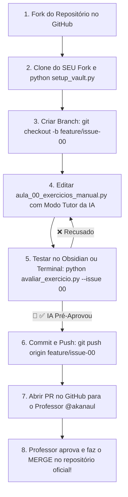

---
aliases:
  - Aula 00 — Onboarding, Configuração do Ambiente & Mindset Vibe Coding Ético
tags:
  - aula
  - bloco-1
  - onboarding
  - setup
  - vibe-coding
  - etica
---
# 🚀 Aula 00 — Onboarding, Configuração do Ambiente & Mindset Vibe Coding Ético

> [!TUTOR] 🚀 Guia Prático de Estudo da Aula (Ciclo de 4 Passos em 1-Clique)
> 1. 📖 **Conceito:** Leia as explicações abaixo e tire dúvidas com a IA no **Modo Tutor**.
> 2. 👨‍💻 **Código:** Edite e desenvolva sua solução no arquivo `aula_00_exercicios_manual.py`.
> 3. ⚡ **Testar no Obsidian (1-Clique):** Clique em **Run** no bloco abaixo para validar:
> ```python run
> import subprocess
> res = subprocess.run(["python", "avaliar_exercicio.py", "--issue", "00"], capture_output=True, text=True)
> print(res.stdout)
> ```
> 4. 🔀 **Enviar PR:** Se aprovado pela IA, envie o Pull Request no GitHub para o Tutor (@akanaul)!

---

## 🎯 Objetivos da Aula (Dia Zero)
- Configurar do zero todo o ambiente de desenvolvimento (Python 3.12, Git, VS Code / Cursor e Obsidian).
- Rodar o script de setup automático `setup_vault.py` para criar o `.venv` e ativar os 21 plugins do vault.
- Dominar o **Framework de Aprendizado em 4 Passos** e a Dupla Revisão (IA Pre-Approval + Merge do Professor @akanaul).
- Compreender a diferença entre Vibe Coding Cego e Vibe Coding Ético.

---

## 🛠️ Parte 1: Instalação e Configuração do Ambiente

### 1. Instalar o Python 3.12 / 3.13
- Baixe o instalador oficial do Python em [python.org](https://www.python.org/downloads/).
- **ATENÇÃO (Windows):** Na primeira tela do instalador, marque obrigatoriamente a opção **"Add Python to PATH"** antes de clicar em Install!

### 2. Instalar o Git
- Baixe o Git em [git-scm.com](https://git-scm.com/).
- Instale mantendo as opções padrão ativas (incluindo o Git Credential Manager).

### 3. Configurar a IDE (VS Code ou Cursor)
- Instale a extensão oficial do Python (`ms-python.python`) no seu editor de código.

---

## ⚡ Parte 2: Setup do Vault em 1-Clique (`setup_vault.py`)

Com o repositório clonado no seu computador, abra o terminal na pasta do projeto e execute:

```bash
python setup_vault.py
```

Ou execute o bloco interativo abaixo direto no Obsidian:
```python run
import subprocess
res = subprocess.run(["python", "setup_vault.py"], capture_output=True, text=True)
print(res.stdout)
```

> [!CAUTION] O que este comando faz automaticamente?
> 1. Cria o ambiente virtual isolado `.venv`.
> 2. Instala todas as dependências de `requirements.txt` (`pandas`, `openpyxl`, `pyautogui`, `selenium`).
> 3. Desativa o Modo Restrito do Obsidian (`restricted: false`) e ativa os **21 plugins profissionais** e o tema **Cyber Emerald**.

---

## 🔄 Parte 3: O Framework de Aprendizado em 4 Passos & Dupla Revisão

Você aprenderá **Git e Pull Requests reais** desde o primeiro dia através do sistema de dupla revisão:



---

## 🧠 Parte 4: Mindset Vibe Coding Ético & Os 3 Mandamentos

### O que é Vibe Coding?
"Vibe Coding" é a prática de colaborar com Inteligências Artificiais (como Antigravity / Gemini / Copilot) em linguagem natural para acelerar a escrita de código.

### Vibe Coding Cego vs Vibe Coding Ético
- **Vibe Coding Cego:** Copiar e colar código gerado pela IA sem ler ou entender. Na logística ou desenvolvimento profissional, isso causa acidentes graves em produção.
- **Vibe Coding Ético:** Usar a IA como acelerador para rascunhar, mas auditar linha por linha antes de executar.

### Os 3 Mandamentos do Dev Ético
1. **Nunca envie dados sensíveis:** Senhas de ERP, chaves de API ou planilhas confidenciais jamais devem ser colocadas em prompts.
2. **Entenda o que vai rodar:** A responsabilidade do código em produção é sua, não do copiloto.
3. **Use a IA para aprender, não para terceirizar o pensamento:** Pergunte *"Como isso funciona?"* no **Modo Tutor**.

---

## 🏋️ Parte 5: Exercícios da Aula 00
> 📌 **Issue Relacionada no GitHub:** `# Issue #00`
> 📁 **Arquivo de Trabalho (Manual):** `01_fundamentos/Aula 00 - Mindset Vibe Coding Etico/aula_00_exercicios_manual.py`
> 🧪 **Comando de Teste:** `python avaliar_exercicio.py --issue 00`

---

## 🔀 Aprendizado Ativo de Git, Issue & Pull Request

> 📌 **Issue Oficial no GitHub:** `# Issue #00`
> 🔀 **Branch de Desenvolvimento:** `git checkout -b feature/issue-00-vibe-coding`
> 📁 **Arquivo de Trabalho (Manual):** `aula_00_exercicios_manual.py`
> 🧪 **Teste Automatizado & Pré-Aprovação IA:** `python avaliar_exercicio.py --issue 00`
> 🚀 **Envio de Pull Request (PR):** `git push origin feature/issue-00-vibe-coding` e abra o PR no GitHub para a revisão final do Tutor (@akanaul)!

---

## 📝 Anotações Pessoais do Aluno sobre esta Aula

> [!TIP] **Criar Nota de Estudo Relacionada**
> Quer guardar resumos ou anotações próprias sobre esta aula?
> Pressione `Alt + N` no Templater e selecione **Template de Anotação do Aluno** para salvar automaticamente em [[meu_caderno_aluno/anotacoes_aulas/anotacoes_aulas|meu_caderno_aluno/anotacoes_aulas/]]!