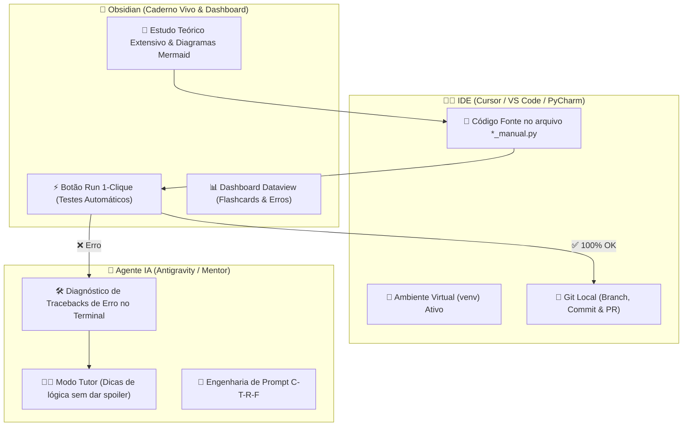
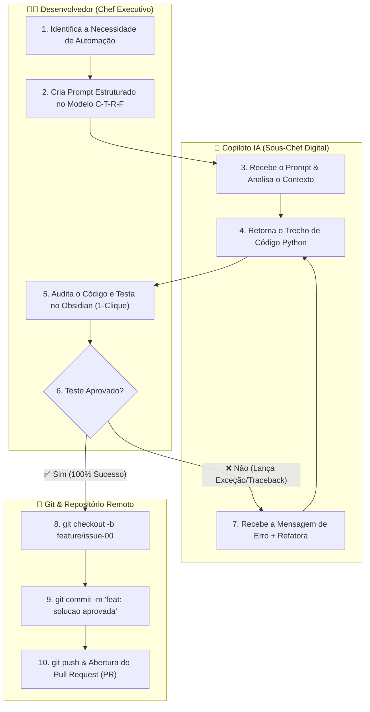

# 🚀 Aula 00 — Mindset Vibe Coding Ético, Copilotos de Inteligência Artificial e Fundamentos do Git Flow

> [!TUTOR] 🚀 Guia Prático de Estudo da Aula (Ciclo de 4 Passos em 1-Clique)
> 1. 📖 **Conceito Extensivo:** Leia as explicações teóricas minuciosas e tire dúvidas com a IA no **Modo Tutor**.
> 2. 👨‍💻 **Código & Prática:** Edite e desenvolva sua solução no arquivo `aula_00_exercicios_manual.py`.
> 3. ⚡ **Testar no Obsidian (1-Clique):** Clique em **Run** no bloco abaixo para validar sua solução:
> > [!EXERCICIO] 🧪 Avaliação 1-Clique dos Exercícios da IDE (Issue #00)
> > 📌 **Exercício Avaliado:** Issue #00 — Mindset Vibe Coding Etico e Copilotos
> > 📁 **Arquivo de Trabalho na IDE:** `01_fundamentos/pratica/Aula 00 - Mindset Vibe Coding Etico/aula_00_exercicios_manual.py`
> > ⚡ Clique no botão **Run** no canto superior direito do bloco abaixo para testar sua solução:

```python run
import sys, os, subprocess

def find_vault_root():
    curr = os.path.abspath(os.getcwd())
    while curr:
        if os.path.exists(os.path.join(curr, "avaliar_exercicio.py")):
            return curr
        parent = os.path.dirname(curr)
        if parent == curr:
            break
        curr = parent
    user_home = os.path.expanduser("~")
    for root, dirs, files in os.walk(user_home):
        if "avaliar_exercicio.py" in files:
            return root
        if root.count(os.sep) - user_home.count(os.sep) >= 4:
            dirs.clear()
    return os.path.abspath(".")

vault_root = find_vault_root()
script_path = os.path.join(vault_root, "avaliar_exercicio.py")
print("📌 [AVALIAÇÃO 1-CLIQUE] Testando Exercício da Issue #00...")
print("📁 Arquivo Alvo na IDE: 01_fundamentos/pratica/Aula 00 - Mindset Vibe Coding Etico/aula_00_exercicios_manual.py")
res = subprocess.run([sys.executable, script_path, "--issue", "00"], cwd=vault_root, capture_output=True, text=True, encoding="utf-8", errors="replace")
print(res.stdout or res.stderr)
```
> 4. 🔀 **Enviar PR:** Se aprovado pela IA, envie o Pull Request no GitHub para o Tutor (@akanaul)!

---

## 💡 1. Conceito Extensivo & O Porquê

### A Transformação Histórica no Desenvolvimento de Software
Durante mais de cinco décadas, o ato de programar computadores foi tratado como uma atividade puramente operacional e mecânica. O profissional de tecnologia precisava memorizar regras sintáticas complexas, nomes de funções obscuras, sintaxes de comandos de compilação e centenas de detalhes de bibliotecas em linguagens como C, C++, Java e Assembly. O ciclo tradicional era composto por 80% do tempo gasto em pesquisas lentas de documentação de sintaxe e apenas 20% dedicado ao raciocínio lógico da solução do problema do cliente.

Com o advento dos Modelos de Linguagem de Grande Porte (LLMs) e das ferramentas de copiloto de Inteligência Artificial — tais como **ChatGPT, Antigravity, GitHub Copilot, Claude e Gemini** —, essa dinâmica se inverteu radicalmente. Hoje, vivenciamos a transição para a era do **Vibe Coding** e do **Agentic Coding**:

- **Vibe Coding:** Representa a capacidade do desenvolvedor expressar seu pensamento lógico e intenção de automação em linguagem natural (português ou inglês fluente). Em vez de digitar cada caractere de código manualmente, você descreve o objetivo da automação e a Inteligência Artificial gera a primeira versão estruturada do código em Python. O papel humano evolui de "digitador de código" para o de **Arquiteto de Soluções, Auditor de Qualidade e Tutor Estratégico**.
- **Agentic Coding (Automação Baseada em Agentes):** Ocorre quando a Inteligência Artificial deixa de ser apenas um gerador de texto passivo e passa a atuar como um agente autônomo dentro da IDE. O copiloto lê a estrutura de arquivos do projeto, executa testes automatizados locais, identifica falhas de sintaxe e sugere correções iterativas sem necessidade de intervenção humana em cada linha.

```text
CONCEITO CHAVE:
No Vibe Coding, a linguagem de programação primária passa a ser a Lógica Humana expressa em linguagem natural, 
enquanto o Python atua como a linguagem de execução interpretada e validada pelo ambiente virtual (venv).

---

### 🧩 O Framework Híbrido: Como Usar Obsidian + IDE (Cursor/VS Code) + Agente IA

Para garantir que você obtenha o máximo aproveitamento logo na primeira aula, este curso utiliza um **Tríptico de Aprendizado Híbrido** composto por 3 ferramentas perfeitamente integradas:



1. **📓 Obsidian (Seu Caderno Vivo & Dashboard Interativo):**
   - É onde você lê os capítulos teóricos, estuda a arquitetura dos sistemas e visualiza os diagramas.
   - **Recurso de 1-Clique:** Todas as notas de aula possuem um bloco de avaliação `python run`. Ao clicar no botão **Run** no canto superior direito do bloco, o plugin `Execute Code` dispara a suíte de testes unitários do seu código sem você precisar alternar para o terminal!
2. **👨‍💻 IDEs & Ambientes (Antigravity / OpenCode / VS Code):**
   - É onde você edita seus scripts Python `.py` localizados nas pastas `pratica/` (ex: `aula_00_exercicios_manual.py`).
   - Mantenha o seu ambiente virtual (`venv`) ativo para isolamento de dependências.
3. **🤖 Agente IA / Antigravity (Seu Mentor Agêntico & Pair Programmer):**
   - O agente atua com a inteligência do Google Antigravity e OpenCode. Você pode acionar **Comandos de Barra (`/`)** para automatizar a curadoria do vault e tirar dúvidas:

| Comando Slash | O que faz no Antigravity / OpenCode? |
| :--- | :--- |
| **`/tutor`** | Ativa o **Modo Tutor Agêntico** (dicas pedagógicas sem spoilers de código e sugestão de salvamento de notas). |
| **`/debug`** | Diagnostica o traceback de erros do terminal e gera a nota de erro em `meu_caderno_aluno/diagnostico_erros/` com `#flashcard`. |
| **`/curar-vault`** | Executa a **Curadoria Ativa**, roda os testes, salva o progresso em `meu_caderno_aluno/progresso/` e atualiza o Dataview. |
| **`/duvida`** | Responde e registra dúvidas do aluno na pasta `meu_caderno_aluno/duvidas/` com o template oficial. |
| **`/git-flow`** | Exibe o tutorial de terminal (`git checkout`, `git commit`, `git push`) e oferece a automação de commits/PRs pelo agente. |

---

### A Analogia do Chef Executivo e do Sous-Chef Digital
Para compreender perfeitamente a divisão de responsabilidades no desenvolvimento moderno com Inteligência Artificial, imagine a cozinha de um restaurante de alta gastronomia:

1. **Você é o Chef Executivo da Cozinha:**
   - É você quem conhece as preferências do cliente final.
   - É você quem cria o conceito do prato, define o cardápio da noite, seleciona os ingredientes e decide a apresentação visual.
   - É você quem provará o sabor final e dará a aprovação para que o prato saia para a mesa do cliente.
   
2. **A IA Copiloto é o Sous-Chef Digital:**
   - O Sous-Chef possui habilidades manuais incríveis: descasca legumes em alta velocidade, pica cebolas perfeitamente, organiza os utensílios, prepara molhos base e limpa a bancada de trabalho.
   - No entanto, o Sous-Chef não possui a percepção humana do sabor final. Se ele adicionar pimenta em excesso por engano ou usar um ingrediente estragado, o Chef Executivo deve perceber o erro imediatamente durante a inspeção e orientar a correção.

No desenvolvimento de automações com Python, aceitar o código gerado pela IA sem lê-lo, sem entendê-lo e sem executá-lo em um ambiente de testes é o equivalente a entregar um prato sem prová-lo. O resultado pode ser desastroso para a sua empresa ou projeto pessoal.

---

### Os Três Pilares da Ética e da Responsabilidade no Vibe Coding
Trabalhar com assistentes de IA exige maturidade técnica e responsabilidade ética. Definimos três pilares inegociáveis para o desenvolvedor moderno:

1. **Privacidade e Proteção de Dados Sigilosos (LGPD & Compliance):**
   - NUNCA envie senhas reais, chaves de API privadas (`secret_key`), dados bancários de clientes, CPFs ou arquivos confidenciais da sua empresa para chats de IA públicos.
   - Utilize sempre variáveis de ambiente ou dados fictícios de simulação ao solicitar ajuda à IA para a criação de scripts.
   
2. **Auditoria Crítica e Combate a Alucinações:**
   - Modelos de Inteligência Artificial funcionam por probabilidade estatística de tokens. Eventualmente, eles cometem o erro conhecido como **Alucinação**, que consiste em inventar nomes de bibliotecas Python que não existem no repositório PyPI ou sugerir métodos obsoletos que causam falhas de segurança.
   - É sua obrigação auditar o código e validar o funcionamento real através de testes locais.

3. **Aprendizado Ativo vs Dependência Cega:**
   - Usar a IA para acelerar a digitação de rotinas repetitivas é extremamente produtivo.
   - Usar a IA como "muleta" sem buscar entender o significado dos comandos impede o seu desenvolvimento profissional. Quando a IA falhar em um cenário complexo, você não saberá como prosseguir se não dominar a lógica básica da linguagem.

---

## ⚙️ 2. Lógica de Funcionamento Interno & Ambientes Virtuais

### Como o Copiloto de IA Processa Prompts e Gera Respostas
Por trás da interface amigável do copiloto, existe um processo contínuo de processamento de linguagem natural:

```text
[1. Prompt do Desenvolvedor em Português]
                       │
                       ▼
[2. Tokenização & Análise Contextual pela LLM]
                       │
                       ▼
[3. Geração Probabilística de Código Python (.py)]
                       │
                       ▼
[4. Inspeção Humana & Validação Local via Testes (1-Clique)]
                       │
                       ▼
[5. Versionamento com Git (Branch ➔ Commit ➔ Pull Request)]
```

---

### Introdução Essencial aos Ambientes Virtuais (`venv`) em Python
Quando começamos a desenvolver projetos em Python, um dos erros mais comuns de iniciantes é instalar todas as bibliotecas e pacotes de terceiros (como `pandas`, `openpyxl`, `pyautogui`, `selenium`) diretamente no Python Global do sistema operacional.

#### Por que isso é perigoso?
Se o Projeto A precisa da versão 1.5 do Pandas e o Projeto B exige a versão 2.2 do Pandas, instalar ambos globalmente causará um **conflito destrutivo de dependências**. O seu computador deixará de rodar o Projeto A.

#### O que é um Ambiente Virtual (`venv`)?
Um Ambiente Virtual é uma **pasta isolada e independente** dentro do seu projeto que contém a sua própria cópia do interpretador Python e a sua própria pasta de bibliotecas (`site-packages`).

```text
EXEMPLO DE ESTRUTURA DE AMBIENTE VIRTUAL (`venv`):

Meu_Projeto/
├── venv/                       <-- Pasta do ambiente virtual isolado
│   ├── Scripts/ (ou bin/)      <-- Executáveis do Python e Pip isolados
│   └── Lib/site-packages/      <-- Onde ficam as bibliotecas deste projeto
├── main.py                     <-- Seu código fonte
└── requirements.txt            <-- Lista de dependências e versões
```

---

## 📊 3. Diagrama Visual (Mermaid)



---

## 🖥️ 4. Sintaxe, Código Comentado & Alternativas

Abaixo, demonstraremos o problema de **Validar e Classificar uma Lista de Gastos Financeiros**, apresentando três abordagens sintáticas diferentes em Python 3.12.

### Abordagem 1: Estrutura Tradicional com Funções e Validação Manual (Abordagem Recomendada)

```python
def analisar_gastos_pessoais(lista_gastos, limite_alerta=100.0):
    """
    Analisa uma lista de valores de gastos e retorna estatísticas detalhadas.
    
    Parâmetros:
      lista_gastos (list): Lista contendo floats ou ints representando valores em R$.
      limite_alerta (float): Valor a partir do qual um gasto é considerado alto.
      
    Retorno:
      dict: Dicionário com total_gasto, media_gasto, quantidade e itens_altos.
    """
    # Validação defensiva para evitar erro de divisão por zero
    if not lista_gastos:
        return {
            "total": 0.0,
            "media": 0.0,
            "quantidade": 0,
            "gastos_altos": []
        }
        
    soma_total = sum(lista_gastos)
    qtd = len(lista_gastos)
    media = soma_total / qtd
    
    # Filtrando gastos altos com loop for tradicional
    gastos_altos = []
    for valor in lista_gastos:
        if valor >= limite_alerta:
            gastos_altos.append(valor)
            
    return {
        "total": round(soma_total, 2),
        "media": round(media, 2),
        "quantidade": qtd,
        "gastos_altos": gastos_altos
    }

# Testando a Abordagem 1
gastos_semana = [45.50, 120.00, 15.90, 230.00, 89.00]
relatorio = analisar_gastos_pessoais(gastos_semana, limite_alerta=100.0)

print("Abordagem 1 ➔ Relatório Estruturado:")
print(f"  • Total Gasto: R$ {relatorio['total']:.2f}")
print(f"  • Média por Item: R$ {relatorio['media']:.2f}")
print(f"  • Gastos Acima do Limite (>= R$100): {relatorio['gastos_altos']}")
```

---

### Abordagem 2: Utilizando Compreensão de Listas (*List Comprehension*) e Funções Nativas

```python
def analisar_gastos_compacto(lista_gastos, limite_alerta=100.0):
    """Realiza a mesma análise de forma compacta utilizando List Comprehension."""
    if not lista_gastos:
        return (0.0, 0.0, [])
        
    total = sum(lista_gastos)
    media = total / len(lista_gastos)
    
    # List comprehension filtra diretamente na criação da lista
    gastos_altos = [g for g in lista_gastos if g >= limite_alerta]
    
    return (round(total, 2), round(media, 2), gastos_altos)

# Testando a Abordagem 2
total_c, media_c, altos_c = analisar_gastos_compacto(gastos_semana)
print(f"\nAbordagem 2 (Compacta) ➔ Total: R$ {total_c:.2f} | Altos: {altos_c}")
```

---

### Abordagem 3: Programação Funcional com `filter()` e Expressão Lambda

```python
def analisar_gastos_funcional(lista_gastos, limite_alerta=100.0):
    """Utiliza a função nativa filter() e uma expressão lambda."""
    if not lista_gastos:
        return []
        
    # filter aplica a expressão lambda booleana sobre cada item da lista
    gastos_altos_iter = filter(lambda g: g >= limite_alerta, lista_gastos)
    return list(gastos_altos_iter)

# Testando a Abordagem 3
altos_f = analisar_gastos_funcional(gastos_semana)
print(f"\nAbordagem 3 (Funcional/Filter) ➔ Gastos Altos: {altos_f}")
```

---

## 🛠️ 5. Anatomia do Traceback & Tratamento Exaustivo de Exceções

No desenvolvimento com Python, quando o interpretador encontra uma instrução impossível de ser executada, ele lança uma **Exceção** e exibe o bloco de texto chamado **Traceback**.

### Analisando um Erro Real no Terminal: `ZeroDivisionError`

Imagine que tentamos calcular a média de uma lista vazia de compras `compras = []`:

```text
================================ TRACEBACK REAL DO TERMINAL ================================
Traceback (most recent call last):
  File "c:/projetos/aula_00.py", line 45, in <module>
    media = soma / quantidade
ZeroDivisionError: division by zero
============================================================================================
```

#### Dissecando a Causa Raiz:
1. **Linha 45 (`media = soma / quantidade`):** O Python indica a linha exata onde a falha ocorreu.
2. **`ZeroDivisionError: division by zero`:** A variável `quantidade` assumiu o valor `0`. Como na matemática é impossível dividir qualquer número por zero, o Python interrompeu a execução do programa imediatamente.

---

### Como Prevenir e Tratar Erros com Blocos `try / except / else / finally`

Em código de produção, nunca deixamos o programa quebrar bruscamente na tela do cliente. Utilizamos o tratamento defensivo de exceções:

```python
def calcular_media_segura(valores):
    """Calcula a média de uma lista tratando exceções de divisão por zero e tipos inválidos."""
    try:
        soma = sum(valores)
        qtd = len(valores)
        media = soma / qtd
        
    except ZeroDivisionError:
        print("⚠️ Exceção Capturada: A lista enviada está vazia (quantidade = 0).")
        return 0.0
        
    except TypeError as err:
        print(f"⚠️ Exceção Capturada: A lista contém tipos de dados inválidos! Detalhe: {err}")
        return 0.0
        
    else:
        # Bloco executado apenas se NENHUMA exceção ocorrer
        print("✅ Cálculo da média realizado com sucesso sem exceções!")
        return round(media, 2)
        
    finally:
        # Bloco SEMPRE executado ao final, ocorrendo erro ou não
        print("🔄 Concluída a tentativa de processamento da média.")

# Testando o tratamento de exceções
print("\n--- Teste 1: Lista Vazia ---")
resultado_vazio = calcular_media_segura([])

print("\n--- Teste 2: Lista com String Inválida ---")
resultado_invalido = calcular_media_segura([10.0, "texto", 30.0])

print("\n--- Teste 3: Lista Válida ---")
resultado_ok = calcular_media_segura([10.0, 20.0, 30.0])
```

---

## ⚖️ 6. Guia de Decisão & Recomendações Caso a Caso

| Abordagem | Vantagens | Desvantagens | Recomendação de Uso |
| :--- | :--- | :--- | :--- |
| **Abordagem 1 (`if/else` tradicional + `try/except`)** | • Extremamente didática<br>• Permite tratar cada exceção individualmente<br>• Fácil de debugar no Obsidian | • Exige mais linhas de código verboso | **Ideal para iniciantes** e para funções de negócios críticas onde o erro deve ser registrado em log. |
| **Abordagem 2 (`List Comprehension`)** | • Código muito compacto e elegante<br>• Performance superior em listas grandes | • Pode ficar de difícil leitura se houver condicionais aninhadas | **Recomendada para filtragens simples** e transformações de dados em uma única linha. |
| **Abordagem 3 (`filter` + `lambda`)** | • Estilo de programação funcional puro<br>• Cria geradores leves em memória | • Exige conversão manual para `list()` para visualizar os dados | **Ideal ao integrar com pipelines funcionais** ou processamento de streams de dados. |

---

## ⚠️ 7. Armadilhas Comuns, Casos Extremos & PEP 8

> [!WARNING] **Cuidado com Exceções Genéricas e Variáveis Globais Mutáveis**
> 1. **Capturar `except Exception:` sem Tratar (Silenciamento de Erros):** Fazer `try: ... except: pass` esconde bugs graves no sistema, como erros de digitação de variáveis (`NameError`). Especifique sempre a exceção exata (ex: `except ZeroDivisionError:`).
> 2. **Variáveis de Entrada Nulas (`None`):** Se uma função esperar uma lista e receber `None`, tentar executar `len(None)` lançará o erro `TypeError: object of type 'NoneType' has no len()`. Sempre valide se `valores is not None`.
> 3. **PEP 8 — Guia de Estilo Oficial do Python:**
>    - **Nomenclatura:** Variáveis e funções devem usar `snake_case` (ex: `analisar_gastos_pessoais`).
>    - **Indentação:** Use estritamente 4 espaços por nível de bloco (nunca misture a tecla Tab com Espaços).
>    - **Comprimento de Linhas:** Limite linhas de código a no máximo 79 caracteres para facilitar a leitura em telas divididas.

---

## 🧠 8. Vibe Coding, Cheatsheet & Git Workflow

### Dicas de Prompt Estruturado no Modelo C-T-R-F
Para obter soluções robustas com o seu copiloto de Inteligência Artificial, utilize a estrutura abaixo:

> **Exemplo de Prompt Recomendado (C-T-R-F):**
> - **Contexto (C):** *"Sou estudante do curso de Python e Automação com IA. Estou desenvolvendo uma função de análise de dados de compras."*
> - **Tarefa (T):** *"Crie uma função em Python 3.12 chamada `calcular_estatisticas_compras` que receba uma lista de dicionários `[{'item': 'arroz', 'preco': 25.50}]` e retorne a soma total e o item mais caro."*
> - **Restrições (R):** *"Não utilize pacotes externos como pandas ou numpy. Use apenas funções nativas do Python com tratamento defensivo de exceções para listas vazias."*
> - **Formato (F):** *"Retorne um código Python comentado passo a passo, acompanhado de docstrings e exemplos de chamada."*

---

### Cheatsheet Rápido de Comandos do Terminal e Python

| Comando / Operação | Sintaxe | Função |
| :--- | :--- | :--- |
| **Criar Ambiente Virtual** | `python -m venv venv` | Cria a pasta de ambiente isolado `venv` no projeto. |
| **Ativar `venv` (Windows)**| `.\venv\Scripts\activate` | Ativa o ambiente isolado no terminal PowerShell/CMD. |
| **Ativar `venv` (Linux/Mac)**| `source venv/bin/activate` | Ativa o ambiente isolado no bash/zsh. |
| **Desativar `venv`** | `deactivate` | Desativa o ambiente virtual ativo no terminal. |
| **Soma de Lista** | `sum(lista)` | Retorna a soma numérica de todos os elementos. |
| **Tamanho de Coleção** | `len(colecao)` | Retorna a quantidade de itens na coleção. |

---

### 🔀 Workflow Ativo de Git, Issue & Pull Request

Para consolidar e enviar sua solução da Aula 00 para avaliação no repositório do curso:

```bash
# 1. Criar e alternar para a branch de funcionalidade da Issue #00
git checkout -b feature/issue-00-mindset-vibe-coding

# 2. Verificar o status dos arquivos modificados no seu workspace
git status

# 3. Adicionar o arquivo trabalhado ao staging do Git
git add 01_fundamentos/pratica/Aula\ 00\ -\ Mindset\ Vibe\ Coding\ Etico/aula_00_exercicios_manual.py

# 4. Gravar o commit com mensagem clara e padronizada
git commit -m "feat(issue-00): solucao dos exercicios de mindset vibe coding e copilotos"

# 5. Enviar a branch para o seu repositório remoto no GitHub
git push origin feature/issue-00-mindset-vibe-coding
```

> 🚀 **Passo Final:** Abra o **Pull Request (PR)** no GitHub e solicite a revisão formal do Tutor (@akanaul)!

---

## 📝 Anotações Pessoais do Aluno sobre esta Aula

> [!TIP] **Criar Nota de Estudo Relacionada**  
> Quer guardar resumos ou anotações próprias sobre esta aula?  
> Pressione `Alt + N` no Templater e selecione **Template de Anotação do Aluno** para salvar automaticamente em [[meu_caderno_aluno/anotacoes_aulas/anotacoes_aulas|meu_caderno_aluno/anotacoes_aulas/]]!