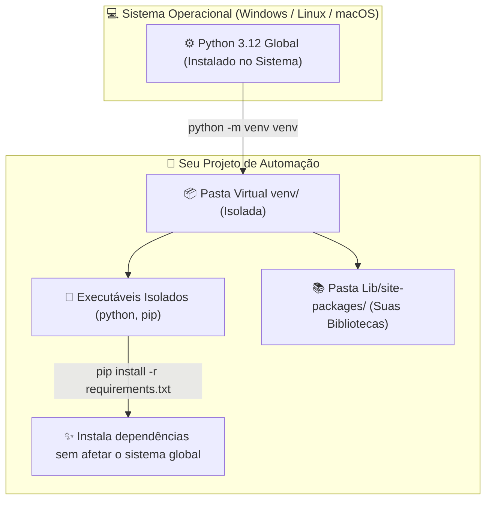

# 🚀 Aula 01 — Setup Completo do Ambiente de Desenvolvimento, Ambientes Virtuais (`venv`) e Primeiros Passos em Python

> [!TUTOR] 🚀 Guia Prático de Estudo da Aula (Ciclo de 4 Passos em 1-Clique)
> 1. 📖 **Conceito Extensivo:** Leia as explicações teóricas minuciosas e tire dúvidas com a IA no **Modo Tutor**.
> 2. 👨‍💻 **Código & Prática:** Edite e desenvolva sua solução no arquivo `aula_01_exercicios_manual.py`.
> 3. ⚡ **Testar no Obsidian (1-Clique):** Clique em **Run** no bloco abaixo para validar sua solução:
> > [!EXERCICIO] 🧪 Avaliação 1-Clique dos Exercícios da IDE (Issue #01)
> > 📌 **Exercício Avaliado:** Issue #01 — Setup Completo e Primeiros Passos
> > 📁 **Arquivo de Trabalho na IDE:** `01_fundamentos/pratica/Aula 01 - Setup e Primeiros Passos/aula_01_exercicios_manual.py`
> > ⚡ Clique no botão **Run** no canto superior direito do bloco abaixo para testar sua solução:

```python run
import sys, os, subprocess

def find_vault_root():
    curr = os.path.abspath(os.getcwd())
    while curr:
        if os.path.exists(os.path.join(curr, "avaliar_exercicio.py")):
            return curr
        parent = os.path.dirname(curr)
        if parent == curr:
            break
        curr = parent
    user_home = os.path.expanduser("~")
    for root, dirs, files in os.walk(user_home):
        if "avaliar_exercicio.py" in files:
            return root
        if root.count(os.sep) - user_home.count(os.sep) >= 4:
            dirs.clear()
    return os.path.abspath(".")

vault_root = find_vault_root()
script_path = os.path.join(vault_root, "avaliar_exercicio.py")
print("📌 [AVALIAÇÃO 1-CLIQUE] Testando Exercício da Issue #01...")
print("📁 Arquivo Alvo na IDE: 01_fundamentos/pratica/Aula 01 - Setup e Primeiros Passos/aula_01_exercicios_manual.py")
res = subprocess.run([sys.executable, script_path, "--issue", "01"], cwd=vault_root, capture_output=True, text=True, encoding="utf-8", errors="replace")
print(res.stdout or res.stderr)
```
> 4. 🔀 **Enviar PR:** Se aprovado pela IA, envie o Pull Request no GitHub para o Tutor (@akanaul)!

---

## 💡 1. Conceito Extensivo & O Porquê

### A Analogia da Oficina Mecânica de Alta Precisão
Imagine que você decidiu construir ou restaurar carros de alta performance. Antes de tocar na primeira peça do motor ou desapertar o primeiro parafuso, você precisa organizar a sua **Oficina Mecânica**:

- **O Interpretador Python 3.12:** É o **Motor Principal e o Gerador Elétrico** da oficina. Sem ele devidamente instalado no sistema operacional e configurado no caminho de execução (`PATH`), nenhuma máquina da sua oficina funcionará.
- **A IDE (Obsidian Vault / VS Code):** É a sua **Bancada de Trabalho Iluminada e Organizada**. É nela que você guarda suas chaves de fenda, manuais de instrução, visualiza seus scripts `.py`, destaca erros com cores chamativas e executa testes automatizados com apenas 1 clique.
- **Os Ambientes Virtuais (`venv`):** São os **Boxes de Trabalho Isolados**. Se você está consertando um carro antigo no Box 1 (que exige óleo mineral antigo) e um carro elétrico moderno no Box 2 (que exige fluidos sintéticos específicos), manter os dois carros no mesmo box causaria contaminação cruzada. Cada projeto em Python deve ter o seu próprio `venv` isolado.
- **O Git e GitHub:** É o seu **Diário de Bordo Criptografado**. Cada alteração relevante na oficina é registrada com data, hora, autor e descrição detalhada. Se um experimento der errado, você pode voltar no tempo para o momento exato em que tudo funcionava.

---

### 🧩 Como Funciona o Trabalho Híbrido (Obsidian ➔ IDE ➔ Agente IA)

Para garantir produtividade máxima durante o curso, você operará um ecossistema integrado em 3 camadas:

1. **Obsidian (Central de Leitura & Testes 1-Clique):**
   - É onde você lê os capítulos didáticos, acompanha seu mapa de progresso no Dataview e revisa flashcards.
   - **Avaliação Automatizada:** Clique no botão **Run** no bloco de código `python run` na nota de exercícios do Obsidian para rodar os testes unitários sem abrir o terminal manualmente!
2. **IDE & Ambientes (Antigravity / OpenCode / VS Code):**
   - É onde você edita seus arquivos Python na pasta `pratica/` (ex: `aula_01_exercicios_manual.py`).
   - Mantenha o seu ambiente virtual (`venv`) ativado e gerencie seus commits pelo terminal da IDE.
3. **Agente IA / Antigravity (Tutor Agêntico & Pair Programmer):**
   - Utilize os comandos de barra (`/`) diretamente no chat do Antigravity ou OpenCode:
     - `/tutor` ➔ Modo Tutor com sugestão de salvamento de notas.
     - `/debug` ➔ Análise de traceback de erros e criação de flashcards.
     - `/curar-vault` ➔ Curadoria ativa do vault e atualização de progresso no Dataview.
     - `/duvida` ➔ Resposta didática e salvamento de dúvidas no caderno.
     - `/git-flow` ➔ Tutorial de comandos no terminal e suporte a commits/PRs.

---

## ⚙️ 2. Lógica de Funcionamento Interno & Ambientes Virtuais (`venv`)

### Guia Definitivo de Ambientes Virtuais (`venv`) e Gerenciamento de Pacotes (`pip`)

#### 1. Criando o Ambiente Virtual Isolado
Para criar uma pasta de ambiente isolado no seu projeto, navegue até a pasta do projeto no Terminal / Prompt de Comando e execute:

```bash
# Cria uma pasta chamada 'venv' contendo o ambiente isolado
python -m venv venv
```

---

#### 2. Ativando o Ambiente Virtual no Sistema Operacional

A ativação altera temporariamente as variáveis de ambiente do seu terminal para apontar para o Python do `venv`:

- **No Windows (PowerShell):**
  ```powershell
  .\venv\Scripts\Activate.ps1
  ```
  *(Se ocorrer erro de permissão no PowerShell, execute como Administrador: `Set-ExecutionPolicy Unrestricted -Scope Process`)*

- **No Windows (Prompt de Comando / CMD):**
  ```cmd
  .\venv\Scripts\activate.bat
  ```

- **No Linux ou macOS (Terminal Bash / Zsh):**
  ```bash
  source venv/bin/activate
  ```

Após a ativação, você verá o prefixo `(venv)` aparecendo no lado esquerdo da linha de comando do seu terminal.

---

#### 3. Instalando Pacotes e Gerando o `requirements.txt`
Dentro do ambiente virtual ativo, utilize o gerenciador de pacotes `pip`:

```bash
# 1. Atualizar o gerenciador pip
python -m pip install --upgrade pip

# 2. Instalar uma biblioteca necessária (exemplo: requests)
pip install requests

# 3. Congelar e exportar a lista exata de dependências e versões do projeto
pip freeze > requirements.txt

# 4. Em um novo computador, reinstalar todas as dependências com 1 comando:
pip install -r requirements.txt
```

---

## 📊 3. Diagrama Visual (Mermaid)



---

## 🖥️ 4. Sintaxe, Código Comentado & Alternativas

Abaixo, exploraremos três abordagens para **Formatar Mensagens de Saída no Console com `print()`** e inspecionar os tipos de variáveis no Python.

### Abordagem 1: Formatação com f-strings (Padrão Oficial Recomendado)

```python
# Definindo variáveis de configuração do ambiente
nome_usuario = "Gabriel Santos"
sistema_operacional = "Windows 11"
versao_python = "3.12.2"
status_ambiente = True

# Criando a string formatada dinâmica com f-strings
mensagem_boas_vindas = (
    f"🚀 AMBIENTE CONFIGURADO COM SUCESSO!\n"
    f"  • Usuário Ativo: {nome_usuario}\n"
    f"  • Sistema Operacional: {sistema_operacional}\n"
    f"  • Versão do Python: {versao_python}\n"
    f"  • Ambiente Virtual (venv) Ativo? {status_ambiente}"
)

print("Abordagem 1 ➔ Exibição com f-strings:")
print(mensagem_boas_vindas)
```

---

### Abordagem 2: Uso do `print()` com Parâmetros Especiais `sep` e `end`

```python
# A função print aceita parâmetros de customização de separador e finalização
print("\nAbordagem 2 ➔ Customização de Saída:")

# Imprime itens separados por hífens em vez de espaços
print("PROJETO", "AUTOMAÇÃO", "VIBE_CODING", sep=" --- ")

# Mantém a impressão na mesma linha alterando o parâmetro end
print("Status da Inicialização: Verificando dependências...", end=" ")
print("✅ Concluído!")
```

---

### Abordagem 3: Inspeção Dinâmica de Tipos de Dados com `type()` e `isinstance()`

```python
# Inspeção de tipos em tempo de execução
valor_contador = 100
preco_produto = 49.90
nome_bot = "RoboLeitor"

print("\nAbordagem 3 ➔ Inspeção de Tipos de Dados:")
print(f"  • Tipo de 'valor_contador': {type(valor_contador)} | É inteiro? {isinstance(valor_contador, int)}")
print(f"  • Tipo de 'preco_produto': {type(preco_produto)} | É float? {isinstance(preco_produto, float)}")
print(f"  • Tipo de 'nome_bot': {type(nome_bot)} | É string? {isinstance(nome_bot, str)}")
```

---

## 🛠️ 5. Anatomia do Traceback & Tratamento Exaustivo de Exceções

### Analisando Erros Frequentes do Terminal no Setup Inicial

#### 1. `SyntaxError: EOL while scanning string literal`

```text
================================ TRACEBACK REAL DO TERMINAL ================================
  File "c:/projetos/aula_01.py", line 12
    print("Olá, bem-vindo ao curso de Python)
          ^
SyntaxError: EOL while scanning string literal
============================================================================================
```

##### Causa Raiz:
`EOL` significa *End Of Line* (Fim de Linha). Você abriu aspas duplas no texto `"Olá...`, mas esqueceu de fechar as aspas antes do final da linha.

##### Solução:
Feche as aspas corretamente: `print("Olá, bem-vindo ao curso de Python")`.

---

#### 2. `IndentationError: unexpected indent`

```text
================================ TRACEBACK REAL DO TERMINAL ================================
  File "c:/projetos/aula_01.py", line 15
    print("Testando indentação")
IndentationError: unexpected indent
============================================================================================
```

##### Causa Raiz:
O Python é uma linguagem sensível à espaçamentos. Adicionar espaços ou Tabs antes de uma instrução fora de um bloco condicional ou função causa esse erro.

##### Solução:
Remova todos os espaços iniciais da linha e alinhe a instrução à margem esquerda.

---

#### 3. `NameError: name 'variavel' is not defined`

```text
================================ TRACEBACK REAL DO TERMINAL ================================
  File "c:/projetos/aula_01.py", line 20, in <module>
    print(nome_aluno)
NameError: name 'nome_aluno' is not defined. Did you mean: 'nome_usuario'?
============================================================================================
```

##### Causa Raiz:
Você tentou imprimir a variável `nome_aluno`, mas ela não foi criada previamente no código ou teve seu nome digitado com erro ortográfico.

---

### Tratamento Defensivo de Variáveis Não Definidas com `try / except NameError`

```python
def exibir_variavel_segura(nome_var, valor_var):
    """Exibe o valor da variável tratando exceção de NameError de forma amigável."""
    try:
        if valor_var is None:
            raise NameError(f"A variável '{nome_var}' está nula ou não definida.")
        print(f"✅ Valor da Variável '{nome_var}': {valor_var}")
    except NameError as err:
        print(f"🚨 Exceção Capturada: {err}")

# Testando a exibição segura
exibir_variavel_segura("usuario", "Lucas")
exibir_variavel_segura("token_acesso", None)
```

---

## ⚖️ 6. Guia de Decisão & Recomendações Caso a Caso

| Ferramenta / Método | Sintaxe | Função e Recomendação |
| :--- | :--- | :--- |
| **`python -m venv venv`** | Terminal | **Obrigatório em 100% dos projetos**, isola as bibliotecas e evita conflitos do sistema. |
| **`pip freeze > requirements.txt`** | Terminal | **Obrigatório ao versionar com Git**, permite que qualquer colega reinstale as mesmas bibliotecas. |
| **f-strings (`f"..."`)** | `print(f"{var}")` | **Padrão recomendado para formatação de texto**, por ser mais legível e performático. |
| **`isinstance(var, tipo)`** | `isinstance(x, int)` | **Ideal para validação defensiva** de tipos de parâmetros antes de executar cálculos. |

---

## ⚠️ 7. Armadilhas Comuns, Casos Extremos & PEP 8

> [!WARNING] **Cuidado com o PATH do Windows e a Pasta `venv` no Git**
> 1. **Esquecer de Adicionar o Python ao PATH:** Durante a instalação do Python no Windows, se você esquecer de marcar a caixa *"Add python.exe to PATH"*, o terminal exibirá a mensagem `python não é reconhecido como um comando interno`.
> 2. **NUNCA Commitar a Pasta `venv/` no Git:** A pasta `venv` contém milhares de arquivos binários pesados específicos do seu sistema operacional. Adicione sempre a palavra `venv/` dentro do seu arquivo `.gitignore`!
> 3. **PEP 8 — Nomenclatura Padrão de Variáveis:**
>    - Nomes de variáveis devem usar `snake_case` (ex: `caminho_arquivo`, `versao_python`).
>    - Evite nomes genéricos de uma única letra como `a`, `b`, `c`. Prefira `contador`, `preco_total`.

---

## 🧠 8. Vibe Coding, Cheatsheet & Git Workflow

### Dicas de Prompt para Resolução de Erros de Setup
Se o seu terminal apresentar erros ao ativar o ambiente virtual:

> **Exemplo de Prompt Recomendado:**
> *"Atue como um Tutor de Python. Tentei ativar o ambiente virtual no Windows PowerShell digitando `.\venv\Scripts\Activate.ps1` e recebi a mensagem 'A execução de scripts foi desativada neste sistema'. Forneça o comando exato de permissão para resolver isso com segurança e explique o motivo."*

---

### Cheatsheet Rápido de Setup e Ambientes Virtuais

| Comando | Onde Executar | Descrição |
| :--- | :--- | :--- |
| `python --version` | Terminal / CMD | Exibe a versão do interpretador Python instalado. |
| `python -m venv venv` | Terminal do Projeto | Cria o ambiente virtual isolado na pasta `venv`. |
| `.\venv\Scripts\activate`| Terminal Windows | Ativa o ambiente virtual no Windows. |
| `source venv/bin/activate`| Terminal Linux/Mac | Ativa o ambiente virtual no Linux ou macOS. |
| `pip install pacote` | Terminal (venv ativo) | Instala uma biblioteca isolada no ambiente virtual. |
| `pip freeze > requirements.txt` | Terminal (venv ativo) | Exporta as bibliotecas para o arquivo de requisitos. |

---

### 🔀 Workflow Ativo de Git, Issue & Pull Request

Para registrar sua solução da Aula 01 no repositório oficial:

```bash
# 1. Criar branch de funcionalidade para a Issue #01
git checkout -b feature/issue-01-setup-primeiros-passos

# 2. Verificar os arquivos alterados no workspace
git status

# 3. Adicionar o arquivo de exercícios resolvido ao staging
git add 01_fundamentos/pratica/Aula\ 01\ -\ Setup\ e\ Primeiros\ Passos/aula_01_exercicios_manual.py

# 4. Registrar o commit no histórico do Git
git commit -m "feat(issue-01): resolucao dos exercicios de setup e ambientes virtuais"

# 5. Enviar a branch para o seu repositório remoto no GitHub
git push origin feature/issue-01-setup-primeiros-passos
```

> 🚀 **Passo Final:** Abra o **Pull Request (PR)** no GitHub para avaliação do Tutor (@akanaul)!

---

## 📝 Anotações Pessoais do Aluno sobre esta Aula

> [!TIP] **Criar Nota de Estudo Relacionada**  
> Quer guardar resumos ou anotações próprias sobre esta aula?  
> Pressione `Alt + N` no Templater e selecione **Template de Anotação do Aluno** para salvar automaticamente em [[meu_caderno_aluno/anotacoes_aulas/anotacoes_aulas|meu_caderno_aluno/anotacoes_aulas/]]!