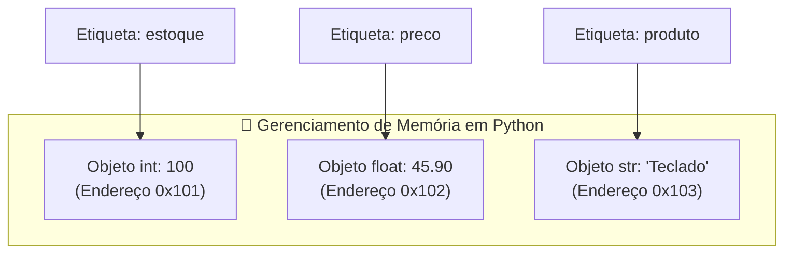

# 🚀 Aula 02 — Variáveis, Tipos de Dados Primitivos, Operadores Aritméticos, Relacionais e Lógicos

> [!TUTOR] 🚀 Guia Prático de Estudo da Aula (Ciclo de 4 Passos em 1-Clique)
> 1. 📖 **Conceito Extensivo:** Leia as explicações teóricas minuciosas e tire dúvidas com a IA no **Modo Tutor**.
> 2. 👨‍💻 **Código & Prática:** Edite e desenvolva sua solução no arquivo `aula_02_exercicios_manual.py`.
> 3. ⚡ **Testar no Obsidian (1-Clique):** Clique em **Run** no bloco abaixo para validar sua solução:
> > [!EXERCICIO] 🧪 Avaliação 1-Clique dos Exercícios da IDE (Issue #02)
> > 📌 **Exercício Avaliado:** Issue #02 — Variaveis e Operadores
> > 📁 **Arquivo de Trabalho na IDE:** `01_fundamentos/pratica/Aula 02 - Variaveis e Operadores/aula_02_exercicios_manual.py`
> > ⚡ Clique no botão **Run** no canto superior direito do bloco abaixo para testar sua solução:

```python run
import sys, os, subprocess

def find_vault_root():
    curr = os.path.abspath(os.getcwd())
    while curr:
        if os.path.exists(os.path.join(curr, "avaliar_exercicio.py")):
            return curr
        parent = os.path.dirname(curr)
        if parent == curr:
            break
        curr = parent
    user_home = os.path.expanduser("~")
    for root, dirs, files in os.walk(user_home):
        if "avaliar_exercicio.py" in files:
            return root
        if root.count(os.sep) - user_home.count(os.sep) >= 4:
            dirs.clear()
    return os.path.abspath(".")

vault_root = find_vault_root()
script_path = os.path.join(vault_root, "avaliar_exercicio.py")
print("📌 [AVALIAÇÃO 1-CLIQUE] Testando Exercício da Issue #02...")
print("📁 Arquivo Alvo na IDE: 01_fundamentos/pratica/Aula 02 - Variaveis e Operadores/aula_02_exercicios_manual.py")
res = subprocess.run([sys.executable, script_path, "--issue", "02"], cwd=vault_root, capture_output=True, text=True, encoding="utf-8", errors="replace")
print(res.stdout or res.stderr)
```
> 4. 🔀 **Enviar PR:** Se aprovado pela IA, envie o Pull Request no GitHub para o Tutor (@akanaul)!

---

## 💡 1. Conceito Extensivo & O Porquê

### A Analogia das Caixas Etiquetadas do Armazém Pessoal
Em qualquer linguagem de programação, para que um algoritmo possa tomar decisões ou realizar cálculos, ele precisa guardar informações temporárias enquanto é executado.

- **Uma Variável em Python:** É como uma **Caixa de Papelão Etiquetada** em um armazém. A etiqueta colada do lado de fora da caixa é o **Nome da Variável** (ex: `preco_unitario`, `quantidade_estoque`), enquanto o objeto guardado dentro da caixa é o **Valor** (ex: `150.00`, `25`).
- **Tipagem Dinâmica e Forte do Python:**
  - **Dinâmica:** Você não precisa declarar com antecedência que a caixa guardará apenas números inteiros ou apenas textos. O Python descobre o tipo de dado automaticamente no momento em que você guarda o valor na caixa.
  - **Forte:** O Python impede categoricamente que você tente realizar operações matematicamente incompatíveis entre tipos diferentes (como tentar multiplicar o texto de uma etiqueta de papel por uma caixa de ferramentas sem conversão prévia).

---

### Os Quatro Tipos Primitivos de Dados em Python

1. **Inteiro (`int`):** Representa números inteiros sem casas decimais, sejam eles positivos, negativos ou zero (ex: `idade = 28`, `estoque = 150`, `temperatura = -5`).
2. **Ponto Flutuante (`float`):** Representa números reais com casas decimais (separados por ponto `.`) (ex: `preco = 199.90`, `altura = 1.78`, `desconto = 0.15`).
3. **Texto / String (`str`):** Sequência de caracteres alfanuméricos delimitada por aspas simples `'...'` ou aspas duplas `"..."` (ex: `nome = "Ana Silva"`, `codigo = "PRD-987"`).
4. **Booleano (`bool`):** Representa apenas dois estados lógicos possíveis: Verdadeiro (`True`) ou Falso (`False`), essenciais para tomadas de decisão.

---

## ⚙️ 2. Lógica de Funcionamento Interno & Precedência de Operadores

### Como o Python Gerencia Variáveis na Memória RAM
Ao contrário de linguagens como C ou Java, onde a variável representa o próprio espaço físico da memória, em Python **tudo é um objeto**.

Ao escrever `desconto = valor * 0.10`, o Python realiza três etapas lógicas internas:

```text
[1. Cálculo da Expressão no Lado Direito: (valor * 0.10)] ➔ [2. Alocação do Objeto Float na RAM] ➔ [3. Vinculação do Apontador 'desconto']
```

1. **Avaliação do Lado Direito:** O interpretador resolve primeiro a expressão à direita do sinal de igual `=`.
2. **Alocação do Objeto:** O resultado (ex: `15.0`) é criado em um endereço de memória (ex: `0x7f8a90`).
3. **Vinculação de Ponteiro:** O nome `desconto` passa a ser uma referência apontando para o endereço `0x7f8a90`.

---

### Tabela Oficial de Precedência de Operadores Matemáticos

Quando uma linha de código possui múltiplos operadores, o Python resolve na seguinte ordem hierárquica:

1. **Parênteses `()`:** Altera a ordem e resolve o conteúdo interno primeiro.
2. **Exponenciação `**`:** Potenciação.
3. **Multiplicação `*`, Divisão `/`, Divisão Inteira `//`, Módulo `%`:** Executados da esquerda para a direita.
4. **Soma `+` e Subtração `-`:** Executados por último.

---

## 📊 3. Diagrama Visual (Mermaid)



---

## 🖥️ 4. Sintaxe, Código Comentado & Alternativas

Abaixo, veremos três abordagens para **Calcular a Divisão de uma Conta de Restaurante com Taxa de Serviço e Desconto**.

### Abordagem 1: Operações Passo a Passo com Variáveis Explicativas (Abordagem Didática)

```python
# Dados de entrada
valor_consumo_bruto = 250.00
percentual_taxa_servico = 10.0  # 10%
quantidade_amigos = 4
cupom_desconto_valor = 20.00    # R$ 20 de desconto

# Passo 1: Aplicar o cupom de desconto ao consumo bruto
consumo_com_desconto = valor_consumo_bruto - cupom_desconto_valor

# Passo 2: Calcular a taxa de serviço (10% sobre o consumo já com desconto)
valor_taxa = consumo_com_desconto * (percentual_taxa_servico / 100)

# Passo 3: Calcular o total geral da conta
total_geral = consumo_com_desconto + valor_taxa

# Passo 4: Dividir igualmente entre os amigos
valor_individual = total_geral / quantidade_amigos

print("Abordagem 1 ➔ Divisão Detalhada:")
print(f"  • Consumo com Desconto: R$ {consumo_com_desconto:.2f}")
print(f"  • Taxa de Serviço (10%): R$ {valor_taxa:.2f}")
print(f"  • Total Geral: R$ {total_geral:.2f}")
print(f"  • Cada um dos {quantidade_amigos} amigos pagará: R$ {valor_individual:.2f}")
```

---

### Abordagem 2: Expressão Direta com Parênteses (Abordagem Compacta)

```python
# Realizando todo o cálculo em uma única expressão usando parênteses para precedência
valor_individual_direto = ((250.00 - 20.00) * 1.10) / 4

print(f"\nAbordagem 2 (Expressão Direta) ➔ Valor por Pessoa: R$ {valor_individual_direto:.2f}")
```

---

### Abordagem 3: Conversão Explícita de Tipos (`Type Casting`) e Operadores de Pertencimento (`in`)

```python
# Entradas recebidas como strings (simulando campos de formulário web)
entrada_valor_str = "180.50"
entrada_cupom = "DESCONTO15"

# Conversão explícita de tipos (Type Casting)
valor_num = float(entrada_valor_str)

# Operador de pertencimento (in) e comparações lógicas (and/or)
tem_cupom_valido = "DESCONTO" in entrada_cupom and valor_num > 100.0

if tem_cupom_valido:
    valor_final = valor_num * 0.85  # Aplica 15% de desconto
else:
    valor_final = valor_num

print(f"\nAbordagem 3 ➔ Valor Convertido: R$ {valor_num:.2f} | Tem Cupom Válido? {tem_cupom_valido} | Final: R$ {valor_final:.2f}")
```

---

## 🛠️ 5. Anatomia do Traceback & Tratamento Exaustivo de Exceções

### Analisando Erros Frequentes de Variáveis e Operadores no Terminal

#### 1. `TypeError: can only concatenate str (not "int") to str`

```text
================================ TRACEBACK REAL DO TERMINAL ================================
  File "c:/projetos/aula_02.py", line 14, in <module>
    resultado = "O total da compra é: R$ " + 150
TypeError: can only concatenate str (not "int") to str
============================================================================================
```

##### Causa Raiz:
O Python possui tipagem forte. Ele impede concatenar diretamente uma `str` com um `int` ou `float` usando o operador `+`.

##### Solução:
Converta o número para texto usando `str(150)` ou utilize f-strings: `f"O total da compra é: R$ {150}"`.

---

#### 2. `ValueError: invalid literal for int() with base 10: '25.50'`

```text
================================ TRACEBACK REAL DO TERMINAL ================================
  File "c:/projetos/aula_02.py", line 18, in <module>
    idade = int("25.50")
ValueError: invalid literal for int() with base 10: '25.50'
============================================================================================
```

##### Causa Raiz:
Você tentou converter a string `"25.50"` diretamente para inteiro (`int`). Como a string contém um ponto decimal, a conversão para inteiro falha.

##### Solução:
Converta primeiro para `float`: `float("25.50")` (ou depois converta para int: `int(float("25.50"))`).

---

### Tratamento Defensivo de Conversões com `try / except ValueError`

```python
def converter_valor_seguro(texto_valor):
    """Tenta converter uma string para float com tratamento seguro de exceções."""
    try:
        valor_limpo = texto_valor.replace("R$", "").replace(",", ".").strip()
        valor_float = float(valor_limpo)
        return valor_float
    except ValueError as err:
        print(f"🚨 Erro de Conversão: O texto '{texto_valor}' não é um número válido! Detalhe: {err}")
        return 0.0

# Testando conversões seguras
print("\n--- Testes de Conversão Segura ---")
print("1. Valor Válido:", converter_valor_seguro("R$ 150,50"))
print("2. Texto Inválido:", converter_valor_seguro("Cinquenta Reais"))
```

---

## ⚖️ 6. Guia de Decisão & Recomendações Caso a Caso

| Operador / Abordagem | Sintaxe | Quando Escolher |
| :--- | :--- | :--- |
| **Divisão Float (`/`)** | `10 / 4 ➔ 2.5` | Sempre que precisar do **resultado exato com decimais**. |
| **Divisão Inteira (`//`)** | `10 // 4 ➔ 2` | Quando precisar **descartar as casas decimais** (ex: quantidade de pacotes inteiros). |
| **Módulo (`%`)** | `10 % 2 ➔ 0` | Perfeito para **verificar se um número é par (`num % 2 == 0`)** ou calcular ciclos. |
| **Exponenciação (`**`)** | `2 ** 3 ➔ 8` | Para cálculos de **potência e juros compostos**. |
| **Operador `in`** | `"SP" in "São Paulo"` | Para **verificar presença de texto** em formulários de forma limpa. |

---

## ⚠️ 7. Armadilhas Comuns, Casos Extremos & PEP 8

> [!WARNING] **Cuidado com a Diferença entre `=` e `==`**
> 1. **Diferença Crítica entre Atribuição e Comparação:**
>    - `=` é operador de **Atribuição** (guarda o valor na variável: `status = True`).
>    - `==` é operador de **Comparação** (testa se dois valores são iguais: `if status == True:`).
> 2. **Imprecisão dos Números de Ponto Flutuante (`float`):** Devido à representação binária do computador, somar `0.1 + 0.2` resulta em `0.30000000000000004`. Para exibir valores monetários arredondados, use sempre `round(valor, 2)` ou f-strings `f"{valor:.2f}"`.
> 3. **PEP 8 — Espaçamento em Operadores:**
>    - Deixe sempre um espaço antes e depois de operadores de atribuição e comparação: `x = 10`, `if preco >= 50.0:`.

---

## 🧠 8. Vibe Coding, Cheatsheet & Git Workflow

### Dicas de Prompt Estruturado para Limpeza de Dados Numéricos
Se precisar converter entradas complexas de texto com o copiloto:

> **Exemplo de Prompt Recomendado:**
> *"Atue como um Tutor de Python. Tenho uma variável string contendo o texto 'R$ 1.250,50'. Crie uma função em Python 3.12 que limpe o texto 'R$', remova o ponto de milhar, substitua a vírgula por ponto e converta a string para float com tratamento defensivo `try/except ValueError`."*

---

### Cheatsheet Rápido de Tipos e Operadores

| Operador / Função | Sintaxe | Descrição |
| :--- | :--- | :--- |
| **Atribuição** | `x = 10` | Armazena o valor 10 na variável `x`. |
| **Conversão Float** | `float("10.5")` | Converte texto/inteiro para o tipo float (`10.5`). |
| **Conversão String** | `str(100)` | Converte número para o tipo texto (`"100"`). |
| **E Lógico** | `a and b` | Retorna `True` apenas se **ambas** as condições forem verdadeiras. |
| **OU Lógico** | `a or b` | Retorna `True` se **pelo menos uma** condição for verdadeira. |
| **NÃO Lógico** | `not a` | Inverte o valor booleano (`not True ➔ False`). |

---

### 🔀 Workflow Ativo de Git, Issue & Pull Request

Para registrar sua solução da Aula 02:

```bash
# 1. Criar branch para a Issue #02
git checkout -b feature/issue-02-variaveis-operadores

# 2. Adicionar o arquivo alterado ao staging
git add 01_fundamentos/pratica/Aula\ 02\ -\ Variaveis\ e\ Operadores/aula_02_exercicios_manual.py

# 3. Registrar o commit
git commit -m "feat(issue-02): resolucao dos exercicios de variaveis e operadores"

# 4. Enviar a branch para o repositório remoto no GitHub
git push origin feature/issue-02-variaveis-operadores
```

> 🚀 **Passo Final:** Abra o **Pull Request (PR)** no GitHub para avaliação do Tutor (@akanaul)!

---

## 📝 Anotações Pessoais do Aluno sobre esta Aula

> [!TIP] **Criar Nota de Estudo Relacionada**  
> Quer guardar resumos ou anotações próprias sobre esta aula?  
> Pressione `Alt + N` no Templater e selecione **Template de Anotação do Aluno** para salvar automaticamente em [[meu_caderno_aluno/anotacoes_aulas/anotacoes_aulas|meu_caderno_aluno/anotacoes_aulas/]]!