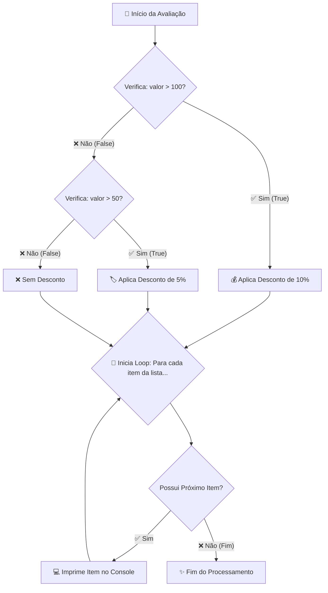

# 🚀 Aula 03 — Estruturas Condicionais (`if/elif/else`, `match/case`) e Laços de Repetição (`for`, `while`)

> [!TUTOR] 🚀 Guia Prático de Estudo da Aula (Ciclo de 4 Passos em 1-Clique)
> 1. 📖 **Conceito Extensivo:** Leia as explicações teóricas minuciosas e tire dúvidas com a IA no **Modo Tutor**.
> 2. 👨‍💻 **Código & Prática:** Edite e desenvolva sua solução no arquivo `aula_03_exercicios_manual.py`.
> 3. ⚡ **Testar no Obsidian (1-Clique):** Clique em **Run** no bloco abaixo para validar sua solução:
> > [!EXERCICIO] 🧪 Avaliação 1-Clique dos Exercícios da IDE (Issue #03)
> > 📌 **Exercício Avaliado:** Issue #03 — Condicionais e Loops
> > 📁 **Arquivo de Trabalho na IDE:** `01_fundamentos/pratica/Aula 03 - Condicionais e Loops/aula_03_exercicios_manual.py`
> > ⚡ Clique no botão **Run** no canto superior direito do bloco abaixo para testar sua solução:

```python run
import sys, os, subprocess

def find_vault_root():
    curr = os.path.abspath(os.getcwd())
    while curr:
        if os.path.exists(os.path.join(curr, "avaliar_exercicio.py")):
            return curr
        parent = os.path.dirname(curr)
        if parent == curr:
            break
        curr = parent
    user_home = os.path.expanduser("~")
    for root, dirs, files in os.walk(user_home):
        if "avaliar_exercicio.py" in files:
            return root
        if root.count(os.sep) - user_home.count(os.sep) >= 4:
            dirs.clear()
    return os.path.abspath(".")

vault_root = find_vault_root()
script_path = os.path.join(vault_root, "avaliar_exercicio.py")
print("📌 [AVALIAÇÃO 1-CLIQUE] Testando Exercício da Issue #03...")
print("📁 Arquivo Alvo na IDE: 01_fundamentos/pratica/Aula 03 - Condicionais e Loops/aula_03_exercicios_manual.py")
res = subprocess.run([sys.executable, script_path, "--issue", "03"], cwd=vault_root, capture_output=True, text=True, encoding="utf-8", errors="replace")
print(res.stdout or res.stderr)
```
> 4. 🔀 **Enviar PR:** Se aprovado pela IA, envie o Pull Request no GitHub para o Tutor (@akanaul)!

---

## 💡 1. Conceito Extensivo & O Porquê

### A Analogia do Semáforo de Trânsito e da Playlist de Músicas
Sem estruturas de controle de fluxo, um programa de computador seria apenas uma sequência rígida de comandos executados cegamente de cima para baixo. Para criar algoritmos inteligentes, utilizamos condicionais e repetições:

- **Estruturas Condicionais (`if`, `elif`, `else`, `match/case`):** São como os **Semáforos e Placas de Sinalização no Trânsito**. Quando você se aproxima de um cruzamento, você avalia o estado atual: *Se o sinal estiver verde*, você avança; *Senão, se o sinal estiver amarelo*, você reduz a velocidade; *Senão (vermelho)*, você para obrigatoriamente. O código desvia seu caminho com base em condições lógicas.
- **Laços de Repetição (`for` e `while`):** São como uma **Playlist de Músicas no Celular**:
  - O **Loop `for`** é usado quando você **já sabe de antemão** quantos itens precisa processar (ex: tocar todas as 15 músicas da playlist ou iterar sobre 100 linhas de um relatório).
  - O **Loop `while`** é usado quando a repetição deve continuar **enquanto uma condição for verdadeira** (ex: *manter a música tocando enquanto a bateria do celular estiver acima de 5%*), sem saber exatamente quantas iterações vão ocorrer.

---

## ⚙️ 2. Lógica de Funcionamento Interno & Controle de Fluxo

### Avaliação de Curto-Circuito (*Short-Circuit Evaluation*)
Ao avaliar expressões lógicas compostas com `and` ou `or`, o interpretador Python utiliza uma otimização importante:

1. **Operador `and`:** Na expressão `if condicao1 and condicao2`, se a `condicao1` for avaliada como `False`, o Python **nem sequer avalia** a `condicao2`, pois o resultado final da conjunção será obrigatoriamente falso.
2. **Operador `or`:** Na expressão `if condicao1 or condicao2`, se a `condicao1` for `True`, o Python não avalia a `condicao2`, pois o resultado da disjunção já é garantidamente verdadeiro.

---

### Instruções de Desvio Interno (`break`, `continue`, `pass`)

- `break`: Interrompe imediatamente o laço de repetição mais próximo, saltando para a primeira linha de código após o bloco do loop.
- `continue`: Pula o restante das instruções da iteração atual e salta direto para a avaliação da próxima iteração do loop.
- `pass`: Atua como um nulo operacional (*Placeholder*). É usado quando a sintaxe do Python exige um bloco de código, mas nenhuma ação precisa ser tomada no momento.

---

## 📊 3. Diagrama Visual (Mermaid)



---

## 🖥️ 4. Sintaxe, Código Comentado & Alternativas

Abaixo, exploraremos três abordagens para **Filtrar e Categorizar Pedidos de Clientes pelo Valor**.

### Abordagem 1: Estrutura `if/elif/else` Tradicional com Loop `for` (Abordagem Didática)

```python
# Lista de valores de pedidos de clientes no dia
pedidos_clientes = [45.00, 150.00, 320.00, 85.00, 500.00, 12.00]

pedidos_pequenos = []
pedidos_medios = []
pedidos_vip = []

# Iterando sobre a lista usando o loop for
for valor in pedidos_clientes:
    if valor < 100.00:
        pedidos_pequenos.append(valor)
    elif 100.00 <= valor <= 300.00:
        pedidos_medios.append(valor)
    else:
        pedidos_vip.append(valor)

print("Abordagem 1 ➔ Categorização com if/elif/else:")
print(f"  • Pedidos Pequenos (<R$100): {pedidos_pequenos}")
print(f"  • Pedidos Médios (R$100 a R$300): {pedidos_medios}")
print(f"  • Pedidos VIP (>R$300): {pedidos_vip}")
```

---

### Abordagem 2: Utilizando `match/case` com Guardas Relacionais (Python 3.10+)

```python
def categorizar_pedido_match(valor):
    """Categoriza um pedido individual usando a instrução match/case moderna."""
    match valor:
        case v if v < 100.00:
            return "Pequeno Porte"
        case v if 100.00 <= v <= 300.00:
            return "Médio Porte"
        case _:
            return "Cliente VIP / Grande Porte"

# Processando a lista usando list comprehension com match/case
resumo_categorias = [f"R$ {p:.2f} ➔ {categorizar_pedido_match(p)}" for p in pedidos_clientes]

print("\nAbordagem 2 (match/case) ➔ Resumo Categorizado:")
for item in resumo_categorias[:3]:  # Exibe os 3 primeiros
    print("  •", item)
```

---

### Abordagem 3: Loop `while` com Controle de Retentativas e Sinalizador (*Flag*)

```python
# Simulando retentativas de conexão a um banco de dados
tentativa_atual = 0
max_tentativas = 3
conexao_sucesso = False

print("\nAbordagem 3 ➔ Loop while com controle de retentativas:")
while tentativa_atual < max_tentativas and not conexao_sucesso:
    tentativa_atual += 1
    print(f"🔄 Tentativa {tentativa_atual} de {max_tentativas}: Conectando ao servidor...")
    
    # Simulação: Conexão é estabelecida na 2ª tentativa
    if tentativa_atual == 2:
        conexao_sucesso = True
        print("✅ Conexão estabelecida com sucesso!")
        break  # Interrompe o loop imediatamente

if not conexao_sucesso:
    print("❌ Falha crítica: Servidor indisponível após o limite de tentativas.")
```

---

## 🛠️ 5. Anatomia do Traceback & Tratamento Exaustivo de Exceções

### Analisando Erros Frequentes de Controle de Fluxo no Terminal

#### 1. `UnboundLocalError: local variable 'contador' referenced before assignment`

```text
================================ TRACEBACK REAL DO TERMINAL ================================
  File "c:/projetos/aula_03.py", line 22, in processar
    contador += 1
UnboundLocalError: local variable 'contador' referenced before assignment
============================================================================================
```

##### Causa Raiz:
Você tentou incrementar `contador += 1` dentro de uma função sem ter inicializado a variável `contador = 0` previamente naquele escopo.

---

#### 2. `KeyboardInterrupt` (Loop Infinito Trava o Terminal)

```text
================================ TRACEBACK REAL DO TERMINAL ================================
  File "c:/projetos/aula_03.py", line 15, in <module>
    whileTrue:
KeyboardInterrupt
============================================================================================
```

##### Causa Raiz:
O loop `while` entrou em ciclo infinito porque a condição de parada nunca se tornou falsa e não havia um `break`. O usuário precisou pressionar `Ctrl + C` no terminal para interromper a execução.

---

### Tratamento Defensivo contra Loops Infinitos e Valores Inválidos

```python
def processar_lote_com_seguranca(lista_dados, max_processar=5):
    """Processa um lote com limite de segurança contra loops infinitos."""
    processados = 0
    
    try:
        if not isinstance(lista_dados, list):
            raise TypeError("O argumento enviado deve ser uma lista!")
            
        for item in lista_dados:
            if processados >= max_processar:
                print("⚠️ Limite máximo de segurança atingido. Interrompendo loop.")
                break
                
            print(f"  • Processando item: {item}")
            processados += 1
            
    except TypeError as err:
        print(f"🚨 Exceção Capturada: {err}")
    finally:
        print(f"📊 Total de itens processados nesta rodada: {processados}")

# Testando o processamento seguro
print("\n--- Teste de Processamento com Limite ---")
processar_lote_com_seguranca(["A", "B", "C", "D", "E", "F", "G"], max_processar=3)
```

---

## ⚖️ 6. Guia de Decisão & Recomendações Caso a Caso

| Estrutura / Comando | Sintaxe | Quando Escolher |
| :--- | :--- | :--- |
| **`if / elif / else`** | `if x > 10:` | **Padrão universal**, ideal para verificações relacionais e compostas. |
| **`match / case`** | `match opcao: case 1:` | **Ideal para menus de opções** ou substituir longas cadeias de `elif`. |
| **Loop `for`** | `for item in lista:` | **Recomendado para 90% dos loops**, quando a coleção tem fim definido. |
| **Loop `while`** | `while status == True:` | Para **repetições por condição** (ex: manter servidor ativo ou retentativas). |
| **`break`** | `break` | Para **sair imediatamente do loop** ao encontrar o resultado buscado. |

---

## ⚠️ 7. Armadilhas Comuns, Casos Extremos & PEP 8

> [!WARNING] **Cuidado com Loops Infinitos e Modificação de Listas Durante a Iteração**
> 1. **Modificar uma Lista enquanto Itera sobre Ela:** Fazer `for x in minha_lista: minha_lista.remove(x)` altera os índices internos durante o laço, fazendo com que o Python pule elementos sem processar!
> 2. **Esquecer de Incrementar o Contador no `while`:** Esquecer a linha `contador += 1` dentro de um `while contador < 10:` criará um loop infinito travando o processador.
> 3. **PEP 8 — Legibilidade em Blocos Condicionais:**
>    - Prefira `if lista:` em vez de `if len(lista) > 0:` para verificar se uma lista contém itens.
>    - Mantenha no máximo 3 níveis de aninhamento de `if` dentro de loops para evitar código inacessível.

---

## 🧠 8. Vibe Coding, Cheatsheet & Git Workflow

### Dicas de Prompt Estruturado para Resolução de Bugs em Loops
Se a sua repetição estiver travando ou pulando elementos:

> **Exemplo de Prompt Recomendado:**
> *"Atue como um Tutor de Python. Tenho um loop `while` que está travando em ciclo infinito. Forneça uma solução em Python 3.12 que adicione um contador de limite de segurança (`max_tentativas = 5`) e um bloco de tratamento `try/except` para interromper o loop com `break` quando a conexão for estabelecida."*

---

### Cheatsheet Rápido de Condicionais e Loops

| Comando | Sintaxe | Descrição |
| :--- | :--- | :--- |
| **Condicional** | `if c1: ... elif c2: ... else:` | Define desvios de fluxo com base em condições lógicas. |
| **Match/Case** | `match var: case 1: ...` | Seleção moderna de padrões (Python 3.10+). |
| **Loop For** | `for i in range(inicio, fim):` | Itera sobre uma sequência numérica ou coleção. |
| **Loop While** | `while condicao:` | Repete o bloco enquanto a condição for `True`. |
| **Interromper** | `break` | Sai do loop imediatamente. |
| **Pular** | `continue` | Salta para a próxima iteração do loop. |

---

### 🔀 Workflow Ativo de Git, Issue & Pull Request

Para registrar sua solução da Aula 03:

```bash
# 1. Criar branch para a Issue #03
git checkout -b feature/issue-03-condicionais-loops

# 2. Adicionar o arquivo alterado ao staging
git add 01_fundamentos/pratica/Aula\ 03\ -\ Condicionais\ e\ Loops/aula_03_exercicios_manual.py

# 3. Registrar o commit
git commit -m "feat(issue-03): resolucao dos exercicios de condicionais e laos de repeticao"

# 4. Enviar a branch para o repositório remoto no GitHub
git push origin feature/issue-03-condicionais-loops
```

> 🚀 **Passo Final:** Abra o **Pull Request (PR)** no GitHub para avaliação do Tutor (@akanaul)!

---

## 📝 Anotações Pessoais do Aluno sobre esta Aula

> [!TIP] **Criar Nota de Estudo Relacionada**  
> Quer guardar resumos ou anotações próprias sobre esta aula?  
> Pressione `Alt + N` no Templater e selecione **Template de Anotação do Aluno** para salvar automaticamente em [[meu_caderno_aluno/anotacoes_aulas/anotacoes_aulas|meu_caderno_aluno/anotacoes_aulas/]]!