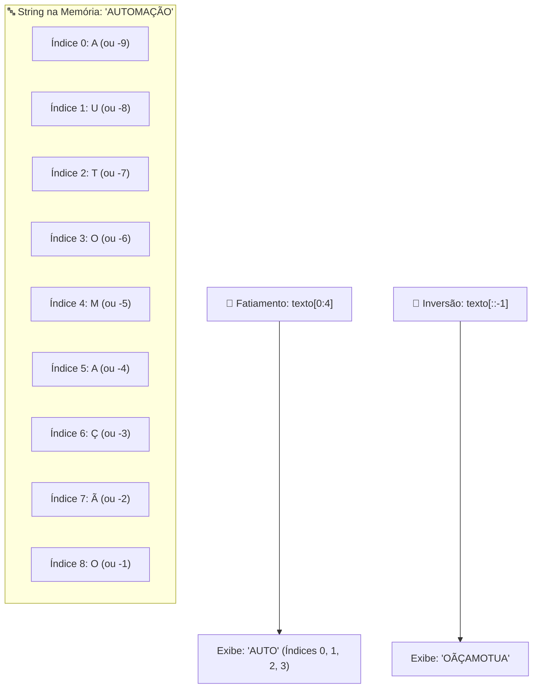

# 🚀 Aula 04 — Manipulação Avançada de Strings, Fatiamento (`Slicing`) e Formatação Tabular

> [!TUTOR] 🚀 Guia Prático de Estudo da Aula (Ciclo de 4 Passos em 1-Clique)
> 1. 📖 **Conceito Extensivo:** Leia as explicações teóricas minuciosas e tire dúvidas com a IA no **Modo Tutor**.
> 2. 👨‍💻 **Código & Prática:** Edite e desenvolva sua solução no arquivo `aula_04_exercicios_manual.py`.
> 3. ⚡ **Testar no Obsidian (1-Clique):** Clique em **Run** no bloco abaixo para validar sua solução:
> > [!EXERCICIO] 🧪 Avaliação 1-Clique dos Exercícios da IDE (Issue #04)
> > 📌 **Exercício Avaliado:** Issue #04 — Strings e Formatacao
> > 📁 **Arquivo de Trabalho na IDE:** `02_python_essencial/pratica/Aula 04 - Strings e Formatacao/aula_04_exercicios_manual.py`
> > ⚡ Clique no botão **Run** no canto superior direito do bloco abaixo para testar sua solução:

```python run
import sys, os, subprocess

def find_vault_root():
    curr = os.path.abspath(os.getcwd())
    while curr:
        if os.path.exists(os.path.join(curr, "avaliar_exercicio.py")):
            return curr
        parent = os.path.dirname(curr)
        if parent == curr:
            break
        curr = parent
    user_home = os.path.expanduser("~")
    for root, dirs, files in os.walk(user_home):
        if "avaliar_exercicio.py" in files:
            return root
        if root.count(os.sep) - user_home.count(os.sep) >= 4:
            dirs.clear()
    return os.path.abspath(".")

vault_root = find_vault_root()
script_path = os.path.join(vault_root, "avaliar_exercicio.py")
print("📌 [AVALIAÇÃO 1-CLIQUE] Testando Exercício da Issue #04...")
print("📁 Arquivo Alvo na IDE: 02_python_essencial/pratica/Aula 04 - Strings e Formatacao/aula_04_exercicios_manual.py")
res = subprocess.run([sys.executable, script_path, "--issue", "04"], cwd=vault_root, capture_output=True, text=True, encoding="utf-8", errors="replace")
print(res.stdout or res.stderr)
```
> 4. 🔀 **Enviar PR:** Se aprovado pela IA, envie o Pull Request no GitHub para o Tutor (@akanaul)!

---

## 💡 1. Conceito Extensivo & O Porquê

### A Analogia da Fita Métrica Graduada e do Processo de Lapidação de Dados
Em quase 100% dos sistemas de automação comerciais e corporativos — desde a leitura de planilhas até o envio de mensagens e tratamento de APIs —, os dados brutos chegam em formato de **Texto (`str`)**.

- **Strings como Sequências Ordenadas:** Uma string em Python não é um bloco indecomponível. É como uma **Fita Métrica Graduada em Milímetros**, onde cada caractere, espaço ou símbolo ocupa uma posição numérica indexada exata, começando do zero (`0`).
- **Tratamento e Sanitização de Dados:** Dados digitados por usuários em formulários ou extraídos de arquivos de texto frequentemente chegam com espaços acidentais nas pontas, caracteres maiúsculos/minúsculos despadronizados ou símbolos corrompidos. Tratar strings é como passar uma peça bruta por um **Processo de Lavagem e Polimento** antes de armazená-la no banco de dados.

---

## ⚙️ 2. Lógica de Funcionamento Interno & Imutabilidade

### A Imutabilidade das Strings em Python
Uma das características fundamentais do Python é que as **strings são imutáveis**. Isso significa que uma vez criada uma string na memória RAM, seus caracteres individuais jamais podem ser modificados diretamente.

```python
# Tentar alterar um caractere gera erro!
nome = "Python"
# nome[0] = "J"  <-- Lança TypeError: 'str' object does not support item assignment
```

Quando você chama um método como `texto.upper()` ou `texto.replace()`, o Python não altera a string original; ele aloca espaço para uma **nova string** totalmente independente na memória RAM.

---

### Mecanismo Interno de Fatiamento (`Slicing` — `texto[início:fim:passo]`)

- `início`: O índice numérico onde a fatia começa (inclusivo).
- `fim`: O índice numérico onde a fatia termina (**exclusivo** — a posição final não entra no resultado).
- `passo`: A quantidade de caracteres a avançar a cada salto (padrão é `1`). Se for `-1`, a leitura ocorre de trás para frente.

---

## 📊 3. Diagrama Visual (Mermaid)



---

## 🖥️ 4. Sintaxe, Código Comentado & Alternativas

Abaixo, veremos como **Extrair Códigos de Produtos, Sanitizar Entradas e Gerar Cupons Tabulares Formatados**.

### Abordagem 1: Fatiamento (`Slicing`) e Métodos Nativos de Sanitização (Abordagem Oficial)

```python
# String bruta simulando a leitura de uma linha de arquivo
linha_bruta_log = "  PRD-98745-ALIMENTOS-25.50  "

# 1. Removendo espaços em branco nas extremidades com .strip()
linha_limpa = linha_bruta_log.strip()

# 2. Dividindo a string usando .split("-") em uma lista de partes
partes = linha_limpa.split("-")

prefixo = partes[0]      # "PRD"
codigo_num = partes[1]   # "98745"
categoria = partes[2]    # "ALIMENTOS"
preco_str = partes[3]    # "25.50"

print("Abordagem 1 ➔ Sanitização e Extração de Texto:")
print(f"  • Código do Produto: {codigo_num}")
print(f"  • Categoria Formatada: {categoria.title()}")
print(f"  • Preço Convertido: R$ {float(preco_str):.2f}")
```

---

### Abordagem 2: Formatação Tabular Avançada com f-strings (`align`, `fill`, `precision`)

```python
# Formatando uma tabela de recebimento de compras alinhada no console
produtos_caixa = [
    ("Arroz Integral 5kg", 29.90, 2),
    ("Feijão Preto 1kg", 8.50, 5),
    ("Azeite Extra Virgem 500ml", 45.00, 1)
]

print("\nAbordagem 2 ➔ Tabela Tabular Alinhada com f-strings:")
print("=" * 52)
print(f"{'PRODUTO':<26} | {'QTD':^5} | {'PREÇO UN':>12}")
print("=" * 52)

for nome, preco, qtd in produtos_caixa:
    # <26 alinha à esquerda com 26 caracteres, ^5 centraliza, >12 alinha à direita
    print(f"{nome:<26} | {qtd:^5} | R$ {preco:>9.2f}")

print("=" * 52)
```

---

### Abordagem 3: Limpeza Encadeada de Caracteres (`Method Chaining`) e Expressão Regular Básica

```python
import re

documento_bruto = " CPF: 123.456.789-00 (Titular: Ana) "

# Limpeza usando substituição encadeada (.replace)
cpf_limpo = documento_bruto.strip().replace("CPF:", "").replace(".", "").replace("-", "")
cpf_apenas_num = cpf_limpo.split("(")[0].strip()

# Alternativa usando expressão regular (re.sub) para manter apenas dígitos
cpf_regex = re.sub(r"\D", "", documento_bruto)  # \D remove tudo que não for dígito

print(f"\nAbordagem 3 ➔ CPF Limpo via Replace: '{cpf_apenas_num}'")
print(f"CPF Limpo via Regex (11 dígitos): '{cpf_regex}'")
```

---

## 🛠️ 5. Anatomia do Traceback & Tratamento Exaustivo de Exceções

### Analisando Erros Frequentes de Manipulação de Strings no Terminal

#### 1. `IndexError: string index out of range`

```text
================================ TRACEBACK REAL DO TERMINAL ================================
  File "c:/projetos/aula_04.py", line 18, in <module>
    caractere = texto[15]
IndexError: string index out of range
============================================================================================
```

##### Causa Raiz:
Você tentou acessar o índice numérico `15` em uma string que possui apenas 10 caracteres (índices válidos de 0 a 9).

---

#### 2. `AttributeError: 'list' object has no attribute 'upper'`

```text
================================ TRACEBACK REAL DO TERMINAL ================================
  File "c:/projetos/aula_04.py", line 22, in <module>
    resultado = palavras.upper()
AttributeError: 'list' object has no attribute 'upper'
============================================================================================
```

##### Causa Raiz:
Você tentou chamar o método `.upper()` diretamente sobre uma lista `['palavra1', 'palavra2']` em vez de chamá-lo sobre um elemento individual do tipo `str`.

---

### Tratamento Defensivo contra Erros de Fatiamento e Tipos Inválidos

```python
def extrair_subtexto_seguro(texto, inicio, fim):
    """Extrai uma fatia de texto tratando exceções de tipo e limites."""
    try:
        if not isinstance(texto, str):
            raise TypeError(f"O parâmetro enviado deve ser uma string, não {type(texto).__name__}.")
            
        if inicio < 0 or fim > len(texto):
            print(f"⚠️ Aviso: Limites de fatiamento ({inicio}:{fim}) ajustados ao tamanho real ({len(texto)}).")
            
        fatia = texto[inicio:fim]
        return fatia
        
    except TypeError as err:
        print(f"🚨 Exceção Capturada: {err}")
        return ""

# Testando a extração segura
print("\n--- Teste de Extração de Subtexto ---")
print("1. Extração Válida:", extrair_subtexto_seguro("Python312", 0, 6))
print("2. Entrada Inválida (Lista):", extrair_subtexto_seguro(["P", "y"], 0, 2))
```

---

## ⚖️ 6. Guia de Decisão & Recomendações Caso a Caso

| Método / Recurso | Sintaxe | Quando Escolher |
| :--- | :--- | :--- |
| **Limpeza (`strip`)** | `texto.strip()` | **Obrigatório ao ler arquivos TXT/CSV** para remover espaços acidentais. |
| **Divisão (`split`)** | `texto.split(",")` | Ideal para **quebrar frases em palavras** ou separar colunas de texto. |
| **Junção (`join`)** | `"-".join(lista)` | Para **unir uma lista de strings** em um texto único separado por um símbolo. |
| **Fatiamento (`slicing`)**| `texto[:5]` | Perfeito para **extrair códigos de tamanho fixo** (ex: primeiros 5 dígitos do CEP). |
| **Busca (`find` / `in`)**| `"@" in email` | Para **verificar presença de substrings** ou validar e-mails/URLs. |

---

## ⚠️ 7. Armadilhas Comuns, Casos Extremos & PEP 8

> [!WARNING] **Cuidado com Espaços Internos e Imutabilidade**
> 1. **O `.strip()` não remove espaços do meio:** Lembre-se que `strip()` remove espaços **apenas das pontas**. Para remover espaços internos, use `replace(" ", "")`.
> 2. **Esquecer que Métodos de String Retornam uma Nova String:** Fazer `texto.upper()` solto na linha sem atribuir `texto = texto.upper()` não alterará a variável.
> 3. **PEP 8 — Legibilidade em f-strings:**
>    - Evite colocar expressões de cálculo complexas dentro das chaves de uma f-string. Realize o cálculo em uma variável antes e passe o resultado formatado.

---

## 🧠 8. Vibe Coding, Cheatsheet & Git Workflow

### Dicas de Prompt Estruturado para Regex e Tratamento de Strings
Se precisar extrair padrões complexos de texto bruto:

> **Exemplo de Prompt Recomendado:**
> *"Atue como um Especialista em Python. Tenho uma string bruta de log 'LOG_2026-07-23_ERRO_404_SERVIDORDESCONECTADO'. Crie uma função em Python 3.12 que extraia a data ('2026-07-23') e o código numérico de erro ('404') usando fatiamento ou `.split()`, com tratamento defensivo de erros `try/except`."*

---

### Cheatsheet Rápido de Métodos de String

| Método | Exemplo | Descrição |
| :--- | :--- | :--- |
| `.upper()` | `"python".upper()` | Converte todos os caracteres para maiúsculas (`"PYTHON"`). |
| `.lower()` | `"PYTHON".lower()` | Converte todos os caracteres para minúsculas (`"python"`). |
| `.title()` | `"joao silva".title()` | Converte as primeiras letras em maiúsculas (`"Joao Silva"`). |
| `.startswith()` | `"https://".startswith("http")` | Retorna `True` se a string começar com o prefixo. |
| `.endswith()` | `"doc.pdf".endswith(".pdf")` | Retorna `True` se a string terminar com o sufixo. |

---

### 🔀 Workflow Ativo de Git, Issue & Pull Request

Para registrar sua solução da Aula 04:

```bash
# 1. Criar branch para a Issue #04
git checkout -b feature/issue-04-strings-formatacao

# 2. Adicionar o arquivo alterado ao staging
git add 02_python_essencial/pratica/Aula\ 04\ -\ Strings\ e\ Formatacao/aula_04_exercicios_manual.py

# 3. Registrar o commit
git commit -m "feat(issue-04): resolucao dos exercicios de manipulacao de strings e formatacao"

# 4. Enviar a branch para o repositório remoto no GitHub
git push origin feature/issue-04-strings-formatacao
```

> 🚀 **Passo Final:** Abra o **Pull Request (PR)** no GitHub para avaliação do Tutor (@akanaul)!

---

## 📝 Anotações Pessoais do Aluno sobre esta Aula

> [!TIP] **Criar Nota de Estudo Relacionada**  
> Quer guardar resumos ou anotações próprias sobre esta aula?  
> Pressione `Alt + N` no Templater e selecione **Template de Anotação do Aluno** para salvar automaticamente em [[meu_caderno_aluno/anotacoes_aulas/anotacoes_aulas|meu_caderno_aluno/anotacoes_aulas/]]!