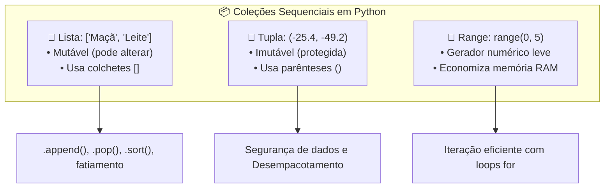

# 🚀 Aula 05 — Coleções Sequenciais: Listas Mutáveis, Tuplas Imutáveis e Iteradores (`range`)

> [!TUTOR] 🚀 Guia Prático de Estudo da Aula (Ciclo de 4 Passos em 1-Clique)
> 1. 📖 **Conceito Extensivo:** Leia as explicações teóricas minuciosas e tire dúvidas com a IA no **Modo Tutor**.
> 2. 👨‍💻 **Código & Prática:** Edite e desenvolva sua solução no arquivo `aula_05_exercicios_manual.py`.
> 3. ⚡ **Testar no Obsidian (1-Clique):** Clique em **Run** no bloco abaixo para validar sua solução:
> > [!EXERCICIO] 🧪 Avaliação 1-Clique dos Exercícios da IDE (Issue #05)
> > 📌 **Exercício Avaliado:** Issue #05 — Listas Tuplas e Ranges
> > 📁 **Arquivo de Trabalho na IDE:** `02_python_essencial/pratica/Aula 05 - Listas Tuplas e Ranges/aula_05_exercicios_manual.py`
> > ⚡ Clique no botão **Run** no canto superior direito do bloco abaixo para testar sua solução:

```python run
import sys, os, subprocess

def find_vault_root():
    curr = os.path.abspath(os.getcwd())
    while curr:
        if os.path.exists(os.path.join(curr, "avaliar_exercicio.py")):
            return curr
        parent = os.path.dirname(curr)
        if parent == curr:
            break
        curr = parent
    user_home = os.path.expanduser("~")
    for root, dirs, files in os.walk(user_home):
        if "avaliar_exercicio.py" in files:
            return root
        if root.count(os.sep) - user_home.count(os.sep) >= 4:
            dirs.clear()
    return os.path.abspath(".")

vault_root = find_vault_root()
script_path = os.path.join(vault_root, "avaliar_exercicio.py")
print("📌 [AVALIAÇÃO 1-CLIQUE] Testando Exercício da Issue #05...")
print("📁 Arquivo Alvo na IDE: 02_python_essencial/pratica/Aula 05 - Listas Tuplas e Ranges/aula_05_exercicios_manual.py")
res = subprocess.run([sys.executable, script_path, "--issue", "05"], cwd=vault_root, capture_output=True, text=True, encoding="utf-8", errors="replace")
print(res.stdout or res.stderr)
```
> 4. 🔀 **Enviar PR:** Se aprovado pela IA, envie o Pull Request no GitHub para o Tutor (@akanaul)!

---

## 💡 1. Conceito Extensivo & O Porquê

### A Analogia do Carrinho de Supermercado e das Coordenadas de GPS
Quando lidamos com múltiplos dados do mesmo tipo em uma automação, criar variáveis isoladas (`item1`, `item2`, `item3`) gera um código prolixo e difícil de manter. Para resolver isso, utilizamos coleções sequenciais:

- **Listas (`[1, 2, 3]` — Mutáveis):** São como o seu **Carrinho de Compras de Supermercado**. Você pode adicionar novos produtos (`append`), remover itens (`pop` ou `remove`), trocar o produto de uma posição por outro e reordenar as compras por preço. A lista é flexível e permite modificações a qualquer momento.
- **Tuplas (`(x, y)` — Imutáveis):** São como as **Coordenadas de GPS de uma Cidade** ou o **CPF de uma Pessoa**. Uma vez registradas, elas nunca devem mudar. A imutabilidade garante que os dados fiquem protegidos contra alterações acidentais em qualquer parte do código.
- **Ranges (`range(0, 100)` — Geradores Sequenciais):** São como a **Máquina de Emitir Senhas da Fila do Banco**. Em vez de carregar 100.000 números inteiros de uma só vez na memória RAM, o `range` gera cada número sob demanda conforme o laço avança.

---

## ⚙️ 2. Lógica de Funcionamento Interno & Mutabilidade

### Mutabilidade de Listas vs Imutabilidade de Tuplas

1. **Alteração em Memória nas Listas:** Quando você executa `minha_lista.append("item")`, o Python altera o objeto lista existente diretamente no seu endereço de memória, sem criar um novo objeto.
2. **Proteção de Memória nas Tuplas:** Se você tentar alterar o elemento de uma tupla executando `minha_tupla[0] = 10`, o interpretador lança imediatamente a exceção `TypeError: 'tuple' object does not support item assignment`.
3. **Desempacotamento de Tuplas (*Unpacking*):** Permite extrair os elementos de uma tupla diretamente para múltiplas variáveis: `latitude, longitude = (-25.42, -49.27)`.

---

## 📊 3. Diagrama Visual (Mermaid)



---

## 🖥️ 4. Sintaxe, Código Comentado & Alternativas

Abaixo, veremos como **Gerenciar uma Fila de Tarefas com Listas e Registrar Logs Seguros com Tuplas**.

### Abordagem 1: Manipulação Tradicional de Listas (`append`, `pop`, `sort`, `enumerate`)

```python
# Criando uma lista de tarefas pendentes
tarefas_pendentes = ["Enviar relatório", "Revisar código", "Comprar café"]

# Adicionando uma nova tarefa ao final da lista
tarefas_pendentes.append("Agendar reunião")

# Ordenando as tarefas em ordem alfabética
tarefas_pendentes.sort()

print("Abordagem 1 ➔ Tarefas Ordenadas:")
for posicao, tarefa in enumerate(tarefas_pendentes, start=1):
    print(f"  {posicao}. {tarefa}")

# Removendo a primeira tarefa concluída
concluida = tarefas_pendentes.pop(0)
print(f"\n✅ Tarefa Concluída e Removida: '{concluida}' | Restantes: {len(tarefas_pendentes)}")
```

---

### Abordagem 2: Uso de Tuplas para Registros de Log Imutáveis e Desempacotamento

```python
# Registrando um histórico de logins como uma lista de tuplas imutáveis: (usuario, ip, sucesso)
historico_logins = [
    ("ana.silva", "192.168.0.1", True),
    ("bruno.lima", "192.168.0.5", False),
    ("carla.souza", "192.168.0.12", True)
]

print("\nAbordagem 2 ➔ Histórico de Acesso Seguro (Tuplas):")
for usuario, ip, status in historico_logins:
    status_str = "🔓 Acesso Concedido" if status else "🔒 Acesso Bloqueado"
    print(f"  • Usuário: {usuario:<12} | IP: {ip:<12} | {status_str}")
```

---

### Abordagem 3: Compreensão de Listas (*List Comprehension*) e Fatiamento de Coleções

```python
numeros_brutos = [12, 45, 68, 23, 89, 90, 34, 100]

# Fatiamento: Extraindo os 3 primeiros e os 2 últimos
primeiros_3 = numeros_brutos[:3]
ultimos_2 = numeros_brutos[-2:]

# List Comprehension: Filtrando apenas os números pares e multiplicando por 2
pares_dobrados = [n * 2 for n in numeros_brutos if n % 2 == 0]

print(f"\nAbordagem 3 ➔ Primeiros 3: {primeiros_3} | Últimos 2: {ultimos_2}")
print(f"Pares Dobrados (List Comprehension): {pares_dobrados}")
```

---

## 🛠️ 5. Anatomia do Traceback & Tratamento Exaustivo de Exceções

### Analisando Erros Frequentes de Coleções no Terminal

#### 1. `IndexError: list index out of range`

```text
================================ TRACEBACK REAL DO TERMINAL ================================
  File "c:/projetos/aula_05.py", line 14, in <module>
    item = lista_tarefas[5]
IndexError: list index out of range
============================================================================================
```

##### Causa Raiz:
Você tentou acessar o índice numérico `5` em uma lista que contém apenas 3 elementos (índices válidos: 0, 1 e 2).

---

#### 2. `ValueError: list.remove(x): x not in list`

```text
================================ TRACEBACK REAL DO TERMINAL ================================
  File "c:/projetos/aula_05.py", line 18, in <module>
    lista_tarefas.remove("ItemInexistente")
ValueError: list.remove(x): x not in list
============================================================================================
```

##### Causa Raiz:
Você tentou remover um item usando `.remove("x")`, mas o valor `"x"` não existe dentro da lista.

---

### Tratamento Defensivo contra Erros de Busca em Listas

```python
def remover_item_seguro(lista, item_para_remover):
    """Remove um item de uma lista tratando exceções de ValueError de forma amigável."""
    try:
        lista.remove(item_para_remover)
        print(f"✅ Item '{item_para_remover}' removido com sucesso!")
        return True
    except ValueError:
        print(f"⚠️ Aviso: O item '{item_para_remover}' não foi encontrado na lista. Nenhuma alteração feita.")
        return False

# Testando remoções seguras
frutas = ["Maçã", "Banana", "Laranja"]
remover_item_seguro(frutas, "Banana")
remover_item_seguro(frutas, "Abacaxi")
```

---

## ⚖️ 6. Guia de Decisão & Recomendações Caso a Caso

| Coleção | Sintaxe | Quando Escolher |
| :--- | :--- | :--- |
| **Lista (`list`)** | `['A', 'B']` | Quando você precisa de uma **coleção dinâmica** onde itens serão adicionados, removidos ou reordenados. |
| **Tupla (`tuple`)** | `('A', 'B')` | Quando a estrutura é fixa e os **dados não devem ser alterados** por motivo de segurança. |
| **Range (`range`)** | `range(0, 10)` | Para **gerar sequências numéricas em loops** sem consumir memória RAM desnecessária. |

---

## ⚠️ 7. Armadilhas Comuns, Casos Extremos & PEP 8

> [!WARNING] **Cuidado com Cópia Roteada de Listas (`Shallow Copy`)**
> 1. **Atribuição Simples não Cria Cópia (`lista_b = lista_a`):** Fazer `lista_b = lista_a` **não cria uma nova lista**; faz ambas as variáveis apontarem para o **mesmo carrinho na memória**. Alterar `lista_b` modificará `lista_a`! Para criar uma cópia independente, use `lista_b = lista_a.copy()` ou `lista_b = lista_a[:]`.
> 2. **Tupla de Um Único Elemento Exige Vírgula:** Para criar uma tupla com apenas 1 item, a vírgula final é obrigatória: `uma_tupla = ("item",)` (sem a vírgula, o Python tratará como uma simples string entre parênteses).
> 3. **PEP 8 — Espaçamento em Coleções:**
>    - Deixe um espaço após as vírgulas em listas e tuplas: `[1, 2, 3]`.

---

## 🧠 8. Vibe Coding, Cheatsheet & Git Workflow

### Dicas de Prompt Estruturado para Ordenação e Filtragem de Coleções
Se precisar filtrar ou ordenar coleções complexas:

> **Exemplo de Prompt Recomendado:**
> *"Atue como um Especialista em Python. Tenho uma lista de tuplas `[(nome, preco)]`. Crie uma solução em Python 3.12 usando `list comprehension` que filtre apenas os itens com preço acima de R$ 50,00 e os ordene do maior para o menor valor, tratando exceções de dados inválidos."*

---

### Cheatsheet Rápido de Métodos de Lista

| Operação | Sintaxe | Descrição |
| :--- | :--- | :--- |
| `.append(item)` | `l.append("A")` | Adiciona um item ao final da lista. |
| `.insert(pos, item)`| `l.insert(0, "A")` | Insere um item na posição informada. |
| `.pop(pos)` | `l.pop(0)` | Remove e retorna o item da posição especificada. |
| `.remove(item)` | `l.remove("A")` | Remove a primeira ocorrência do valor informado. |
| `len(l)` | `len(l)` | Retorna a quantidade total de itens na coleção. |

---

### 🔀 Workflow Ativo de Git, Issue & Pull Request

Para registrar sua solução da Aula 05:

```bash
# 1. Criar branch para a Issue #05
git checkout -b feature/issue-05-listas-tuplas-ranges

# 2. Adicionar o arquivo alterado ao staging
git add 02_python_essencial/pratica/Aula\ 05\ -\ Listas\ Tuplas\ e\ Ranges/aula_05_exercicios_manual.py

# 3. Registrar o commit
git commit -m "feat(issue-05): resolucao dos exercicios de listas, tuplas e ranges"

# 4. Enviar a branch para o repositório remoto no GitHub
git push origin feature/issue-05-listas-tuplas-ranges
```

> 🚀 **Passo Final:** Abra o **Pull Request (PR)** no GitHub para avaliação do Tutor (@akanaul)!

---

## 📝 Anotações Pessoais do Aluno sobre esta Aula

> [!TIP] **Criar Nota de Estudo Relacionada**  
> Quer guardar resumos ou anotações próprias sobre esta aula?  
> Pressione `Alt + N` no Templater e selecione **Template de Anotação do Aluno** para salvar automaticamente em [[meu_caderno_aluno/anotacoes_aulas/anotacoes_aulas|meu_caderno_aluno/anotacoes_aulas/]]!