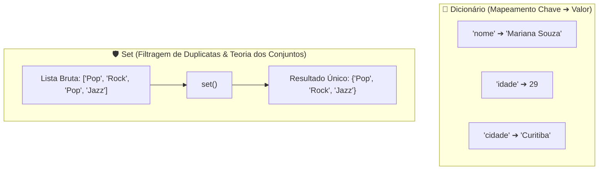

# 🚀 Aula 06 — Dicionários Estruturados (`{chave: valor}`) e Conjuntos Sem Duplicidade (`set`)

> [!TUTOR] 🚀 Guia Prático de Estudo da Aula (Ciclo de 4 Passos em 1-Clique)
> 1. 📖 **Conceito Extensivo:** Leia as explicações teóricas minuciosas e tire dúvidas com a IA no **Modo Tutor**.
> 2. 👨‍💻 **Código & Prática:** Edite e desenvolva sua solução no arquivo `aula_06_exercicios_manual.py`.
> 3. ⚡ **Testar no Obsidian (1-Clique):** Clique em **Run** no bloco abaixo para validar sua solução:
> > [!EXERCICIO] 🧪 Avaliação 1-Clique dos Exercícios da IDE (Issue #06)
> > 📌 **Exercício Avaliado:** Issue #06 — Dicionarios e Conjuntos
> > 📁 **Arquivo de Trabalho na IDE:** `02_python_essencial/pratica/Aula 06 - Dicionarios e Conjuntos/aula_06_exercicios_manual.py`
> > ⚡ Clique no botão **Run** no canto superior direito do bloco abaixo para testar sua solução:

```python run
import sys, os, subprocess

def find_vault_root():
    curr = os.path.abspath(os.getcwd())
    while curr:
        if os.path.exists(os.path.join(curr, "avaliar_exercicio.py")):
            return curr
        parent = os.path.dirname(curr)
        if parent == curr:
            break
        curr = parent
    user_home = os.path.expanduser("~")
    for root, dirs, files in os.walk(user_home):
        if "avaliar_exercicio.py" in files:
            return root
        if root.count(os.sep) - user_home.count(os.sep) >= 4:
            dirs.clear()
    return os.path.abspath(".")

vault_root = find_vault_root()
script_path = os.path.join(vault_root, "avaliar_exercicio.py")
print("📌 [AVALIAÇÃO 1-CLIQUE] Testando Exercício da Issue #06...")
print("📁 Arquivo Alvo na IDE: 02_python_essencial/pratica/Aula 06 - Dicionarios e Conjuntos/aula_06_exercicios_manual.py")
res = subprocess.run([sys.executable, script_path, "--issue", "06"], cwd=vault_root, capture_output=True, text=True, encoding="utf-8", errors="replace")
print(res.stdout or res.stderr)
```
> 4. 🔀 **Enviar PR:** Se aprovado pela IA, envie o Pull Request no GitHub para o Tutor (@akanaul)!

---

## 💡 1. Conceito Extensivo & O Porquê

### A Analogia da Agenda Telefônica e do Filtro de Músicas Duplicadas
Em aplicações reais de automação de dados, informações raramente são salvas em listas simples. Precisamos de estruturas capazes de mapear relacionamentos estruturados ou filtrar repetições instantaneamente.

- **Dicionários (`{"chave": valor}`):** São como a **Agenda de Contatos do seu Celular**. Em vez de você ter que procurar o telefone de uma cliente varrendo a lista da posição 0 até a posição 1.000, você busca diretamente pelo **Nome da Cliente (Chave)** e acessa instantaneamente o **Telefone / E-mail (Valor)** em tempo constante de busca.
- **Conjuntos / Sets (`{1, 2, 3}`):** São como um **Filtro Inteligente de Músicas em uma Playlist**. Se a mesma música for adicionada 10 vezes por engano à playlist, o `set` garante automaticamente que apenas **uma cópia única** seja mantida, eliminando todas as repetições sem você precisar fazer varreduras manuais.

---

## ⚙️ 2. Lógica de Funcionamento Interno & Tabelas Hash

### O Mecanismo da Tabela Hash (*Hash Table*)

1. **Como Funciona a Busca em Tempo Constante $O(1)$:** Tanto os Dicionários quanto os Conjuntos utilizam um algoritmo de computação chamado *Hash Table*. Quando você faz `usuario["email"]`, o Python não percorre o dicionário do início ao fim; ele aplica uma função matemática sobre a string `"email"`, descobre o endereço numérico exato na memória RAM e pula direto para o valor guardado.
2. **Exigência de Chaves Imutáveis:** Por causa da função Hash, as chaves de um dicionário e os elementos de um `set` devem ser obrigatoriamente objetos imutáveis (como `str`, `int`, `float` ou `tuple`). Você **não pode** usar uma lista mutável `[1, 2]` como chave de dicionário.
3. **Operações Matemáticas de Conjuntos:**
   - **União (`a | b`):** Combina todos os elementos de dois conjuntos sem duplicar.
   - **Intersecção (`a & b`):** Retorna apenas os elementos presentes em **ambos** os conjuntos.
   - **Diferença (`a - b`):** Retorna os elementos do primeiro conjunto que não existem no segundo.

---

## 📊 3. Diagrama Visual (Mermaid)



---

## 🖥️ 4. Sintaxe, Código Comentado & Alternativas

Abaixo, veremos como **Mapear Perfis de Usuários com Dicionários e Comparar Interesses em Comum com Sets**.

### Abordagem 1: Criação e Acesso Seguro a Dicionários com `.get()` e Iteração com `.items()` (Abordagem Oficial)

```python
# 1. Criando o dicionário de perfil de usuário
perfil_usuario = {
    "nome": "Mariana Souza",
    "idade": 29,
    "email": "mariana@email.com",
    "premium": True
}

# Acesso seguro com .get(chave, valor_padrao) — Evita o erro fatal KeyError
telefone = perfil_usuario.get("telefone", "Não Cadastrado")
cidade = perfil_usuario.get("cidade", "São Paulo")

print("Abordagem 1 ➔ Perfil do Usuário:")
print(f"  • Nome: {perfil_usuario['nome']} | Telefone: {telefone} | Cidade: {cidade}")

# Atualizando valores e adicionando novas chaves
perfil_usuario["cidade"] = "Curitiba"
perfil_usuario["pontos"] = 1500

# Iterando sobre pares (chave, valor) com .items()
print("\n📋 Dados Registrados no Dicionário:")
for chave, valor in perfil_usuario.items():
    print(f"  📌 {chave.title()}: {valor}")
```

---

### Abordagem 2: Remoção de Duplicidades e Operações de Intersecção com Conjuntos (`set`)

```python
# Lista contendo tags de pesquisa repetidas
tags_pesquisa = ["python", "musica", "python", "viagem", "musica", "tecnologia", "python"]

# Convertendo a lista para set para eliminar duplicatas instantaneamente
tags_unicas = set(tags_pesquisa)

print("\nAbordagem 2 ➔ Tags Únicas (Sem Repetições):", tags_unicas)

# Comparando interesses entre duas pessoas usando Intersecção (&)
interesses_ana = {"cinema", "python", "corrida", "fotografia"}
interesses_pedro = {"futebol", "python", "cinema", "jogos"}

interesses_comuns = interesses_ana & interesses_pedro
exclusivos_ana = interesses_ana - interesses_pedro

print(f"🤝 Interesses em Comum: {interesses_comuns}")
print(f"⭐ Exclusivos da Ana: {exclusivos_ana}")
```

---

### Abordagem 3: Mesclagem de Dicionários com o Operador de União `|` (Python 3.9+)

```python
config_padrao = {"tema": "escuro", "notificacoes": True, "idioma": "pt-br"}
config_usuario = {"idioma": "en-us", "fonte_tamanho": 14}

# Mesclando dicionários: os valores da direita sobrescrevem os da esquerda
config_final = config_padrao | config_usuario

print("\nAbordagem 3 ➔ Configurações Mescladas:")
print(config_final)
```

---

## 🛠️ 5. Anatomia do Traceback & Tratamento Exaustivo de Exceções

### Analisando Erros Frequentes de Dicionários e Sets no Terminal

#### 1. `KeyError: 'endereco'`

```text
================================ TRACEBACK REAL DO TERMINAL ================================
  File "c:/projetos/aula_06.py", line 12, in <module>
    rua = perfil_usuario["endereco"]
KeyError: 'endereco'
============================================================================================
```

##### Causa Raiz:
Você tentou acessar a chave `"endereco"` utilizando a sintaxe de colchetes `dict["chave"]`, mas essa chave não foi cadastrada no dicionário.

##### Solução:
Utilize o método seguro `.get("endereco", "Endereço Não Informado")`.

---

#### 2. `TypeError: unhashable type: 'list'`

```text
================================ TRACEBACK REAL DO TERMINAL ================================
  File "c:/projetos/aula_06.py", line 16, in <module>
    meu_dict = {[1, 2]: "Valor"}
TypeError: unhashable type: 'list'
============================================================================================
```

##### Causa Raiz:
Você tentou utilizar uma lista mutável `[1, 2]` como chave de um dicionário ou item de um `set`.

##### Solução:
Converta a lista para uma tupla imutável `(1, 2)` antes de usá-la como chave.

---

### Tratamento Defensivo contra Erros de Chave

```python
def buscar_dado_usuario_seguro(dicionario, chave):
    """Busca uma chave no dicionário tratando exceção de KeyError de forma defensiva."""
    try:
        valor = dicionario[chave]
        return valor
    except KeyError:
        print(f"⚠️ Exceção Capturada: A chave '{chave}' não existe no cadastro.")
        return None

# Testando busca segura
print("\n--- Teste de Busca de Chaves ---")
buscar_dado_usuario_seguro(perfil_usuario, "nome")
buscar_dado_usuario_seguro(perfil_usuario, "rg")
```

---

## ⚖️ 6. Guia de Decisão & Recomendações Caso a Caso

| Estrutura / Operação | Sintaxe | Quando Escolher |
| :--- | :--- | :--- |
| **Acesso `dict.get()`** | `d.get("chave", "padrão")` | **Recomendado para 90% dos casos**, pois evita o travamento por `KeyError`. |
| **Iteração `.items()`** | `for k, v in d.items():` | Sempre que precisar ler a **Chave e o Valor** simultaneamente em um loop. |
| **Remover Repetidos**| `set(minha_lista)` | A forma mais rápida e performática de **eliminar duplicatas** em uma coleção. |
| **Intersecção (`&`)** | `s1 & s2` | Para **encontrar itens presentes em ambos os grupos** simultaneamente. |

---

## ⚠️ 7. Armadilhas Comuns, Casos Extremos & PEP 8

> [!WARNING] **Cuidado com KeyError e Tentativa de Acesso por Índice em Sets**
> 1. **Sets não possuem índice numérico (`TypeError`):** Tentar fazer `meu_set[0]` causa o erro `TypeError: 'set' object is not subscriptable`. Sets não possuem ordem de índices; se precisar de posições, converta de volta para lista (`list(meu_set)`).
> 2. **Dicionários Nulos:** Sempre verifique se o dicionário não está vazio antes de tentar extrair valores numéricos para cálculo de médias.
> 3. **PEP 8 — Espaçamento em Dicionários:**
>    - Deixe um espaço após os dois pontos em cada par chave-valor: `{"nome": "Ana", "idade": 25}`.

---

## 🧠 8. Vibe Coding, Cheatsheet & Git Workflow

### Dicas de Prompt Estruturado para Dicionários Aninhados
Se precisar manipular dicionários com estruturas complexas:

> **Exemplo de Prompt Recomendado:**
> *"Atue como um Engenheiro de Software Python. Crie uma estrutura de dicionário aninhado para o cadastro de alunos de um curso (Matrícula ➔ Nome, Lista de Notas, Endereço). Mostre como adicionar uma nova nota à lista do aluno com o método `.append()` usando tratamento defensivo `try/except`."*

---

### Cheatsheet Rápido de Métodos de Dict e Set

| Método | Sintaxe | Descrição |
| :--- | :--- | :--- |
| `dict.keys()` | `d.keys()` | Retorna todas as chaves registradas no dicionário. |
| `dict.values()` | `d.values()` | Retorna todos os valores armazenados. |
| `dict.items()` | `d.items()` | Retorna os pares `(chave, valor)` para iteração. |
| `set.add(item)` | `s.add("A")` | Adiciona um novo elemento ao conjunto. |
| `set.union(s2)` | `s1.union(s2)` | Une dois conjuntos sem duplicar itens. |

---

### 🔀 Workflow Ativo de Git, Issue & Pull Request

Para registrar sua solução da Aula 06:

```bash
# 1. Criar branch para a Issue #06
git checkout -b feature/issue-06-dicionarios-conjuntos

# 2. Adicionar o arquivo alterado ao staging
git add 02_python_essencial/pratica/Aula\ 06\ -\ Dicionarios\ e\ Conjuntos/aula_06_exercicios_manual.py

# 3. Registrar o commit
git commit -m "feat(issue-06): resolucao dos exercicios de dicionarios e conjuntos"

# 4. Enviar a branch para o repositório remoto no GitHub
git push origin feature/issue-06-dicionarios-conjuntos
```

> 🚀 **Passo Final:** Abra o **Pull Request (PR)** no GitHub para avaliação do Tutor (@akanaul)!

---

## 📝 Anotações Pessoais do Aluno sobre esta Aula

> [!TIP] **Criar Nota de Estudo Relacionada**  
> Quer guardar resumos ou anotações próprias sobre esta aula?  
> Pressione `Alt + N` no Templater e selecione **Template de Anotação do Aluno** para salvar automaticamente em [[meu_caderno_aluno/anotacoes_aulas/anotacoes_aulas|meu_caderno_aluno/anotacoes_aulas/]]!