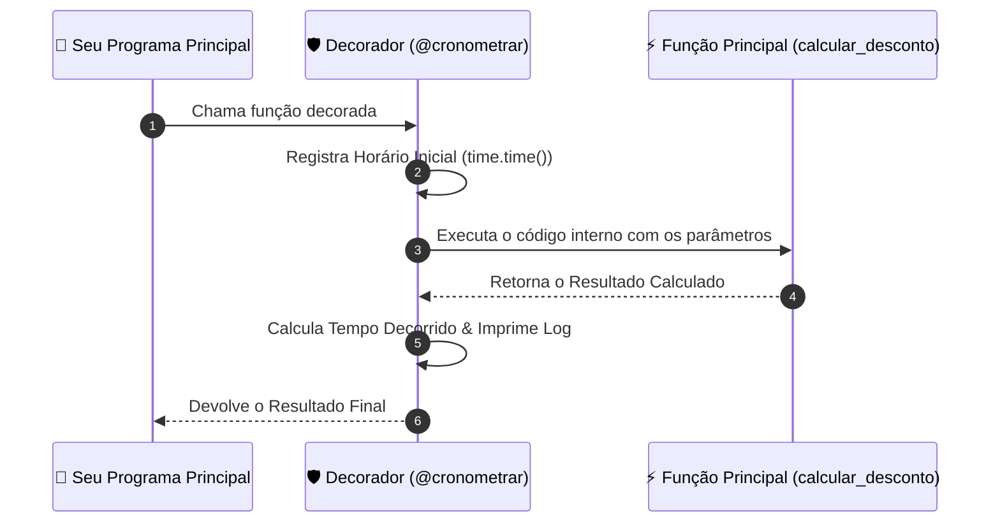

# 🚀 Aula 07 — Funções Reutilizáveis (`def`), Metaprogramação com Decoradores (`@wraps`) e Geradores (`yield`)

> [!TUTOR] 🚀 Guia Prático de Estudo da Aula (Ciclo de 4 Passos em 1-Clique)
> 1. 📖 **Conceito Extensivo:** Leia as explicações teóricas minuciosas e tire dúvidas com a IA no **Modo Tutor**.
> 2. 👨‍💻 **Código & Prática:** Edite e desenvolva sua solução no arquivo `aula_07_exercicios_manual.py`.
> 3. ⚡ **Testar no Obsidian (1-Clique):** Clique em **Run** no bloco abaixo para validar sua solução:
> > [!EXERCICIO] 🧪 Avaliação 1-Clique dos Exercícios da IDE (Issue #07)
> > 📌 **Exercício Avaliado:** Issue #07 — Funcoes
> > 📁 **Arquivo de Trabalho na IDE:** `02_python_essencial/pratica/Aula 07 - Funcoes/aula_07_exercicios_manual.py`
> > ⚡ Clique no botão **Run** no canto superior direito do bloco abaixo para testar sua solução:

```python run
import sys, os, subprocess

def find_vault_root():
    curr = os.path.abspath(os.getcwd())
    while curr:
        if os.path.exists(os.path.join(curr, "avaliar_exercicio.py")):
            return curr
        parent = os.path.dirname(curr)
        if parent == curr:
            break
        curr = parent
    user_home = os.path.expanduser("~")
    for root, dirs, files in os.walk(user_home):
        if "avaliar_exercicio.py" in files:
            return root
        if root.count(os.sep) - user_home.count(os.sep) >= 4:
            dirs.clear()
    return os.path.abspath(".")

vault_root = find_vault_root()
script_path = os.path.join(vault_root, "avaliar_exercicio.py")
print("📌 [AVALIAÇÃO 1-CLIQUE] Testando Exercício da Issue #07...")
print("📁 Arquivo Alvo na IDE: 02_python_essencial/pratica/Aula 07 - Funcoes/aula_07_exercicios_manual.py")
res = subprocess.run([sys.executable, script_path, "--issue", "07"], cwd=vault_root, capture_output=True, text=True, encoding="utf-8", errors="replace")
print(res.stdout or res.stderr)
```
> 4. 🔀 **Enviar PR:** Se aprovado pela IA, envie o Pull Request no GitHub para o Tutor (@akanaul)!

---

## 💡 1. Conceito Extensivo & O Porquê

### A Analogia da Receita Culinária, do Inspetor de Qualidade e do Servidor de Streaming
Conforme os programas de computador crescem em complexidade, duplicar trechos de código em múltiplos arquivos torna o sistema frágil e difícil de manter. Para resolver isso, utilizaremos a modularização avançada em Python:

- **Funções (`def`):** São como **Receitas Culinárias Reaproveitáveis**. Em vez de você ter que reescrever toda a sequência de cálculos para aplicar o desconto em uma compra em vários arquivos do projeto, você cria a função `calcular_desconto(valor)` e chama essa receita pronta sempre que precisar.
- **Decoradores (`@decorador`):** São como um **Inspetor de Qualidade**. Ele se posiciona na entrada de uma função para medir quanto tempo ela levou para ser executada, verificar se o usuário possui permissão de acesso ou gravar logs de auditoria, **sem alterar uma única linha** do código interno da função original.
- **Geradores (`yield`):** São como um **Servidor de Streaming de Vídeo**. Em vez de carregar um filme de 40GB inteiro de uma vez na memória RAM do computador antes de assistir, o `yield` envia o vídeo em pequenos pedaços (quadro por quadro) conforme você assiste.

---

## ⚙️ 2. Lógica de Funcionamento Interno & Metaprogramação

### Escopo de Variáveis, Retornos e Avaliação Preguiçosa (*Lazy Evaluation*)

1. **Escopo Local vs Global:** Variáveis criadas dentro de uma função existem apenas enquanto a função está em execução (escopo local). Tentar acessar uma variável interna fora da função lançará o erro `NameError`.
2. **Metaprogramação com Decoradores:** Um decorador é uma função que recebe outra função como argumento, cria uma função interna wrappers (`*args`, `**kwargs`) para injetar comportamentos antes/depois, e retorna essa nova função decorada. O uso de `@wraps(func)` do módulo `functools` preserva o nome e docstrings da função original.
3. **Geradores e Pausa com `yield`:** Quando uma função possui a palavra-chave `yield`, o Python não a executa de uma vez. Ela se transforma em um gerador que pausa seu estado atual a cada `yield` e só continua quando a função `next()` for chamada novamente.

---

## 📊 3. Diagrama Visual (Mermaid)



---

## 🖥️ 4. Sintaxe, Código Comentado & Alternativas

Abaixo, veremos como **Calculamos Descontos, Auditamos o Tempo com Decoradores e Transmitimos Dados com Geradores**.

### Abordagem 1: Função Tradicional com Argumentos Opcionais e Retorno (Abordagem Oficial)

```python
def calcular_preco_final(preco_original, percentual_desconto=10.0, taxa_entrega=15.0):
    """
    Calcula o preço final aplicando desconto e somando a taxa de entrega.
    
    Parâmetros:
      preco_original (float): Valor inicial do produto.
      percentual_desconto (float): Desconto percentual (padrão: 10%).
      taxa_entrega (float): Taxa fixa de frete (padrão: R$ 15,00).
    """
    valor_desconto = preco_original * (percentual_desconto / 100)
    preco_com_desconto = preco_original - valor_desconto
    total_final = preco_com_desconto + taxa_entrega
    
    return round(total_final, 2)

# Testando a função com parâmetros padrão e nomeados
total1 = calcular_preco_final(100.00)  # Usará 10% desconto e R$ 15 frete ➔ R$ 105.00
total2 = calcular_preco_final(200.00, percentual_desconto=20.0, taxa_entrega=0.0)  # R$ 160.00

print(f"Abordagem 1 ➔ Exemplo 1: R$ {total1:.2f} | Exemplo 2: R$ {total2:.2f}")
```

---

### Abordagem 2: Criando um Decorador Reutilizável com `@wraps` para Medição de Tempo

```python
import time
from functools import wraps

# Definindo o decorador para cronometrar funções
def cronometrar(func):
    @wraps(func)
    def wrapper(*args, **kwargs):
        inicio = time.time()
        resultado = func(*args, **kwargs)
        duracao = time.time() - inicio
        print(f"⏱️ [{func.__name__}] Tempo de execução: {duracao:.4f} segundos.")
        return resultado
    return wrapper

# Aplicando o decorador à função
@cronometrar
def processar_lote_dados(quantidade):
    """Simula o processamento pesado de uma lista de dados."""
    soma = sum(i ** 2 for i in range(quantidade))
    return soma

# Executando a função decorada
resultado_lote = processar_lote_dados(500_000)
print(f"Abordagem 2 ➔ Resultado do lote: {resultado_lote}")
```

---

### Abordagem 3: Criando um Gerador com `yield` para Economia Severa de Memória RAM

```python
def gerador_stream_notificacoes():
    """Gera mensagens de notificação sob demanda sem guardar todas na RAM."""
    yield "📩 Notificação 1: Pedido Criado"
    yield "💳 Notificação 2: Pagamento Confirmado"
    yield "🚚 Notificação 3: Produto Enviado para Transportadora"

# Consumindo o gerador com a função next()
stream = gerador_stream_notificacoes()

print("\nAbordagem 3 ➔ Streaming de Notificações (yield):")
print("  •", next(stream))
print("  •", next(stream))
print("  •", next(stream))
```

---

## 🛠️ 5. Anatomia do Traceback & Tratamento Exaustivo de Exceções

### Analisando Erros Frequentes em Funções no Terminal

#### 1. `TypeError: calcular_preco_final() missing 1 required positional argument: 'preco_original'`

```text
================================ TRACEBACK REAL DO TERMINAL ================================
  File "c:/projetos/aula_07.py", line 15, in <module>
    resultado = calcular_preco_final()
TypeError: calcular_preco_final() missing 1 required positional argument: 'preco_original'
============================================================================================
```

##### Causa Raiz:
Você chamou a função sem passar o argumento obrigatório `preco_original`, que não possui valor padrão definido na assinatura da função.

---

#### 2. `StopIteration` em Geradores

```text
================================ TRACEBACK REAL DO TERMINAL ================================
  File "c:/projetos/aula_07.py", line 25, in <module>
    item = next(stream)
StopIteration
============================================================================================
```

##### Causa Raiz:
Você chamou `next()` em um gerador que já entregou todos os seus valores `yield` e chegou ao fim de sua execução.

---

### Tratamento Defensivo contra Exaustão de Geradores

```python
def consumir_gerador_seguro(gerador):
    """Consome um gerador tratando a exceção StopIteration de forma graciosa."""
    while True:
        try:
            item = next(gerador)
            print(f"📦 Item Recebido do Stream: {item}")
        except StopIteration:
            print("✅ Stream de dados encerrado (StopIteration tratado com sucesso).")
            break

# Testando consumo seguro
consumir_gerador_seguro(gerador_stream_notificacoes())
```

---

## ⚖️ 6. Guia de Decisão & Recomendações Caso a Caso

| Recurso | Sintaxe | Quando Escolher |
| :--- | :--- | :--- |
| **Função (`def`)** | `def minha_func(a, b=0):` | **Padrão Obrigatório** para reutilizar trechos de código em mais de um lugar. |
| **`*args` e `**kwargs`**| `def f(*args, **kwargs):` | Quando a função precisa receber um **número indeterminado de argumentos** numéricos ou nomeados. |
| **Decorador (`@`)** | `@meu_decorador` | Para **injetar comportamentos transversais** (logs, medição de tempo, checagem de login) sem alterar as funções. |
| **Gerador (`yield`)** | `yield item` | Perfeito para **ler arquivos gigantescos** (como logs de 5GB) sem estourar a memória RAM. |

---

## ⚠️ 7. Armadilhas Comuns, Casos Extremos & PEP 8

> [!WARNING] **Cuidado com Retorno Involuntário de `None` e Objetos Mutáveis nos Argumentos Padrão**
> 1. **Esquecer a Instrução `return`:** Se você esquecer de colocar `return` no final de uma função, o Python retornará `None`. Fazer `x = funcao_sem_return() + 10` causará o erro `TypeError: unsupported operand type(s) for +: 'NoneType' and 'int'`.
> 2. **Usar Listas Mutáveis como Argumento Padrão (`def f(l=[])`):** NUNCA use `def f(lista=[])`. O Python compartilha essa mesma lista em todas as chamadas futuras da função! Use `def f(lista=None): if lista is None: lista = []`.
> 3. **PEP 8 — Espaçamento entre Funções:**
>    - Deixe exatamente 2 linhas em branco antes e depois de definir funções no nível superior do script.

---

## 🧠 8. Vibe Coding, Cheatsheet & Git Workflow

### Dicas de Prompt Estruturado para Decoradores Personalizados
Se precisar criar decoradores para tratamento de exceções ou retentativas:

> **Exemplo de Prompt Recomendado:**
> *"Atue como um Arquiteto de Software Python. Crie um decorador personalizado chamado `@retry(tentativas=3)` que tente executar uma função até 3 vezes se ela lançar uma exceção de conexão. Utilize `from functools import wraps` e inclua docstrings explicativas."*

---

### Cheatsheet Rápido de Funções e Geradores

| Recurso / Palavra-Chave | Exemplo | Descrição |
| :--- | :--- | :--- |
| **Retorno** | `return valor` | Devolve o resultado calculado e encerra a função. |
| **Padrão de Parâmetro** | `def f(x=10):` | Define valor padrão para o argumento caso omitido. |
| **Gerador** | `yield valor` | Pausa a função e entrega um valor de cada vez. |
| **Consumir Gerador** | `next(gerador)` | Pede o próximo elemento gerado pelo `yield`. |
| **Decorador Nativo** | `from functools import wraps`| Garante a preservação dos metadados da função decorada. |

---

### 🔀 Workflow Ativo de Git, Issue & Pull Request

Para registrar sua solução da Aula 07:

```bash
# 1. Criar branch para a Issue #07
git checkout -b feature/issue-07-funcoes-pep8

# 2. Adicionar o arquivo alterado ao staging
git add 02_python_essencial/pratica/Aula\ 07\ -\ Funcoes/aula_07_exercicios_manual.py

# 3. Registrar o commit
git commit -m "feat(issue-07): resolucao dos exercicios de funcoes, decoradores e geradores"

# 4. Enviar a branch para o repositório remoto no GitHub
git push origin feature/issue-07-funcoes-pep8
```

> 🚀 **Passo Final:** Abra o **Pull Request (PR)** no repositório para a revisão oficial do Tutor (@akanaul)!

---

## 📝 Anotações Pessoais do Aluno sobre esta Aula

> [!TIP] **Criar Nota de Estudo Relacionada**  
> Quer guardar resumos ou anotações próprias sobre esta aula?  
> Pressione `Alt + N` no Templater e selecione **Template de Anotação do Aluno** para salvar automaticamente em [[meu_caderno_aluno/anotacoes_aulas/anotacoes_aulas|meu_caderno_aluno/anotacoes_aulas/]]!