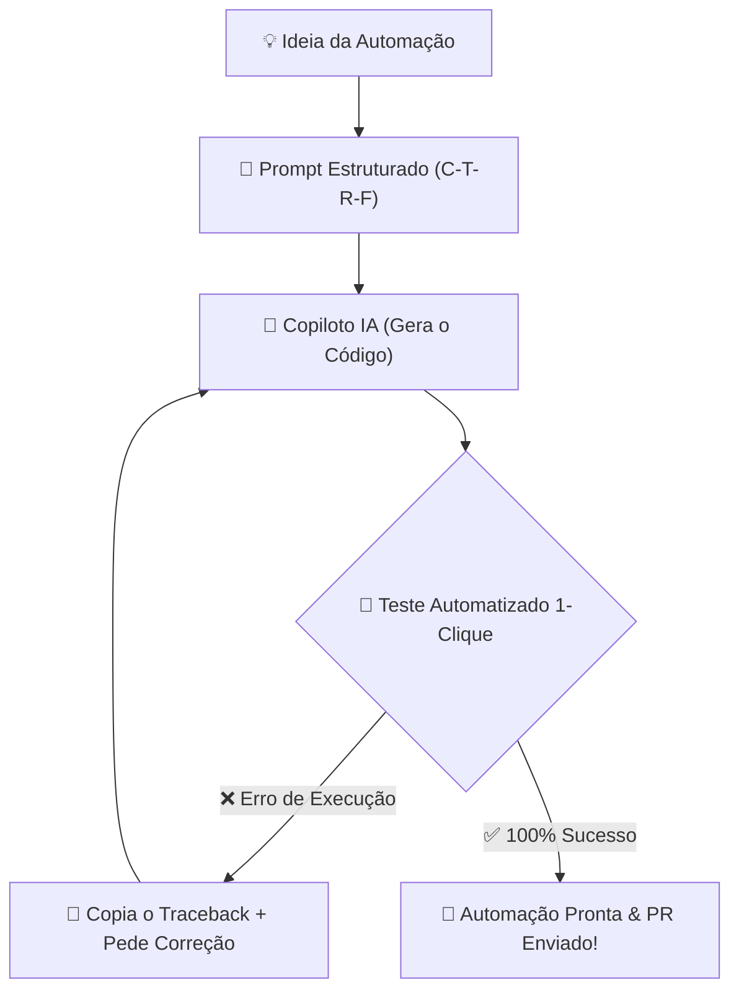

# 🚀 Aula 08 — Vibe Coding e Engenharia de Prompts Prática na Solução de Problemas Realistas

> [!TUTOR] 🚀 Guia Prático de Estudo da Aula (Ciclo de 4 Passos em 1-Clique)
> 1. 📖 **Conceito Extensivo:** Leia as explicações teóricas minuciosas e tire dúvidas com a IA no **Modo Tutor**.
> 2. 👨‍💻 **Código & Prática:** Edite e desenvolva sua solução no arquivo `aula_08_exercicios_manual.py`.
> 3. ⚡ **Testar no Obsidian (1-Clique):** Clique em **Run** no bloco abaixo para validar sua solução:
> > [!EXERCICIO] 🧪 Avaliação 1-Clique dos Exercícios da IDE (Issue #08)
> > 📌 **Exercício Avaliado:** Issue #08 — Vibe Coding e Engenharia de Prompt
> > 📁 **Arquivo de Trabalho na IDE:** `02_python_essencial/pratica/Aula 08 - Vibe Coding e Engenharia de Prompt/aula_08_exercicios_manual.py`
> > ⚡ Clique no botão **Run** no canto superior direito do bloco abaixo para testar sua solução:

```python run
import sys, os, subprocess

def find_vault_root():
    curr = os.path.abspath(os.getcwd())
    while curr:
        if os.path.exists(os.path.join(curr, "avaliar_exercicio.py")):
            return curr
        parent = os.path.dirname(curr)
        if parent == curr:
            break
        curr = parent
    user_home = os.path.expanduser("~")
    for root, dirs, files in os.walk(user_home):
        if "avaliar_exercicio.py" in files:
            return root
        if root.count(os.sep) - user_home.count(os.sep) >= 4:
            dirs.clear()
    return os.path.abspath(".")

vault_root = find_vault_root()
script_path = os.path.join(vault_root, "avaliar_exercicio.py")
print("📌 [AVALIAÇÃO 1-CLIQUE] Testando Exercício da Issue #08...")
print("📁 Arquivo Alvo na IDE: 02_python_essencial/pratica/Aula 08 - Vibe Coding e Engenharia de Prompt/aula_08_exercicios_manual.py")
res = subprocess.run([sys.executable, script_path, "--issue", "08"], cwd=vault_root, capture_output=True, text=True, encoding="utf-8", errors="replace")
print(res.stdout or res.stderr)
```
> 4. 🔀 **Enviar PR:** Se aprovado pela IA, envie o Pull Request no GitHub para o Tutor (@akanaul)!

---

## 💡 1. Conceito Extensivo & O Porquê

### A Analogia do Maestro e da Orquestra Filarmônica Inteligente
No paradigma tradicional de desenvolvimento, o programador atuava como o **Músico Solista**, que precisava dominar individualmente a física do instrumento de cordas e tocar cada nota manual de uma partitura complexa.

No **Vibe Coding**, você eleva seu papel para o de **Maestro da Orquestra Filarmônica**:
- Os músicos virtuais altamente treinados (os modelos de Inteligência Artificial) possuem conhecimento profundo de milhares de partituras (códigos em Python, C++, Java), mas dependem inteiramente dos movimentos da **Batuta do Maestro (O Prompt)** para tocar em sincronia perfeita.
- Se o Maestro apenas disser *"Toquem algo bonito"* (prompt vago), cada músico tocará um estilo diferente e a música virará um caos incompreensível. Se o Maestro apresentar a partitura com velocidade, tom, entradas e pausas (estrutura C-T-R-F), a apresentação será um espetáculo inesquecível.

---

## ⚙️ 2. Lógica de Funcionamento Interno & Estruturação de Prompts

### A Estrutura de Engenharia de Prompt C-T-R-F

Para obter códigos de alta qualidade e prontos para produção na primeira tentativa, você deve estruturar seus prompts sob quatro pilares fundamentais:

```text
[1. Contexto (C)] ➔ [2. Tarefa (T)] ➔ [3. Restrições (R)] ➔ [4. Formato (F)]
```

1. **Contexto (C):** Define quem é você, qual o cenário e onde o código rodará. Exemplo: *"Sou um estudante iniciante criando uma automação pessoal de tarefas no Windows."*
2. **Tarefa (T):** Explica a ação concreta que a IA deve programar. Exemplo: *"Crie uma função que receba uma lista de preços e filtre apenas os itens acima de R$ 50,00."*
3. **Restrições (R):** Define os limites e o que a IA **não** deve fazer. Exemplo: *"Não use bibliotecas externas como pandas ou numpy. Use apenas funções nativas do Python."*
4. **Formato (F):** Especifica como a resposta deve ser apresentada. Exemplo: *"Apresente o código Python comentado passo a passo para que eu possa aprender a lógica."*

---

## 📊 3. Diagrama Visual (Mermaid)



---

## 🖥️ 4. Sintaxe, Código Comentado & Alternativas

Abaixo, compararemos a diferença prática entre solicitar código de forma vaga versus solicitar código usando a estrutura C-T-R-F.

### Comparação: Prompt Vago vs Prompt Estruturado (C-T-R-F)

```text
❌ PROMPT VAGO (Gera códigos genéricos ou difíceis de entender):
"Filtra essa lista de compras pra mim em Python."

✅ PROMPT ESTRUTURADO C-T-R-F (Gera soluções precisas e didáticas):
"Sou aluno iniciante de Python. Tenho uma lista de compras: compras = ['arroz', 'feijão', 'sabão', 'café', 'sabão', 'arroz']. 
Crie uma função em Python que receba essa lista, remova os itens duplicados mantendo a ordem original e retorne uma nova lista com os nomes formatados em maiúsculas. 
Restrição: Use a biblioteca padrão do Python (como listas ou dicionários), sem instalar pacotes externos. 
Formato: Mostre o código com comentários explicativos e tratamento defensivo try/except para que eu possa aprender a lógica."
```

---

### Código Resultado Gerado e Inspecionado pelo Aluno (Comentado Passo a Passo):

```python
def filtrar_compras_unicas(lista_compras):
    """
    Recebe uma lista de itens e remove duplicidades mantendo a ordem original de inserção.
    """
    if not isinstance(lista_compras, list):
        print("⚠️ Erro de entrada: O argumento deve ser uma lista.")
        return []
        
    itens_unicos = []
    
    for item in lista_compras:
        if isinstance(item, str):
            # Padroniza a string removendo espaços e convertendo para maiúsculas
            item_formatado = item.strip().upper()
            
            # Adiciona à nova lista apenas se o item ainda não estiver presente
            if item_formatado not in itens_unicos:
                itens_unicos.append(item_formatado)
                
    return itens_unicos

# Testando a função com dados do dia a dia
compras_brutas = ["arroz", "feijão", "sabão", "café", "sabão", "arroz"]
resultado_limpo = filtrar_compras_unicas(compras_brutas)

print("Abordagem C-T-R-F ➔ Lista Bruta:", compras_brutas)
print("Lista Limpa sem Duplicatas:", resultado_limpo)
```

---

## 🛠️ 5. Anatomia do Traceback & Tratamento Exaustivo de Exceções

### Analisando Erros Frequentes ao Executar Códigos Sugeridos pela IA

#### 1. `ModuleNotFoundError: No module named 'pandas'`

```text
================================ TRACEBACK REAL DO TERMINAL ================================
  File "c:/projetos/aula_08.py", line 5, in <module>
    import pandas as pd
ModuleNotFoundError: No module named 'pandas'
============================================================================================
```

##### Causa Raiz:
A IA sugeriu uma solução que depende da biblioteca externa `pandas`, mas você não a instalou no seu ambiente virtual (`venv`) ou não adicionou a restrição *"Use apenas bibliotecas nativas"* no prompt.

---

### Como Enviar o Traceback de Erro de Volta para a IA para Debugging Guiado

Quando o terminal exibir um erro, não tente adivinhar a solução. Copie o bloco de erro completo e envie para o copiloto usando a estrutura de Debugging:

```text
PROMPT DE CORREÇÃO DE BUG (DEBUGGING):
"Rodei o código que você me sugeriu e recebi a seguinte mensagem de erro no terminal:
`ModuleNotFoundError: No module named 'pandas'`

Por favor, refatore o código para não utilizar a biblioteca pandas. 
Reescreva a função usando apenas a biblioteca padrão nativa do Python (como csv ou json)."
```

---

## ⚖️ 6. Guia de Decisão & Recomendações Caso a Caso

| Pilar do Prompt | Significado Didático | Exemplo de Aplicação |
| :--- | :--- | :--- |
| **C — Contexto** | Estabelece o cenário e o público | *"Sou aluno do curso Python e IA para Automação..."* |
| **T — Tarefa** | Ação exata desejada | *"Crie uma função para calcular a taxa de entrega..."* |
| **R — Restrição** | Limites técnicos e bibliotecas permitidas | *"Não use pandas. Use apenas o módulo nativo csv."* |
| **F — Formato** | Estilo visual do retorno | *"Retorne em um bloco de código único com docstrings."* |

---

## ⚠️ 7. Armadilhas Comuns, Casos Extremos & PEP 8

> [!WARNING] **Cuidado com o Aceite Cego e Comandos Destrutivos**
> 1. **Executar Comandos do Terminal sem Entender:** NUNCA copie e rode comandos sugeridos pela IA no seu terminal se eles contiverem `rm -rf`, `DROP DATABASE` ou exclusões de arquivos sem ter certeza absoluta do impacto.
> 2. **Copiar Erros sem Ler a Primeira e Última Linha:** Quando o Python lançar uma exceção, leia a mensagem de erro (ex: `KeyError`, `FileNotFoundError`) para entender o que aconteceu antes de pedir ajuda à IA.
> 3. **PEP 8 — Clareza nos Prompts:**
>    - Peça à IA que nomeie variáveis de acordo com a PEP 8 em `snake_case` e adicione docstrings explicativas nas funções.

---

## 🧠 8. Vibe Coding, Cheatsheet & Git Workflow

### Dicas de Prompt para Feedback de Erros (Debugging Guiado)
Quando um script lançar um erro durante os seus testes:

> **Exemplo de Prompt para Correção de Bugs:**
> *"Rodei o código abaixo e recebi o seguinte erro: `FileNotFoundError: [Errno 2] No such file or directory: 'dados.csv'`. Como posso corrigir meu script usando `pathlib.Path` para garantir que o arquivo seja encontrado em qualquer sistema operacional?"*

---

### Cheatsheet Rápido dos Pilares de Prompt

| Pilar | Pergunta Chave | Exemplo Curto |
| :--- | :--- | :--- |
| **Contexto** | Quem sou eu e onde o código roda? | `"Sou iniciante em Python..."` |
| **Tarefa** | O que o código deve fazer exatamente? | `"Filtre a lista de notas..."` |
| **Restrição**| O que não pode ser usado? | `"Sem usar pacotes externos..."` |
| **Formato** | Como deve ser entregue? | `"Código comentado em português..."` |

---

### 🔀 Workflow Ativo de Git, Issue & Pull Request

Para registrar sua evolução na Aula 08:

```bash
# 1. Criar branch para a Issue #08
git checkout -b feature/issue-08-prompt-engineering

# 2. Adicionar o arquivo alterado ao staging
git add 02_python_essencial/pratica/Aula\ 08\ -\ Vibe\ Coding\ e\ Engenharia\ de\ Prompt/aula_08_exercicios_manual.py

# 3. Registrar o commit
git commit -m "feat(issue-08): resolucao dos exercicios de vibe coding e engenharia de prompt"

# 4. Enviar a branch para o GitHub
git push origin feature/issue-08-prompt-engineering
```

> 🚀 **Passo Final:** Abra o **Pull Request (PR)** no GitHub para revisão do Tutor (@akanaul)!

---

## 📝 Anotações Pessoais do Aluno sobre esta Aula

> [!TIP] **Criar Nota de Estudo Relacionada**  
> Quer guardar resumos ou anotações próprias sobre esta aula?  
> Pressione `Alt + N` no Templater e selecione **Template de Anotação do Aluno** para salvar automaticamente em [[meu_caderno_aluno/anotacoes_aulas/anotacoes_aulas|meu_caderno_aluno/anotacoes_aulas/]]!