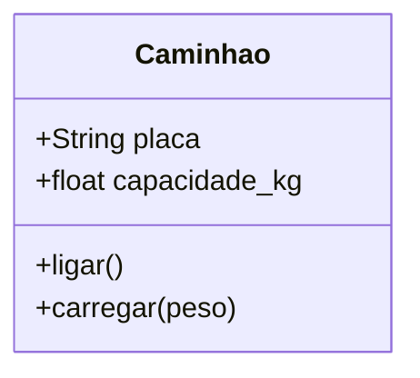

# Aula 9A — Módulos e POO Básico
> 💡 **O que você vai aprender:** O que são módulos (import, from), classes, objetos, atributos e métodos, focando na aplicação em sistemas logísticos.
> ⏱️ **Duração estimada:** 2h | 📅 **Bloco:** 3

---

## 🎯 Objetivos da Aula
- Entender como organizar código em módulos para reutilização.
- Compreender os conceitos básicos de Programação Orientada a Objetos (Classes e Objetos).
- Modelar entidades do mundo real (ex: Caminhões, Entregas) usando POO em Python.

---

## 📊 Diagrama Visual (Mermaid)


---

## 📖 Prosa de 2h (Conceito e Explicação)
Quando seu código começa a crescer (como a frota de uma transportadora), colocá-lo todo em um único arquivo é como tentar gerenciar todo o armazém em uma única planilha sem abas. **Módulos** permitem separar as lógicas. Já a **POO (Programação Orientada a Objetos)** nos permite criar "moldes" (classes) para gerar "produtos" (objetos). Em logística, você tem vários caminhões. A classe é a especificação do caminhão. Os objetos são os caminhões reais rodando!

### Novidades de Mercado
Em vez de reinventar a roda, módulos nativos como `datetime` (agora otimizado com `zoneinfo` para fusos horários precisos de entregas internacionais) e `pathlib` (para caminhos de arquivos modernos em vez de strings soltas) facilitam muito.

---

## 🔗 Conexão com os Projetos Reais
> 💼 **AutoMDFText:** Usamos classes para modelar os dados extraídos, separando o processamento de texto em um módulo específico.
> 📊 **AutoPickingPy:** Módulos nos permitem organizar as funções de leitura do Excel longe das funções de envio de e-mail.

---

## 💻 Tríade Dev+IA (Exemplos)

### Exemplo 1 — Módulos Modernos
```python
# Importando o pathlib moderno para caminhos logísticos
from pathlib import Path
from zoneinfo import ZoneInfo
from datetime import datetime

pasta_xml = Path("C:/xml_cte")
agora = datetime.now(ZoneInfo("America/Sao_Paulo"))
```

### Exemplo 2 — Aplicado à Logística (POO)
```python
class Truck:
    def __init__(self, plate, capacity):
        self.plate = plate
        self.capacity = capacity
        
    def load_cargo(self, weight):
        if weight <= self.capacity:
            print(f"Carga de {weight}kg alocada no caminhão {self.plate}")
        else:
            print(f"Excesso de peso para o caminhão {self.plate}")

meu_caminhao = Truck("ABC-1234", 15000)
meu_caminhao.load_cargo(10000)
```

### Exemplo 3 — Com IA (Antigravity)
> 🤖 **Prompt sugerido:**
> "Crie um módulo Python `freight.py` com uma classe `Route` que calcule a distância. Use boas práticas."

---

## 🔗 Links de Código e Prática
> 📁 Arquivo de prática: `exercicios/aula_09A_exercicios.py`

**Exercício 1 — [Nível: Básico]**
Crie uma classe `Warehouse` com um atributo de capacidade.
**Exercício 2 — [Nível: Intermediário]**
Importe a classe de outro arquivo e simule a entrada de mercadorias.

---

## 👣 Rodapé / Conexão com a Próxima Aula
Na próxima aula, vamos aprofundar em POO com Composição e aprender como salvar esses objetos!
#aula #bloco-3 #python #poo
