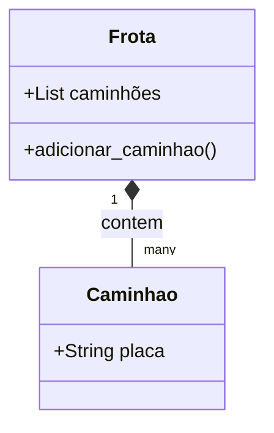

# Aula 9B — POO Prático, Composição e Persistência
> 💡 **O que você vai aprender:** Composição de objetos e como salvar e carregar dados estruturados, essenciais para relatórios.
> ⏱️ **Duração estimada:** 2h | 📅 **Bloco:** 3

---

## 🎯 Objetivos da Aula
- Aplicar composição de classes (um Objeto dentro de outro).
- Entender persistência básica (salvar dados).
- Integrar objetos complexos para gerenciar rotas e estoques.

---

## 📊 Diagrama Visual (Mermaid)


---

## 📖 Prosa de 2h (Conceito e Explicação)
Um caminhão sozinho é bom, mas uma transportadora tem uma Frota. Na programação, quando uma classe possui outra, chamamos isso de **Composição**. A classe `Frota` tem uma lista de objetos `Caminhao`. Isso espelha exatamente a vida real em sistemas ERP (onde um Pedido tem vários Itens).
Quando o sistema desliga, a memória é apagada. Precisamos da **Persistência** (salvar em arquivo, como `.json` ou texto). Modernamente, usamos o `pathlib.Path` para garantir que os arquivos sejam gravados no diretório correto em qualquer sistema!

---

## 🔗 Conexão com os Projetos Reais
> 💼 **AutoMDFText:** Composição é usada quando um arquivo de texto extraído possui vários blocos de informações.
> 📊 **AutoPickingPy:** Uma classe `Report` pode conter vários objetos `Row` processados do Excel.

---

## 💻 Tríade Dev+IA (Exemplos)

### Exemplo 1 — Composição Logística
```python
class Item:
    def __init__(self, name, weight):
        self.name = name
        self.weight = weight

class Order:
    def __init__(self, order_id):
        self.order_id = order_id
        self.items = [] # Composição!
        
    def add_item(self, item):
        self.items.append(item)
```

### Exemplo 2 — Persistência Moderna
```python
import json
from pathlib import Path

data_folder = Path("dados")
data_folder.mkdir(exist_ok=True) # pathlib facilita tudo!

route_data = {"route": "SP-RJ", "driver": "João"}
file_path = data_folder / "route_01.json"

with file_path.open("w", encoding="utf-8") as f:
    json.dump(route_data, f)
```

### Exemplo 3 — Com IA (Antigravity)
> 🤖 **Prompt sugerido:**
> "Crie um script Python que leia um JSON usando pathlib e instancie objetos da classe `Order` para cada registro."

---

## 🔗 Links de Código e Prática
> 📁 Arquivo de prática: `exercicios/aula_09B_exercicios.py`

**Exercício 1:** Crie a classe Transportadora que recebe vários Caminhões.
**Exercício 2:** Salve a lista de placas num arquivo texto usando `pathlib`.

---

## 👣 Rodapé / Conexão com a Próxima Aula
Agora que sabemos modelar e salvar dados simples, na Aula 10 mergulharemos em arquivos de texto e CSV massivos!
#aula #bloco-3 #python #poo #persistencia
