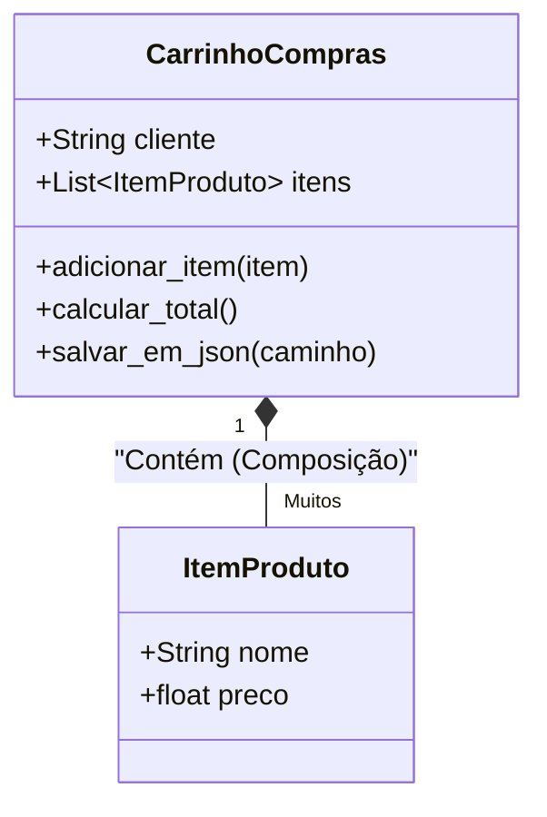

# 🚀 Aula 09B — POO Avançado: Composição de Objetos e Persistência de Dados em Arquivos (`json`)

> [!TUTOR] 🚀 Guia Prático de Estudo da Aula (Ciclo de 4 Passos em 1-Clique)
> 1. 📖 **Conceito Extensivo:** Leia as explicações teóricas minuciosas e tire dúvidas com a IA no **Modo Tutor**.
> 2. 👨‍💻 **Código & Prática:** Edite e desenvolva sua solução no arquivo `aula_09b_exercicios_manual.py`.
> 3. ⚡ **Testar no Obsidian (1-Clique):** Clique em **Run** no bloco abaixo para validar sua solução:
> > [!EXERCICIO] 🧪 Avaliação 1-Clique dos Exercícios da IDE (Issue #09b)
> > 📌 **Exercício Avaliado:** Issue #09b — POO Pratico Composicao e Persistencia
> > 📁 **Arquivo de Trabalho na IDE:** `03_poo/pratica/Aula 09B - POO Pratico Composicao e Persistencia/aula_09b_exercicios_manual.py`
> > ⚡ Clique no botão **Run** no canto superior direito do bloco abaixo para testar sua solução:

```python run
import sys, os, subprocess

def find_vault_root():
    curr = os.path.abspath(os.getcwd())
    while curr:
        if os.path.exists(os.path.join(curr, "avaliar_exercicio.py")):
            return curr
        parent = os.path.dirname(curr)
        if parent == curr:
            break
        curr = parent
    user_home = os.path.expanduser("~")
    for root, dirs, files in os.walk(user_home):
        if "avaliar_exercicio.py" in files:
            return root
        if root.count(os.sep) - user_home.count(os.sep) >= 4:
            dirs.clear()
    return os.path.abspath(".")

vault_root = find_vault_root()
script_path = os.path.join(vault_root, "avaliar_exercicio.py")
print("📌 [AVALIAÇÃO 1-CLIQUE] Testando Exercício da Issue #09b...")
print("📁 Arquivo Alvo na IDE: 03_poo/pratica/Aula 09B - POO Pratico Composicao e Persistencia/aula_09b_exercicios_manual.py")
res = subprocess.run([sys.executable, script_path, "--issue", "09b"], cwd=vault_root, capture_output=True, text=True, encoding="utf-8", errors="replace")
print(res.stdout or res.stderr)
```
> 4. 🔀 **Enviar PR:** Se aprovado pela IA, envie o Pull Request no GitHub para o Tutor (@akanaul)!

---

## 💡 1. Conceito Extensivo & O Porquê

### A Analogia do Carrinho de Compras e da Caderneta de Anotações Permanente
Na vida real, objetos complexos raramente existem isolados no espaço. Eles são construídos através da união de objetos menores:

- **Composição de Objetos (Relacionamento "Tem-Um"):** Um **Carrinho de Compras de E-commerce** possui uma lista interna contendo várias instâncias da classe **ItemProduto**. Em POO, a **Composição** ocorre quando uma classe guarda instâncias de outras classes dentro dos seus atributos, permitindo construir sistemas modulares e realistas.
- **Persistência de Dados (`json` + `pathlib`):** Quando você encerra a execução de um script Python, todos os objetos criados na memória RAM são completamente apagados. Para garantir que as informações não se percam ao desligar o computador, precisamos salvar o estado dos objetos em arquivos no disco (como arquivos `.json`). É como anotar a lista de compras em uma caderneta física para consultar no dia seguinte.

---

## ⚙️ 2. Lógica de Funcionamento Interno & Serialização

### Serialização JSON, Deserialização e Manipulação de Caminhos com `pathlib`

1. **O que é Serialização:** É o processo de converter um objeto Python vivo na memória RAM em um formato de texto padronizado (como JSON) que possa ser gravado em disco ou transmitido pela rede.
2. **Por que o `json.dump()` não aceita Objetos Personalizados Diretamente:** O módulo nativo `json` sabe converter dicionários (`dict`), listas (`list`), números e textos. No entanto, se você passar um objeto de uma classe personalizada diretamente para `json.dump(meu_objeto, f)`, o Python lançará um `TypeError: Object of type MinhaClasse is not JSON serializable`. Para resolver isso, convertemos os atributos do objeto em um dicionário antes de salvar.
3. **Navegação Segura com `pathlib.Path`:** O módulo `pathlib` substitui a manipulação antiga de strings com barras invertidas do Windows, permitindo criar diretórios (`mkdir()`) e abrir arquivos (`open()`) de forma totalmente compatível com Windows, macOS e Linux.

---

## 📊 3. Diagrama Visual (Mermaid)



---

## 🖥️ 4. Sintaxe, Código Comentado & Alternativas

Abaixo, veremos como **Criar um Carrinho de Compras composto por Produtos e Persistir os Dados em Arquivo JSON**.

### Abordagem 1: Composição de Classes e Persistência Manual em JSON (Abordagem Oficial)

```python
import json
from pathlib import Path

# 1. Classe de Item individual (Objeto Menor)
class ItemProduto:
    def __init__(self, nome, preco):
        self.nome = nome
        self.preco = preco

# 2. Classe Principal que guarda instâncias de ItemProduto (Composição)
class CarrinhoCompras:
    def __init__(self, cliente):
        self.cliente = cliente
        self.itens = []  # Lista que armazenará objetos ItemProduto

    def adicionar_item(self, item):
        """Adiciona uma instância de ItemProduto ao carrinho."""
        self.itens.append(item)
        print(f"🛒 '{item.nome}' (R$ {item.preco:.2f}) adicionado ao carrinho de {self.cliente}.")

    def calcular_total(self):
        """Calcula o valor total somando o preço de todos os itens."""
        return sum(item.preco for item in self.itens)

    def salvar_em_json(self, caminho_arquivo):
        """Serializa o carrinho para dicionário e grava no arquivo JSON."""
        dados_dict = {
            "cliente": self.cliente,
            "total": self.calcular_total(),
            "itens": [{"nome": item.nome, "preco": item.preco} for item in self.itens]
        }
        
        path = Path(caminho_arquivo)
        path.parent.mkdir(parents=True, exist_ok=True)
        
        with path.open("w", encoding="utf-8") as f:
            json.dump(dados_dict, f, indent=2, ensure_ascii=False)
            
        print(f"💾 Carrinho salvo com sucesso no arquivo: {path.name}")

# Executando o fluxo de composição e persistência
carrinho = CarrinhoCompras("Camila Rocha")
carrinho.adicionar_item(ItemProduto("Livro de Python", 79.90))
carrinho.adicionar_item(ItemProduto("Fone Bluetooth", 149.00))

caminho_json = Path(__file__).resolve().parent / "carrinho_camila.json"
carrinho.salvar_em_json(caminho_json)
```

---

### Abordagem 2: Carregando e Re-instanciando Objetos a partir do Arquivo JSON (Deserialização)

```python
def carregar_carrinho_de_json(caminho_arquivo):
    """Lê o arquivo JSON e re-cria a estrutura de objetos CarrinhoCompras na memória."""
    path = Path(caminho_arquivo)
    
    if not path.exists():
        print(f"⚠️ Arquivo '{path.name}' não encontrado.")
        return None
        
    with path.open("r", encoding="utf-8") as f:
        dados = json.load(f)
        
    # Re-instanciando o objeto principal
    carrinho_recuperado = CarrinhoCompras(dados["cliente"])
    
    # Re-instanciando os objetos ItemProduto internos
    for item_dict in dados["itens"]:
        item_obj = ItemProduto(item_dict["nome"], item_dict["preco"])
        carrinho_recuperado.adicionar_item(item_obj)
        
    print(f"✅ Carrinho de '{carrinho_recuperado.cliente}' recarregado do disco com sucesso!")
    return carrinho_recuperado

# Testando a leitura do arquivo salvo
carrinho_lido = carregar_carrinho_de_json(caminho_json)
if carrinho_lido:
    print(f"Total Lido do Arquivo: R$ {carrinho_lido.calcular_total():.2f}")
```

---

## 🛠️ 5. Anatomia do Traceback & Tratamento Exaustivo de Exceções

### Analisando Erros Frequentes de Serialização e Arquivos no Terminal

#### 1. `TypeError: Object of type ItemProduto is not JSON serializable`

```text
================================ TRACEBACK REAL DO TERMINAL ================================
  File "c:/projetos/aula_09b.py", line 25, in <module>
    json.dump(carrinho, f)
TypeError: Object of type ItemProduto is not JSON serializable
============================================================================================
```

##### Causa Raiz:
Você tentou passar uma instância da classe `ItemProduto` diretamente para `json.dump()`. O módulo `json` não sabe converter instâncias personalizadas automaticamente.

##### Solução:
Converta os atributos do objeto para tipos primitivos (`dict`, `list`, `str`, `float`) antes de serializar.

---

#### 2. `FileNotFoundError: [Errno 2] No such file or directory: 'pasta_inexistente/dados.json'`

```text
================================ TRACEBACK REAL DO TERMINAL ================================
  File "c:/projetos/aula_09b.py", line 30, in <module>
    with open("pasta_inexistente/dados.json", "w") as f:
FileNotFoundError: [Errno 2] No such file or directory: 'pasta_inexistente/dados.json'
============================================================================================
```

##### Causa Raiz:
Você tentou criar um arquivo em uma subpasta que ainda não existe no disco.

##### Solução:
Utilize `path.parent.mkdir(parents=True, exist_ok=True)` do `pathlib` para criar a pasta pai antes de abrir o arquivo.

---

## ⚖️ 6. Guia de Decisão & Recomendações Caso a Caso

| Conceito / Método | Sintaxe | Função e Recomendação |
| :--- | :--- | :--- |
| **Composição** | `self.itens.append(objeto)` | **Ideal para modelar relacionamentos realistas** (ex: Pedido possui Itens, Nota Fiscal possui Produtos). |
| **`Path.mkdir()`** | `path.mkdir(exist_ok=True)` | **Obrigatório** para garantir que a pasta de destino exista antes de tentar criar arquivos. |
| **`json.dump()`** | `json.dump(dict, f, indent=2)` | Salva dicionários Python em formato de texto JSON **com indentação legível**. |
| **`json.load()`** | `dados = json.load(f)` | Lê arquivos JSON do disco e os converte de volta em dicionários Python. |

---

## ⚠️ 7. Armadilhas Comuns, Casos Extremos & PEP 8

> [!WARNING] **Cuidado com Codificação de Caracteres no JSON**
> 1. **Esquecer `ensure_ascii=False` no JSON:** Por padrão, o `json.dump()` converte acentos em códigos Unicode (ex: `"Feijão"` vira `"Feij\u00e3o"`). Passe sempre `ensure_ascii=False` e `encoding="utf-8"` para manter acentos em português limpos.
> 2. **Esquecer de Tratar Arquivos Inexistentes:** Sempre verifique se o arquivo existe com `path.exists()` antes de tentar chamá-lo com `json.load()`.
> 3. **PEP 8 — Nomenclatura de Métodos:**
>    - Mantenha classes auxiliares pequenas e desacopladas da classe principal.

---

## 🧠 8. Vibe Coding, Cheatsheet & Git Workflow

### Dicas de Prompt Estruturado para Persistência em Arquivos JSON
Se precisar persistir coleções complexas em arquivos de configuração:

> **Exemplo de Prompt Recomendado:**
> *"Atue como um Especialista em Python. Tenho duas classes: `Empresa` e `Funcionario`. Crie um método na classe `Empresa` chamado `exportar_relatorio_json(caminho)` que salve o nome da empresa e a lista de todos os funcionários (nome, cargo, salario) em um arquivo JSON bem formatado usando `pathlib` e tratamento de exceções `try/except`."*

---

### Cheatsheet Rápido de JSON e Pathlib

| Operação | Sintaxe | Descrição |
| :--- | :--- | :--- |
| **Caminho Relativo** | `Path(__file__).parent / "dados.json"` | Garante o caminho correto a partir do script. |
| **Criar Diretório** | `Path("dados").mkdir(exist_ok=True)` | Cria a pasta se ela ainda não existir. |
| **Salvar JSON** | `json.dump(dict, f, indent=2)` | Grava o dicionário no arquivo de texto JSON. |
| **Ler JSON** | `dict = json.load(f)` | Lê o arquivo de texto JSON de volta para dicionário. |

---

### 🔀 Workflow Ativo de Git, Issue & Pull Request

Para registrar sua evolução na Aula 09B:

```bash
# 1. Criar branch para a Issue #09b
git checkout -b feature/issue-09b-poo-pratico

# 2. Adicionar o arquivo alterado ao staging
git add 03_poo/pratica/Aula\ 09B\ -\ POO\ Pratico\ Composicao\ e\ Persistencia/aula_09b_exercicios_manual.py

# 3. Registrar o commit
git commit -m "feat(issue-09b): resolucao dos exercicios de poo avancado e persistencia json"

# 4. Enviar para o repositório remoto
git push origin feature/issue-09b-poo-pratico
```

> 🚀 **Passo Final:** Abra o **Pull Request (PR)** no GitHub para avaliação do Tutor (@akanaul)!

---

## 📝 Anotações Pessoais do Aluno sobre esta Aula

> [!TIP] **Criar Nota de Estudo Relacionada**  
> Quer guardar resumos ou anotações próprias sobre esta aula?  
> Pressione `Alt + N` no Templater e selecione **Template de Anotação do Aluno** para salvar automaticamente em [[meu_caderno_aluno/anotacoes_aulas/anotacoes_aulas|meu_caderno_aluno/anotacoes_aulas/]]!