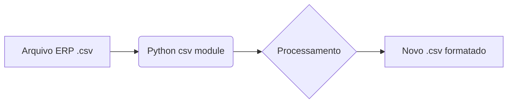

# Aula 10 — Manipulação de Arquivos TXT e CSV
> 💡 **O que você vai aprender:** Ler e escrever dados logísticos brutos em `.txt` e relatórios tubulares em `.csv`.
> ⏱️ **Duração estimada:** 2h | 📅 **Bloco:** 4

---

## 🎯 Objetivos da Aula
- Dominar o módulo `csv` para planilhas leves.
- Trabalhar de forma segura com leitura e escrita (uso do bloco `with`).
- Introduzir `pathlib` de forma massiva para caminhos dinâmicos.

---

## 📊 Diagrama Visual (Mermaid)


---

## 📖 Prosa de 2h (Conceito e Explicação)
O arroz com feijão da logística é o CSV (Comma Separated Values) e o TXT. Quando o ERP trava exportando Excel, ele sempre consegue salvar em CSV. Entender como abrir, varrer linha por linha, e escrever de volta é um superpoder.
Hoje em dia, manipular os arquivos ficou muito mais limpo com o `pathlib`. Esqueça o `os.path.join` verboso, use barras direto no objeto `Path`!

---

## 🔗 Conexão com os Projetos Reais
> 💼 **AutoMDFText:** A base de tudo: lemos um `.txt` extraído de PDF para interpretar CTe e MDFe.
> 📊 **AutoPickingPy:** CSVs são a principal fonte de importação quando o Excel é pesado demais.

---

## 💻 Tríade Dev+IA (Exemplos)

### Exemplo 1 — TXT Básico Moderno
```python
from pathlib import Path

# Path moderno é orientado a objetos!
manifest_file = Path("manifestos") / "mdfe_001.txt"

# with garante o fechamento do arquivo, e pathlib tem .open()
with manifest_file.open("r", encoding="utf-8") as file:
    content = file.read()
```

### Exemplo 2 — Lendo CSV Logístico
```python
import csv
from pathlib import Path

csv_path = Path("dados/pedidos.csv")

with csv_path.open("r", encoding="utf-8") as f:
    reader = csv.DictReader(f, delimiter=";") # Muito usado em BR
    for row in reader:
        print(f"Pedido: {row['ID']} - Peso: {row['PESO_KG']}kg")
```

### Exemplo 3 — Com IA (Antigravity)
> 🤖 **Prompt sugerido:**
> "Escreva um script Python que leia um arquivo CSV com separador ponto-e-vírgula e calcule a soma da coluna 'PESO' utilizando pathlib."

---

## 🔗 Links de Código e Prática
> 📁 Arquivo de prática: `exercicios/aula_10_exercicios.py`

**Exercício 1:** Leia um txt com placas de veículos.
**Exercício 2:** Filtre apenas os pesos acima de 500kg de um arquivo CSV.

---

## 👣 Rodapé / Conexão com a Próxima Aula
TXT e CSV são ótimos, mas o mundo corporativo fala Excel! Na próxima aula, dominaremos `.xlsx` com `openpyxl`.
#aula #bloco-4 #python #csv #txt


---

## 🔀 Aprendizado Ativo de Git, Issue & Pull Request

> 📌 **Issue Oficial no GitHub:** # Issue #10
> 🔀 **Branch de Desenvolvimento:** git checkout -b feature/issue-10-arquivos-txt-csv
> 📁 **Arquivo de Trabalho (Manual):** aula_10_exercicios_manual.py
> 🧪 **Teste Automatizado & Pré-Aprovação IA:** python avaliar_exercicio.py --issue 10
> 🚀 **Envio de Pull Request (PR):** git push origin feature/issue-10-arquivos-txt-csv e abra o PR no GitHub para a revisão final do Tutor (@akanaul)!
