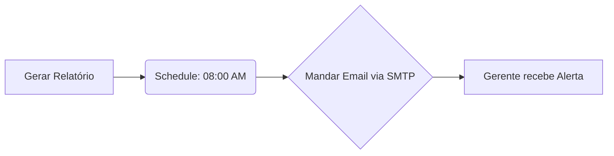

# Aula 12 — Email Automático e Agendamento
> 💡 **O que você vai aprender:** Enviar e-mails (com anexos do Excel) automaticamente e usar agendamento (Schedule/Cron).
> ⏱️ **Duração estimada:** 2h | 📅 **Bloco:** 4

---

## 🎯 Objetivos da Aula
- Enviar relatórios por e-mail com `smtplib` e `email.mime`.
- Automatizar rotinas logísticas por horário com `schedule` e `time`.
- Anexar relatórios gerados via `pathlib`.

---

## 📊 Diagrama Visual (Mermaid)


---

## 📖 Prosa de 2h (Conceito e Explicação)
Nada adia mais o cafezinho do que ter que disparar 15 emails de status de frete todos os dias úteis. Com Python, você pode transformar o script do relatório em um "funcionário digital" pontual. Usamos o módulo `smtplib` em conjunto com a construção moderna de mensagens.
Para agendamentos pesados no Windows, usamos o Agendador de Tarefas do SO ou bibliotecas como `schedule` para processos contínuos de verificação de SLAs logísticos!

---

## 🔗 Conexão com os Projetos Reais
> 💼 **AutoMDFText:** Pode notificar via e-mail caso haja anomalia nos CTe's.
> 📊 **AutoPickingPy:** O coração do projeto! O script roda de madrugada e a equipe chega de manhã com os e-mails de ressuprimento na caixa.

---

## 💻 Tríade Dev+IA (Exemplos)

### Exemplo 1 — E-mail Básico
```python
import smtplib
from email.message import EmailMessage

msg = EmailMessage()
msg['Subject'] = 'Alerta: Caminhão Atrasado!'
msg['From'] = 'robo_logistico@empresa.com'
msg['To'] = 'gerente@empresa.com'
msg.set_content('A entrega para o CD de Guarulhos está fora da janela de SLA.')

# Em produção, usa-se servidor SMTP real e senhas de app
# server = smtplib.SMTP('smtp.office365.com', 587)
# server.starttls()
# server.login('seu_email', 'senha')
# server.send_message(msg)
# server.quit()
```

### Exemplo 2 — Agendamento de Tarefas
```python
import schedule
import time
from datetime import datetime

def job_report():
    print(f"[{datetime.now()}] Gerando relatório de pendências de Picking...")

# Agendando para rodar todo dia às 7h
schedule.every().day.at("07:00").do(job_report)

# Loop infinito (para scripts em background)
# while True:
#     schedule.run_pending()
#     time.sleep(60)
```

### Exemplo 3 — Com IA (Antigravity)
> 🤖 **Prompt sugerido:**
> "Escreva uma função que receba um caminho de arquivo usando pathlib, anexe-o a um EmailMessage e faça o envio via SMTP do Gmail."

---

## 🔗 Links de Código e Prática
> 📁 Arquivo de prática: `exercicios/aula_12_exercicios.py`

**Exercício 1:** Dispare um e-mail local (usando console do python) com os prazos.
**Exercício 2:** Programe um print() a cada 10 segundos no console.

---

## 👣 Rodapé / Conexão com a Próxima Aula
E se o sistema não tem API, não permite CSV, e exige que alguém clique na tela? Entramos no mundo do RPA na Aula 13 com PyAutoGUI!
#aula #bloco-4 #python #email


---

## 🔀 Aprendizado Ativo de Git, Issue & Pull Request

> 📌 **Issue Oficial no GitHub:** # Issue #12
> 🔀 **Branch de Desenvolvimento:** git checkout -b feature/issue-12-email-agendamento
> 📁 **Arquivo de Trabalho (Manual):** aula_12_exercicios_manual.py
> 🧪 **Teste Automatizado & Pré-Aprovação IA:** python avaliar_exercicio.py --issue 12
> 🚀 **Envio de Pull Request (PR):** git push origin feature/issue-12-email-agendamento e abra o PR no GitHub para a revisão final do Tutor (@akanaul)!
