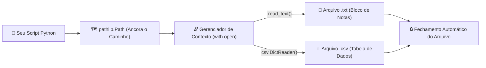

# 🚀 Aula 10 — Leitura e Escrita de Arquivos TXT, Tabelas CSV e Navegação Segura com `pathlib`

> [!TUTOR] 🚀 Guia Prático de Estudo da Aula (Ciclo de 4 Passos em 1-Clique)
> 1. 📖 **Conceito Extensivo:** Leia as explicações teóricas minuciosas e tire dúvidas com a IA no **Modo Tutor**.
> 2. 👨‍💻 **Código & Prática:** Edite e desenvolva sua solução no arquivo `aula_10_exercicios_manual.py`.
> 3. ⚡ **Testar no Obsidian (1-Clique):** Clique em **Run** no bloco abaixo para validar sua solução:
> > [!EXERCICIO] 🧪 Avaliação 1-Clique dos Exercícios da IDE (Issue #10)
> > 📌 **Exercício Avaliado:** Issue #10 — Arquivos txt e csv
> > 📁 **Arquivo de Trabalho na IDE:** `04_bibliotecas_arquivos/pratica/Aula 10 - Arquivos txt e csv/aula_10_exercicios_manual.py`
> > ⚡ Clique no botão **Run** no canto superior direito do bloco abaixo para testar sua solução:

```python run
import sys, os, subprocess

def find_vault_root():
    curr = os.path.abspath(os.getcwd())
    while curr:
        if os.path.exists(os.path.join(curr, "avaliar_exercicio.py")):
            return curr
        parent = os.path.dirname(curr)
        if parent == curr:
            break
        curr = parent
    user_home = os.path.expanduser("~")
    for root, dirs, files in os.walk(user_home):
        if "avaliar_exercicio.py" in files:
            return root
        if root.count(os.sep) - user_home.count(os.sep) >= 4:
            dirs.clear()
    return os.path.abspath(".")

vault_root = find_vault_root()
script_path = os.path.join(vault_root, "avaliar_exercicio.py")
print("📌 [AVALIAÇÃO 1-CLIQUE] Testando Exercício da Issue #10...")
print("📁 Arquivo Alvo na IDE: 04_bibliotecas_arquivos/pratica/Aula 10 - Arquivos txt e csv/aula_10_exercicios_manual.py")
res = subprocess.run([sys.executable, script_path, "--issue", "10"], cwd=vault_root, capture_output=True, text=True, encoding="utf-8", errors="replace")
print(res.stdout or res.stderr)
```
> 4. 🔀 **Enviar PR:** Se aprovado pela IA, envie o Pull Request no GitHub para o Tutor (@akanaul)!

---

## 💡 1. Conceito Extensivo & O Porquê

### A Analogia do Bloco de Notas, do Caderno de Finanças e do GPS Portátil
Em automações do mundo real, os dados raramente estão digitados dentro do código fonte. Eles vivem no sistema de arquivos do computador sob diferentes formatos:

- **`pathlib.Path`:** É o seu **GPS Inteligente e Portátil**. Se você digitar um endereço fixo de estrada (`C:\Users\Joao\Documents\arquivo.csv`), o seu script funcionará no seu computador, mas **quebrará imediatamente** ao rodar no computador de uma colega de trabalho ou em um servidor Linux/macOS (onde os caminhos usam barras normais `/`). O `pathlib` descobre dinamicamente onde o script está rodando e monta os caminhos de forma segura em qualquer sistema operacional.
- **Arquivos TXT:** São o seu **Bloco de Notas Rápido**. Usados para armazenar anotações, logs de erro, configurações do sistema ou textos simples sem formatação visual.
- **Arquivos CSV (`Comma-Separated Values`):** São a **Planilha do Excel em Texto Puro**. Cada linha representa um registro e as colunas são separadas por vírgulas `,` ou ponto e vírgula `;`. É o formato mais leve e universal para importar e exportar tabelas entre sistemas.

---

## ⚙️ 2. Lógica de Funcionamento Interno & Gerenciamento de Arquivos

### Gerenciadores de Contexto (`with`), Codificação UTF-8 e Leitura com `DictReader`

1. **O Gerenciador de Contexto (`with open(...) as f`):** Abrir um arquivo reserva recursos no sistema operacional. Se o programa fechar inesperadamente sem executar `f.close()`, o arquivo continuará bloqueado em segundo plano. A instrução `with` garante que o arquivo seja **fechado automaticamente**, mesmo que ocorra um erro fatal durante a leitura.
2. **Codificação de Caracteres (`encoding="utf-8"`):** Arquivos de texto armazenam caracteres como sequências de bytes. No Windows brasileiro, a codificação padrão pode ser `cp1252`, o que transforma acentos como `á`, `ç`, `õ` em símbolos estranhos (`Garbage Characters`). Especificar `encoding="utf-8"` garante acentuação limpa.
3. **Leitura com `csv.DictReader`:** Em vez de ler cada linha como uma lista de strings soltas (`linha[0]`, `linha[1]`), o `DictReader` lê a primeira linha como cabeçalho e mapeia cada linha subsequente para um dicionário (`linha["Nome"]`, `linha["Preço"]`).

---

## 📊 3. Diagrama Visual (Mermaid)



---

## 🖥️ 4. Sintaxe, Código Comentado & Alternativas

Abaixo, veremos como **Criar, Escrever e Ler Arquivos de Texto e Tabelas CSV** utilizando o módulo `pathlib` e a biblioteca nativa `csv`.

### Abordagem 1: Leitura e Escrita Completa em TXT e CSV usando `pathlib` e `csv.DictReader` (Abordagem Oficial)

```python
import csv
from pathlib import Path

# 1. Definindo caminhos de forma relativa e 100% segura para qualquer OS
PASTA_ATUAL = Path(__file__).resolve().parent
ARQUIVO_TXT = PASTA_ATUAL / "registro_atividades.txt"
ARQUIVO_CSV = PASTA_ATUAL / "relatorio_gastos.csv"

# 2. Criando e escrevendo em um arquivo TXT com codificação UTF-8
conteudo_log = "📝 REGISTRO DE EXECUÇÃO\nData: 2026-07-23\nStatus: Sistema Operacional OK\n"
ARQUIVO_TXT.write_text(conteudo_log, encoding="utf-8")

# Lendo o TXT de volta
texto_salvo = ARQUIVO_TXT.read_text(encoding="utf-8")
print("Abordagem 1 ➔ Conteúdo do Arquivo TXT:")
print(texto_salvo)

# 3. Criando e escrevendo uma tabela em arquivo CSV
compras = [
    {"Item": "Supermercado", "Categoria": "Alimentação", "Valor": 250.50},
    {"Item": "Combustível", "Categoria": "Transporte", "Valor": 120.00},
    {"Item": "Cinema", "Categoria": "Lazer", "Valor": 45.00}
]

cabecalho = ["Item", "Categoria", "Valor"]

# Escrevendo no CSV com DictWriter
with ARQUIVO_CSV.open(mode="w", newline="", encoding="utf-8") as f:
    escritor = csv.DictWriter(f, fieldnames=cabecalho)
    escritor.writeheader()
    escritor.writerows(compras)

print(f"💾 Tabela CSV gerada com sucesso em: {ARQUIVO_CSV.name}")

# 4. Lendo o CSV com DictReader
with ARQUIVO_CSV.open(mode="r", encoding="utf-8") as f:
    leitor = csv.DictReader(f)
    print("\n📊 Conteúdo Lido do CSV:")
    for linha in leitor:
        print(f"  • {linha['Item']} ({linha['Categoria']}): R$ {float(linha['Valor']):.2f}")
```

---

### Abordagem 2: Leitura Linha a Linha em TXT para Arquivos Grandes (Economia de Memória)

```python
ARQUIVO_LOGS = PASTA_ATUAL / "logs_grandes.txt"

# Simulando escrita de múltiplas linhas
ARQUIVO_LOGS.write_text("Linha 1: OK\nLinha 2: ERRO 404\nLinha 3: OK\n", encoding="utf-8")

# Lendo linha a linha usando laço for (Não carrega todo o arquivo na RAM de uma vez)
print("\nAbordagem 2 ➔ Lendo TXT Linha a Linha:")
with ARQUIVO_LOGS.open(mode="r", encoding="utf-8") as f:
    for numero_linha, linha in enumerate(f, start=1):
        if "ERRO" in linha:
            print(f"  🚨 Alerta na Linha {numero_linha}: {linha.strip()}")
```

---

## 🛠️ 5. Anatomia do Traceback & Tratamento Exaustivo de Exceções

### Analisando Erros Frequentes de Arquivos no Terminal

#### 1. `FileNotFoundError: [Errno 2] No such file or directory: 'dados.csv'`

```text
================================ TRACEBACK REAL DO TERMINAL ================================
  File "c:/projetos/aula_10.py", line 12, in <module>
    with open("dados.csv", "r") as f:
FileNotFoundError: [Errno 2] No such file or directory: 'dados.csv'
============================================================================================
```

##### Causa Raiz:
Você tentou abrir o arquivo `'dados.csv'` usando um caminho relativo simples, mas o terminal está sendo executado em outro diretório de trabalho.

##### Solução:
Utilize o `pathlib` ancorado no local do script: `Path(__file__).resolve().parent / "dados.csv"`.

---

#### 2. `UnicodeDecodeError: 'utf-8' codec can't decode byte 0xe7 in position 10`

```text
================================ TRACEBACK REAL DO TERMINAL ================================
  File "c:/projetos/aula_10.py", line 15, in <module>
    conteudo = f.read()
UnicodeDecodeError: 'utf-8' codec can't decode byte 0xe7 in position 10: invalid continuation byte
============================================================================================
```

##### Causa Raiz:
O arquivo foi salvo na codificação antiga do Windows (`cp1252` / `ANSI`) e você tentou lê-lo especificando `encoding="utf-8"`.

##### Solução:
Trate a exceção e tente ler com `encoding="cp1252"` ou `encoding="latin-1"`.

---

### Tratamento Defensivo contra Erros de Leitura de Arquivos

```python
def ler_arquivo_txt_seguro(caminho_arquivo):
    """Lê um arquivo TXT tratando exceções de FileNotFoundError e UnicodeDecodeError."""
    path = Path(caminho_arquivo)
    
    try:
        if not path.exists():
            raise FileNotFoundError(f"O arquivo '{path.name}' não foi localizado no disco.")
            
        return path.read_text(encoding="utf-8")
        
    except FileNotFoundError as err:
        print(f"🚨 Exceção Capturada: {err}")
        return ""
    except UnicodeDecodeError:
        print("⚠️ Exceção de Criptografia: Tentando ler com codificação alternativa cp1252...")
        return path.read_text(encoding="cp1252")

# Testando leitura segura
print("\n--- Teste de Leitura Segura de Arquivos ---")
ler_arquivo_txt_seguro("arquivo_fantasma.txt")
```

---

## ⚖️ 6. Guia de Decisão & Recomendações Caso a Caso

| Ferramenta / Método | Sintaxe | Quando Escolher |
| :--- | :--- | :--- |
| **`Path.read_text()`** | `path.read_text(encoding="utf-8")` | Para **ler arquivos TXT pequenos** em uma única linha de código. |
| **`with open(...)`** | `with path.open("r") as f:` | **Recomendado para arquivos grandes** e para manipulação avançada. |
| **`csv.DictReader`** | `csv.DictReader(f)` | **Ideal para ler tabelas CSV** usando o nome das colunas como chaves. |
| **`csv.writer`** | `csv.writer(f, newline="")` | Para escrever linhas tabulares brutas (listas simples). |

---

## ⚠️ 7. Armadilhas Comuns, Casos Extremos & PEP 8

> [!WARNING] **Cuidado com Linhas em Branco no Windows e Codificação**
> 1. **Linhas em Branco Duplicadas no CSV (Windows):** Ao escrever arquivos CSV no Windows, se você não passar `newline=""` na função `open()`, o Python adicionará uma linha em branco extra entre cada registro.
> 2. **Esquecer `encoding="utf-8"`:** Ler arquivos salvos com acentos no Windows sem especificar `encoding="utf-8"` causará caracteres corrompidos (`ç`, `á`).
> 3. **PEP 8 — Constantes de Caminho:**
>    - Defina variáveis contendo caminhos de arquivos em `UPPER_CASE` se forem constantes no nível global do script (ex: `ARQUIVO_CONFIG = Path(...)`).

---

## 🧠 8. Vibe Coding, Cheatsheet & Git Workflow

### Dicas de Prompt Estruturado para Tratamento de CSVs Complexos
Se precisar manipular um arquivo CSV com delimitador diferente:

> **Exemplo de Prompt Recomendado:**
> *"Atue como um Especialista em Python. Preciso de um script que leia um arquivo CSV separado por ponto e vírgula (`;`) contendo as colunas 'Nome;Idade;Cidade'. O script deve filtrar apenas os registros de 'São Paulo' e salvar o resultado em um novo CSV separado por vírgulas. Use `pathlib`, `csv.DictReader` e tratamento de exceções `try/except`."*

---

### Cheatsheet Rápido de Pathlib e CSV

| Operação | Sintaxe | Descrição |
| :--- | :--- | :--- |
| **Caminho da Pasta** | `Path(__file__).resolve().parent` | Retorna o caminho da pasta onde o script está salvo. |
| **Verificar Existência**| `path.exists()` | Retorna `True` se o arquivo/pasta existir no disco. |
| **Ler TXT Direto** | `path.read_text(encoding="utf-8")` | Lê todo o arquivo de texto como string. |
| **Escrever TXT** | `path.write_text(t, encoding="utf-8")`| Grava uma string no arquivo. |
| **CSV com Dict** | `csv.DictWriter(f, fieldnames=c)` | Prepara a gravação de dicionários em formato CSV. |

---

### 🔀 Workflow Ativo de Git, Issue & Pull Request

Para registrar sua solução da Aula 10:

```bash
# 1. Criar branch para a Issue #10
git checkout -b feature/issue-10-arquivos-txt-csv

# 2. Adicionar o arquivo alterado ao staging
git add 04_bibliotecas_arquivos/pratica/Aula\ 10\ -\ Arquivos\ txt\ e\ csv/aula_10_exercicios_manual.py

# 3. Registrar o commit
git commit -m "feat(issue-10): resolucao dos exercicios de manipulacao de arquivos txt, csv e pathlib"

# 4. Enviar a branch para o repositório remoto no GitHub
git push origin feature/issue-10-arquivos-txt-csv
```

> 🚀 **Passo Final:** Abra o **Pull Request (PR)** no GitHub para revisão do Tutor (@akanaul)!

---

## 📝 Anotações Pessoais do Aluno sobre esta Aula

> [!TIP] **Criar Nota de Estudo Relacionada**  
> Quer guardar resumos ou anotações próprias sobre esta aula?  
> Pressione `Alt + N` no Templater e selecione **Template de Anotação do Aluno** para salvar automaticamente em [[meu_caderno_aluno/anotacoes_aulas/anotacoes_aulas|meu_caderno_aluno/anotacoes_aulas/]]!