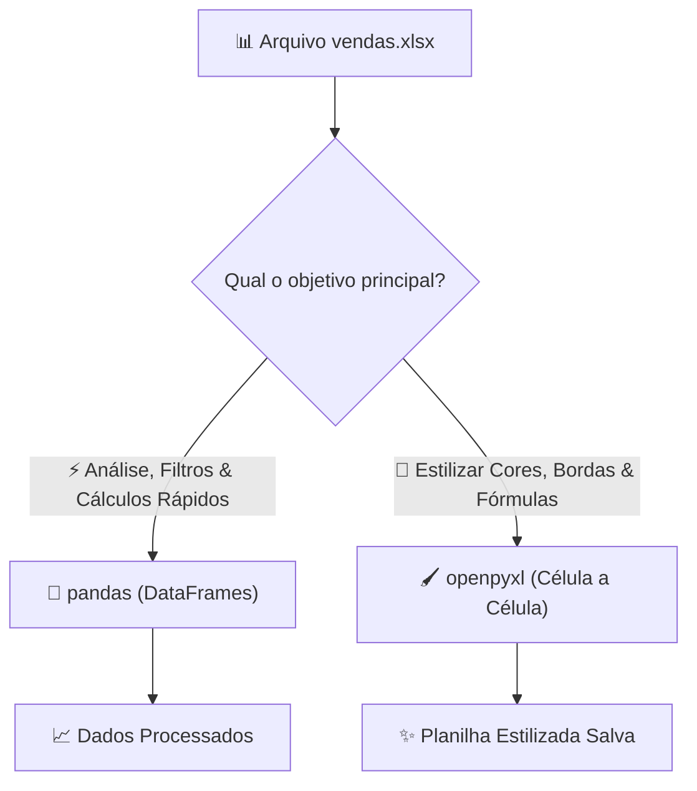

# 🚀 Aula 11 — Automação de Planilhas Excel (`.xlsx`) com `openpyxl` e `pandas`

> [!TUTOR] 🚀 Guia Prático de Estudo da Aula (Ciclo de 4 Passos em 1-Clique)
> 1. 📖 **Conceito Extensivo:** Leia as explicações teóricas minuciosas e tire dúvidas com a IA no **Modo Tutor**.
> 2. 👨‍💻 **Código & Prática:** Edite e desenvolva sua solução no arquivo `aula_11_exercicios_manual.py`.
> 3. ⚡ **Testar no Obsidian (1-Clique):** Clique em **Run** no bloco abaixo para validar sua solução:
> > [!EXERCICIO] 🧪 Avaliação 1-Clique dos Exercícios da IDE (Issue #11)
> > 📌 **Exercício Avaliado:** Issue #11 — Excel com openpyxl e pandas
> > 📁 **Arquivo de Trabalho na IDE:** `04_bibliotecas_arquivos/pratica/Aula 11 - Excel com openpyxl e pandas/aula_11_exercicios_manual.py`
> > ⚡ Clique no botão **Run** no canto superior direito do bloco abaixo para testar sua solução:

```python run
import sys, os, subprocess

def find_vault_root():
    curr = os.path.abspath(os.getcwd())
    while curr:
        if os.path.exists(os.path.join(curr, "avaliar_exercicio.py")):
            return curr
        parent = os.path.dirname(curr)
        if parent == curr:
            break
        curr = parent
    user_home = os.path.expanduser("~")
    for root, dirs, files in os.walk(user_home):
        if "avaliar_exercicio.py" in files:
            return root
        if root.count(os.sep) - user_home.count(os.sep) >= 4:
            dirs.clear()
    return os.path.abspath(".")

vault_root = find_vault_root()
script_path = os.path.join(vault_root, "avaliar_exercicio.py")
print("📌 [AVALIAÇÃO 1-CLIQUE] Testando Exercício da Issue #11...")
print("📁 Arquivo Alvo na IDE: 04_bibliotecas_arquivos/pratica/Aula 11 - Excel com openpyxl e pandas/aula_11_exercicios_manual.py")
res = subprocess.run([sys.executable, script_path, "--issue", "11"], cwd=vault_root, capture_output=True, text=True, encoding="utf-8", errors="replace")
print(res.stdout or res.stderr)
```
> 4. 🔀 **Enviar PR:** Se aprovado pela IA, envie o Pull Request no GitHub para o Tutor (@akanaul)!

---

## 💡 1. Conceito Extensivo & O Porquê

### A Analogia do Pincel de Estilo e da Calculadora Industrial de Tabelas
O Microsoft Excel é a ferramenta mais presente no ambiente corporativo. No entanto, passar horas abrindo planilhas manualmente para aplicar procv, filtrar linhas e formatar cores de relatórios é uma tarefa repetitiva e desgastante.

Em Python, dividimos a automação de planilhas `.xlsx` em duas ferramentas especializadas:
- **`pandas`:** É a sua **Calculadora Industrial de Tabelas (DataFrames)**. Se você precisa carregar mil linhas de vendas, filtrar registros por data, somar faturamentos e agrupar resultados em milissegundos sem precisar abrir a interface do Excel, o `pandas` realiza essa análise de dados diretamente na memória RAM.
- **`openpyxl`:** É o seu **Pincel de Estilo e Formatação Visual**. Quando você precisa alterar a cor de fundo de uma célula (ex: pintar de verde se a meta for atingida), ajustar larguras de colunas, aplicar fontes em negrito ou inserir fórmulas nativas do Excel (`=SOMA()`), o `openpyxl` dá controle total célula a célula.

---

## ⚙️ 2. Lógica de Funcionamento Interno & Ambientes Virtuais (`venv`)

### Instalação de Dependências no Ambiente Virtual
Para automatizar planilhas Excel com `pandas` e `openpyxl`, certifique-se de que o seu ambiente virtual (`venv`) esteja ativo no terminal e instale as bibliotecas necessárias:

```bash
# Com o venv ativo (ex: (venv) no terminal):
pip install pandas openpyxl
```

---

### Arquivos `.xlsx` como Pacotes ZIP XML e Estruturas de DataFrames

1. **O que é um arquivo `.xlsx` por baixo dos panos:** Arquivos do Excel não são blocos binários simples; são na verdade arquivos congelados em formato **ZIP contendo múltiplos documentos XML** de dados e estilos. O `openpyxl` descompacta esse pacote em memória, altera o XML e o salva de volta.
2. **O DataFrame do Pandas:** O `pandas` converte planilhas em objetos de duas dimensões chamados **DataFrames** (linhas e colunas), permitindo operações vetoriais de altíssima velocidade sem loops `for` lentos.
3. **Preservação de Formatação:** Ao ler uma planilha com `pandas.read_excel()` e salvá-la novamente com `df.to_excel()`, as formatações visuais originais (cores, fontes, bordas) são descartadas. Para manter o visual idêntico, utilizamos o `openpyxl`.

---

## 📊 3. Diagrama Visual (Mermaid)



---

## 🖥️ 4. Sintaxe, Código Comentado & Alternativas

Abaixo, veremos como **Filtrar Dados com Pandas e Estilizar uma Planilha com OpenPyXL**.

### Abordagem 1: Análise e Filtragem Rápida com `pandas` (Abordagem Oficial)

```python
import pandas as pd
from pathlib import Path

# Dados de vendas simulados
dados_vendas = {
    "Produto": ["Notebook", "Mouse", "Teclado", "Monitor", "Cadeira Gamer"],
    "Categoria": ["Eletrônicos", "Acessórios", "Acessórios", "Eletrônicos", "Móveis"],
    "Preco": [3500.00, 80.00, 150.00, 900.00, 850.00],
    "Vendido": [True, True, False, True, True]
}

# 1. Criando um DataFrame a partir do dicionário
df = pd.DataFrame(dados_vendas)

# 2. Filtrando apenas os produtos vendidos com preço acima de R$ 100,00
df_filtrado = df[(df["Vendido"] == True) & (df["Preco"] > 100.00)]

# 3. Calculando o faturamento total
faturamento_total = df_filtrado["Preco"].sum()

print("Abordagem 1 (pandas) ➔ Produtos Vendidos de Alto Valor:")
print(df_filtrado[["Produto", "Preco"]])
print(f"💰 Faturamento Total: R$ {faturamento_total:.2f}")
```

---

### Abordagem 2: Criação, Preenchimento e Estilização Célula a Célula com `openpyxl`

```python
from openpyxl import Workbook
from openpyxl.styles import PatternFill, Font, Alignment

# 1. Inicializando uma nova planilha (Workbook)
wb = Workbook()
ws = wb.active
ws.title = "Relatório_Vendas"

# 2. Adicionando o Cabeçalho
ws.append(["Produto", "Categoria", "Preço (R$)"])

# 3. Estilizando o cabeçalho (Verde escuro com texto em branco e negrito)
fill_cabecalho = PatternFill(start_color="1E7E34", end_color="1E7E34", fill_type="solid")
font_cabecalho = Font(color="FFFFFF", bold=True, size=11)
alinhamento_centro = Alignment(horizontal="center", vertical="center")

for col in range(1, 4):
    cell = ws.cell(row=1, column=col)
    cell.fill = fill_cabecalho
    cell.font = font_cabecalho
    cell.alignment = alinhamento_centro

# 4. Adicionando linhas de dados
ws.append(["Notebook Gamer", "Eletrônicos", 4500.00])
ws.append(["Mouse Vertical", "Acessórios", 120.00])

# Salvando o arquivo formatado
PASTA_ATUAL = Path(__file__).resolve().parent
ARQUIVO_EXCEL = PASTA_ATUAL / "relatorio_estilizado.xlsx"
wb.save(ARQUIVO_EXCEL)

print(f"\nAbordagem 2 (openpyxl) ➔ Planilha estilizada salva em: {ARQUIVO_EXCEL.name}")
```

---

## 🛠️ 5. Anatomia do Traceback & Tratamento Exaustivo de Exceções

### Analisando Erros Frequentes de Automação de Excel no Terminal

#### 1. `PermissionError: [Errno 13] Permission denied: 'relatorio.xlsx'`

```text
================================ TRACEBACK REAL DO TERMINAL ================================
  File "c:/projetos/aula_11.py", line 25, in <module>
    wb.save("relatorio.xlsx")
PermissionError: [Errno 13] Permission denied: 'relatorio.xlsx'
============================================================================================
```

##### Causa Raiz:
O arquivo `relatorio.xlsx` está atualmente aberto no aplicativo Microsoft Excel do Windows, o que bloqueia a escrita pelo Python.

##### Solução:
Feche a planilha no Excel antes de rodar o script ou capture o erro com `try/except PermissionError`.

---

#### 2. `KeyError: 'ColunaInexistente'` no Pandas

```text
================================ TRACEBACK REAL DO TERMINAL ================================
  File "c:/projetos/aula_11.py", line 18, in <module>
    faturamento = df["ValorTotal"].sum()
KeyError: 'ValorTotal'
============================================================================================
```

##### Causa Raiz:
Você tentou acessar a coluna `'ValorTotal'`, mas o nome correto na planilha está gravado como `'Preco'` ou com espaços invisíveis (`'ValorTotal '`).

---

### Tratamento Defensivo contra Erros de Permissão ao Salvar Excel

```python
def salvar_workbook_seguro(wb, caminho_arquivo):
    """Salva a planilha tratando exceção de PermissionError se o arquivo estiver aberto."""
    path = Path(caminho_arquivo)
    try:
        wb.save(path)
        print(f"✅ Planilha salva com sucesso em '{path.name}'.")
        return True
    except PermissionError:
        print(f"🚨 Erro de Permissão: O arquivo '{path.name}' está aberto no Excel!")
        print("   Feche a planilha no Excel e pressione Enter para tentar novamente.")
        return False

# Testando salvamento seguro
salvar_workbook_seguro(wb, ARQUIVO_EXCEL)
```

---

## ⚖️ 6. Guia de Decisão & Recomendações Caso a Caso

| Biblioteca | Vantagens | Desvantagens | Quando Escolher |
| :--- | :--- | :--- | :--- |
| **`pandas`** | • Análises e filtros extremamente rápidos<br>• Operações matemáticas em tabelas com 1 linha<br>• Suporta ler CSV, Excel, SQL e JSON | • Descarta formatações visuais (cores, bordas) ao salvar novamente o Excel | **Para processar, filtrar e resumir dados de tabelas.** |
| **`openpyxl`** | • Preserva estilos visuais existentes<br>• Permite alterar cores, fontes, bordas e fórmulas<br>• Adiciona abas e gráficos | • Mais lento para processar tabelas gigantescas | **Para gerar relatórios visuais finais formatados para apresentação.** |

---

## ⚠️ 7. Armadilhas Comuns, Casos Extremos & PEP 8

> [!WARNING] **Cuidado com Arquivos Abertos e Estilos não Salvos**
> 1. **Esquecer de Salvar o Workbook no OpenPyXL:** Alterações feitas em células com `openpyxl` só são gravadas no disco quando você executa explicitamente `wb.save("caminho.xlsx")`.
> 2. **Formatação de Datas no Excel:** Ao inserir datas em planilhas com `openpyxl`, converta-as para o objeto `datetime.date` nativo para que o Excel as reconheça como formato de data válido.
> 3. **PEP 8 — Legibilidade em DataFrames:**
>    - Evite encadear mais de 3 operações do Pandas na mesma linha. Quebre a lógica em variáveis intermediárias explicativas.

---

## 🧠 8. Vibe Coding, Cheatsheet & Git Workflow

### Dicas de Prompt Estruturado para Automação Avançada em Excel
Se precisar criar relatórios com formatação condicional:

> **Exemplo de Prompt Recomendado:**
> *"Atue como um Especialista em Python. Tenho uma planilha Excel 'vendas.xlsx'. Crie um script com `openpyxl` que leia a coluna 'Faturamento' e pinte o fundo das células com valores maiores que R$ 1.000,00 de verde claro (`#D4EDDA`) e menores de vermelho claro (`#F8D7DA`), incluindo tratamento defensivo `try/except PermissionError`."*

---

### Cheatsheet Rápido de Pandas e OpenPyXL

| Operação | Biblioteca | Sintaxe |
| :--- | :--- | :--- |
| **Ler Excel** | `pandas` | `df = pd.read_excel("dados.xlsx")` |
| **Filtrar Linhas**| `pandas` | `df[df["Status"] == "OK"]` |
| **Salvar Excel** | `pandas` | `df.to_excel("saida.xlsx", index=False)` |
| **Carregar Livro**| `openpyxl` | `wb = load_workbook("dados.xlsx")` |
| **Pintar Célula**| `openpyxl` | `cell.fill = PatternFill(fill_type="solid", start_color="FF0000")` |

---

### 🔀 Workflow Ativo de Git, Issue & Pull Request

Para registrar sua solução da Aula 11:

```bash
# 1. Criar branch para a Issue #11
git checkout -b feature/issue-11-excel-pandas

# 2. Adicionar o arquivo alterado ao staging
git add 04_bibliotecas_arquivos/pratica/Aula\ 11\ -\ Excel\ com\ openpyxl\ e\ pandas/aula_11_exercicios_manual.py

# 3. Registrar o commit
git commit -m "feat(issue-11): resolucao dos exercicios de automacao excel com openpyxl e pandas"

# 4. Enviar a branch para o repositório remoto no GitHub
git push origin feature/issue-11-excel-pandas
```

> 🚀 **Passo Final:** Abra o **Pull Request (PR)** no GitHub para revisão do Tutor (@akanaul)!

---

## 📝 Anotações Pessoais do Aluno sobre esta Aula

> [!TIP] **Criar Nota de Estudo Relacionada**  
> Quer guardar resumos ou anotações próprias sobre esta aula?  
> Pressione `Alt + N` no Templater e selecione **Template de Anotação do Aluno** para salvar automaticamente em [[meu_caderno_aluno/anotacoes_aulas/anotacoes_aulas|meu_caderno_aluno/anotacoes_aulas/]]!