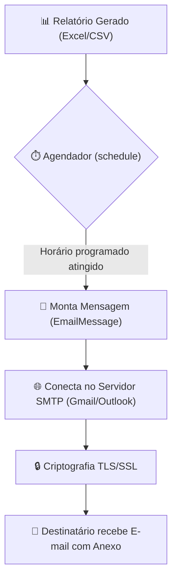

# 🚀 Aula 12 — Envio de E-mails Automáticos (`smtplib`) e Agendamento de Tarefas (`schedule`)

> [!TUTOR] 🚀 Guia Prático de Estudo da Aula (Ciclo de 4 Passos em 1-Clique)
> 1. 📖 **Conceito Extensivo:** Leia as explicações teóricas minuciosas e tire dúvidas com a IA no **Modo Tutor**.
> 2. 👨‍💻 **Código & Prática:** Edite e desenvolva sua solução no arquivo `aula_12_exercicios_manual.py`.
> 3. ⚡ **Testar no Obsidian (1-Clique):** Clique em **Run** no bloco abaixo para validar sua solução:
> > [!EXERCICIO] 🧪 Avaliação 1-Clique dos Exercícios da IDE (Issue #12)
> > 📌 **Exercício Avaliado:** Issue #12 — Email Automatico e Agendamento
> > 📁 **Arquivo de Trabalho na IDE:** `04_bibliotecas_arquivos/pratica/Aula 12 - Email Automatico e Agendamento/aula_12_exercicios_manual.py`
> > ⚡ Clique no botão **Run** no canto superior direito do bloco abaixo para testar sua solução:

```python run
import sys, os, subprocess

def find_vault_root():
    curr = os.path.abspath(os.getcwd())
    while curr:
        if os.path.exists(os.path.join(curr, "avaliar_exercicio.py")):
            return curr
        parent = os.path.dirname(curr)
        if parent == curr:
            break
        curr = parent
    user_home = os.path.expanduser("~")
    for root, dirs, files in os.walk(user_home):
        if "avaliar_exercicio.py" in files:
            return root
        if root.count(os.sep) - user_home.count(os.sep) >= 4:
            dirs.clear()
    return os.path.abspath(".")

vault_root = find_vault_root()
script_path = os.path.join(vault_root, "avaliar_exercicio.py")
print("📌 [AVALIAÇÃO 1-CLIQUE] Testando Exercício da Issue #12...")
print("📁 Arquivo Alvo na IDE: 04_bibliotecas_arquivos/pratica/Aula 12 - Email Automatico e Agendamento/aula_12_exercicios_manual.py")
res = subprocess.run([sys.executable, script_path, "--issue", "12"], cwd=vault_root, capture_output=True, text=True, encoding="utf-8", errors="replace")
print(res.stdout or res.stderr)
```
> 4. 🔀 **Enviar PR:** Se aprovado pela IA, envie o Pull Request no GitHub para o Tutor (@akanaul)!

---

## 💡 1. Conceito Extensivo & O Porquê

### A Analogia do Carteiro Digital Particular e do Despertador Inteligente
O ponto de virada de qualquer automação corporativa ocorre quando ela se torna autônoma: capaz de **notificar pessoas interessadas e rodar em horários programados** sem exigir a presença física do desenvolvedor.

- **Envio de E-mail (`smtplib` + `EmailMessage`):** É como contratar um **Carteiro Digital Particular**. Em vez de você abrir o aplicativo do Outlook ou Gmail, digitar remetente, assunto, anexar relatórios e clicar no botão "Enviar", o Python monta o envelope digital e envia a mensagem diretamente pelo protocolo seguro SMTP em milissegundos.
- **Agendamento de Tarefas (`schedule`):** É o seu **Despertador Programável do Celular**. Você define uma regra clara (ex: *"Executar o relatório todos os dias úteis às 08:00 AM"* ou *"A cada 30 minutos"*), e o script roda em segundo plano, executando a função pontualmente nos horários marcados.

---

## ⚙️ 2. Lógica de Funcionamento Interno & Ambientes Virtuais (`venv`)

### Instalação da Biblioteca `schedule` no Ambiente Virtual
Para agendar tarefas em Python, instale o pacote `schedule` dentro do seu `venv` ativo:

```bash
# Com o venv ativo (ex: (venv) no terminal):
pip install schedule
```

---

### Protocolo SMTP, Autenticação SSL/TLS e o Loop de Execução do Schedule

1. **Como Funciona o Protocolo SMTP:** O *Simple Mail Transfer Protocol* (SMTP) é o protocolo padrão da internet para envio de e-mails. O Python estabelece uma conexão criptografada com o servidor SMTP (ex: `smtp.gmail.com` na porta 587 com TLS ou 465 com SSL), autentica com as credenciais do usuário e envia o pacote `EmailMessage`.
2. **Construção da Mensagem com `EmailMessage`:** Trata-se da classe moderna do Python para construção de mensagens MIME. Ela permite adicionar assunto, remetente, destinatários, corpo em texto puro, HTML e anexos de arquivos (PDFs, planilhas Excel) de forma simples.
3. **O Loop de Monitoramento do `schedule`:** A biblioteca `schedule` funciona registrando tarefas em uma lista interna com horário marcado. A função `schedule.run_pending()` verifica se o horário atual atingiu a marca de alguma tarefa agendada; para manter o monitoramento ativo, colocamos essa verificação dentro de um loop `while True` com um pequeno descanso (`time.sleep(1)`).

---

## 📊 3. Diagrama Visual (Mermaid)



---

## 🖥️ 4. Sintaxe, Código Comentado & Alternativas

Abaixo, veremos como **Montar E-mails com Anexos e Agendar a Execução Periódica de Tarefas**.

### Abordagem 1: Montando Envelopes de E-mail com `EmailMessage` e Anexando Arquivos (Abordagem Oficial)

```python
import mimetypes
from pathlib import Path
from email.message import EmailMessage
from datetime import datetime

def criar_email_relatorio(destinatario, caminho_anexo=None):
    """
    Cria e formata um objeto EmailMessage com suporte a anexos.
    """
    msg = EmailMessage()
    msg["Subject"] = f"📊 Relatório Diário de Vendas — {datetime.now().strftime('%d/%m/%Y')}"
    msg["From"] = "automacao@empresa.com"
    msg["To"] = destinatario
    
    corpo_texto = (
        "Olá equipe,\n\n"
        "Segue em anexo o relatório automatizado gerado pelo sistema.\n"
        "Qualquer dúvida, estou à disposição.\n\n"
        "Atenciosamente,\n"
        "Robô de Automação Python"
    )
    msg.set_content(corpo_texto)

    # Anexando arquivo se o caminho for informado e existir
    if caminho_anexo:
        path = Path(caminho_anexo)
        if path.exists():
            # Identifica automaticamente o tipo MIME do arquivo
            tipo_mime, _ = mimetypes.guess_type(str(path))
            tipo_principal, sub_tipo = (tipo_mime or "application/octet-stream").split("/")
            
            with path.open("rb") as f:
                msg.add_attachment(
                    f.read(),
                    maintype=tipo_principal,
                    subtype=sub_tipo,
                    filename=path.name
                )
            print(f"📎 Arquivo '{path.name}' anexado com sucesso!")
            
    return msg

# Testando a criação da mensagem
email_pronto = criar_email_relatorio("gerencia@empresa.com")
print(f"Abordagem 1 ➔ Envelope criado para: {email_pronto['To']} | Assunto: {email_pronto['Subject']}")
```

---

### Abordagem 2: Agendando Tarefas Periódicas com a Biblioteca `schedule`

```python
import time
import schedule
from datetime import datetime

def tarefa_relatorio_diario():
    """Função que será executada automaticamente pelo agendador."""
    horario_atual = datetime.now().strftime("%H:%M:%S")
    print(f"⏰ [{horario_atual}] Executando tarefa agendada: Gerando e enviando relatório...")

# Configurando frequências de agendamento flexíveis com a biblioteca schedule
print("🚀 Sistema de Agendamento Ativado!")

# Exemplos de configurações de schedule:
schedule.every(5).seconds.do(tarefa_relatorio_diario)  # Para testes rápidos

# Executando 2 ciclos de teste do loop pendente
for _ in range(2):
    schedule.run_pending()
    time.sleep(1)
```

---

## 🛠️ 5. Anatomia do Traceback & Tratamento Exaustivo de Exceções

### Analisando Erros Frequentes de E-mail no Terminal

#### 1. `smtplib.SMTPAuthenticationError: (535, b'5.7.8 Username and Password not accepted')`

```text
================================ TRACEBACK REAL DO TERMINAL ================================
  File "c:/projetos/aula_12.py", line 28, in <module>
    server.login(usuario, senha)
smtplib.SMTPAuthenticationError: (535, b'5.7.8 Username and Password not accepted')
============================================================================================
```

##### Causa Raiz:
O servidor de e-mail (como Gmail ou Outlook) recusou a senha informada. No Gmail, você deve ativar a Autenticação em 2 Etapas e criar uma **Senha de Aplicativo** específica para o Python.

---

#### 2. `smtplib.SMTPConnectError` / `socket.gaierror`

```text
================================ TRACEBACK REAL DO TERMINAL ================================
  File "c:/projetos/aula_12.py", line 18, in <module>
    server = smtplib.SMTP("smtp.servidor_errado.com", 587)
socket.gaierror: [Errno 11001] getaddrinfo failed
============================================================================================
```

##### Causa Raiz:
O endereço do servidor SMTP informado está incorreto ou não há conexão com a internet.

---

### Tratamento Defensivo contra Erros de Conexão SMTP

```python
import smtplib

def enviar_email_seguro(servidor_smtp, porta, usuario, senha, mensagem):
    """Tenta enviar um e-mail tratando exceções de conexão e autenticação."""
    try:
        with smtplib.SMTP(servidor_smtp, porta, timeout=10) as server:
            server.starttls()  # Criptografia TLS
            server.login(usuario, senha)
            server.send_message(mensagem)
            print("✅ E-mail enviado com sucesso!")
            return True
            
    except smtplib.SMTPAuthenticationError:
        print("🚨 Erro de Autenticação: Senha de aplicativo incorreta ou recusada pelo provedor.")
        return False
    except (smtplib.SMTPException, Exception) as err:
        print(f"🚨 Erro de Conexão SMTP: {err}")
        return False

print("\n--- Função de Envio Seguro Carregada ---")
```

---

## ⚖️ 6. Guia de Decisão & Recomendações Caso a Caso

| Recurso / Ferramenta | Sintaxe | Função e Recomendação |
| :--- | :--- | :--- |
| **`EmailMessage`** | `msg = EmailMessage()` | **Classe oficial moderna** do Python para criação de e-mails em texto ou HTML com anexos. |
| **`smtplib.SMTP`** | `smtplib.SMTP("smtp...", 587)` | Estabelece a conexão com servidores de e-mail corporativos ou públicos. |
| **`schedule`** | `schedule.every().day.at("08:00")` | **Ideal para agendamentos internos** em scripts Python rodando continuamente. |
| **Agendador do SO** | Windows Task Scheduler / Cron (Linux) | **Recomendado para produção**, pois executa o script mesmo se a janela do Python for fechada. |

---

## ⚠️ 7. Armadilhas Comuns, Casos Extremos & PEP 8

> [!WARNING] **Cuidado com Senhas Hardcoded e Loops Infinitos de CPU**
> 1. **Nunca Escrever Senhas no Código Fonte:** NUNCA coloque `senha = "123456"` diretamente no seu arquivo `.py`. Utilize variáveis de ambiente (`os.getenv("SENHA_EMAIL")`) ou senhas de aplicativo geradas pelo seu provedor.
> 2. **Loop `while True` sem `time.sleep(1)`:** Colocar um loop `while True: schedule.run_pending()` sem um pequeno descanso `time.sleep(1)` dentro fará o processador do seu computador atingir 100% de uso.
> 3. **PEP 8 — Nomenclatura de Tarefas:**
>    - Nomeie funções de agendamento de forma clara indicando a ação (ex: `enviar_relatorio_matinal`).

---

## 🧠 8. Vibe Coding, Cheatsheet & Git Workflow

### Dicas de Prompt Estruturado para Disparo de E-mails HTML
Se precisar enviar e-mails formatados com tabelas em HTML:

> **Exemplo de Prompt Recomendado:**
> *"Atue como um Especialista em Python. Crie uma função em Python 3.12 que envie um e-mail com corpo em HTML formatado usando `EmailMessage` e `smtplib`. Garanta o uso de `add_alternative(html, subtype='html')`, suporte a anexos PDF via `pathlib` e tratamento defensivo `try/except smtplib.SMTPException`."*

---

### Cheatsheet Rápido de E-mail e Schedule

| Operação | Sintaxe | Descrição |
| :--- | :--- | :--- |
| **Criar Envelope** | `msg = EmailMessage()` | Instancia o objeto de e-mail. |
| **Anexar Arquivo** | `msg.add_attachment(bytes, ...)` | Adiciona um arquivo ao envelope do e-mail. |
| **Agendar Diário** | `schedule.every().day.at("08:00")` | Define execução diária em horário fixo. |
| **Rodar Pendentes**| `schedule.run_pending()` | Verifica e executa tarefas que chegaram no horário. |

---

### 🔀 Workflow Ativo de Git, Issue & Pull Request

Para registrar sua solução da Aula 12:

```bash
# 1. Criar branch para a Issue #12
git checkout -b feature/issue-12-email-agendamento

# 2. Adicionar o arquivo alterado ao staging
git add 04_bibliotecas_arquivos/pratica/Aula\ 12\ -\ Email\ Automatico\ e\ Agendamento/aula_12_exercicios_manual.py

# 3. Registrar o commit
git commit -m "feat(issue-12): resolucao dos exercicios de disparo de e-mails e agendamento de tarefas"

# 4. Enviar a branch para o repositório remoto
git push origin feature/issue-12-email-agendamento
```

> 🚀 **Passo Final:** Abra o **Pull Request (PR)** no GitHub para revisão do Tutor (@akanaul)!

---

## 📝 Anotações Pessoais do Aluno sobre esta Aula

> [!TIP] **Criar Nota de Estudo Relacionada**  
> Quer guardar resumos ou anotações próprias sobre esta aula?  
> Pressione `Alt + N` no Templater e selecione **Template de Anotação do Aluno** para salvar automaticamente em [[meu_caderno_aluno/anotacoes_aulas/anotacoes_aulas|meu_caderno_aluno/anotacoes_aulas/]]!