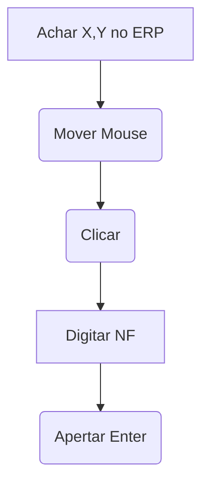

# Aula 13 — PyAutoGUI Básico
> 💡 **O que você vai aprender:** O conceito de RPA. Como controlar mouse e teclado para operar ERPs travados (como SAP, TOTVS).
> ⏱️ **Duração estimada:** 2h | 📅 **Bloco:** 5

---

## 🎯 Objetivos da Aula
- Entender coordenadas da tela (X,Y) e movimentar o mouse.
- Simular digitação (`write`, `press`, `hotkey`) para lançar notas.
- Aprender o conceito crítico de **Fail-Safe** (parada de emergência).

---

## 📊 Diagrama Visual (Mermaid)


---

## 📖 Prosa de 2h (Conceito e Explicação)
Quando a API custa milhares de reais e a TI bloqueia o banco de dados, a única saída é simular o humano. O `PyAutoGUI` move o mouse e aperta as teclas por você. Mas cuidado! Um robô cego digitando rapidamente pode apagar pastas ou enviar mensagens para o chefe.
Por isso, a regra número 1 da automação desktop é o **Fail-Safe** (arrastar o mouse violentamente para os cantos para parar). O uso inteligente do `clipboard` (área de transferência) também evita erros com acentuação e caracteres estranhos.

---

## 🔗 Conexão com os Projetos Reais
> 💼 **AutoMDFText:** Nasceu da necessidade de extrair dados de sistemas arcaicos clicando, copiando e colando os dados.
> 📊 **AutoPickingPy:** Usa pequenos scripts de teclado para abrir os WMS web antes de ler.

---

## 💻 Tríade Dev+IA (Exemplos)

### Exemplo 1 — O Básico e Seguro
```python
import pyautogui
import time

# OBRIGATÓRIO! Jogue o mouse pro canto para abortar.
pyautogui.FAILSAFE = True 

time.sleep(3) # Tempo para você mudar para a tela do ERP!
print(pyautogui.position()) # Descobre o X,Y atual
```

### Exemplo 2 — Preenchimento Seguro com Clipboard
Em vez de `pyautogui.write()`, que falha com acentos em teclados ABNT2, use o `pyperclip` (clipboard)!
```python
import pyautogui
import pyperclip
import time

def paste_text(text):
    pyperclip.copy(text)
    pyautogui.hotkey('ctrl', 'v')

time.sleep(2)
pyautogui.click(x=500, y=300) # Clica no campo de Observação do CTe
paste_text("Carga Sensível — Transporte Cauteloso!")
```

### Exemplo 3 — Com IA (Antigravity)
> 🤖 **Prompt sugerido:**
> "Como faço para o PyAutoGUI pressionar a tecla 'Tab' três vezes e depois colar um texto copiado?"

---

## 🔗 Links de Código e Prática
> 📁 Arquivo de prática: `exercicios/aula_13_exercicios.py`

**Exercício 1:** Abra o bloco de notas e digite uma rota de entrega.
**Exercício 2:** Pressione a tecla Tab e preencha outro campo.

---

## 👣 Rodapé / Conexão com a Próxima Aula
E se o botão do ERP mudar de lugar e o X,Y quebrar? Na Aula 14, vamos dar olhos ao nosso robô usando visão computacional (locateOnScreen)!
#aula #bloco-5 #python #pyautogui
