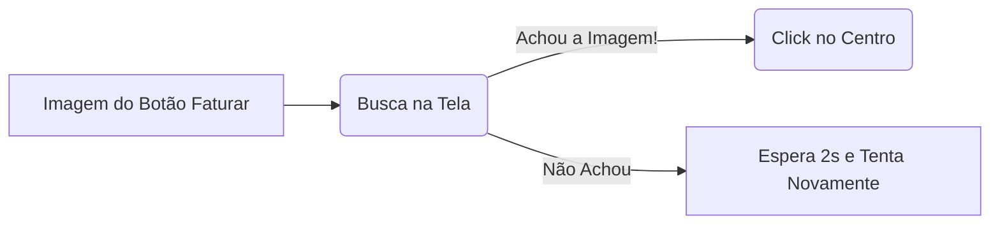

# Aula 14 — PyAutoGUI Avançado (Visão Computacional)
> 💡 **O que você vai aprender:** Como o bot acha os botões na tela buscando imagens (`locateOnScreen`) otimizando velocidade com `region` e `grayscale`.
> ⏱️ **Duração estimada:** 2h | 📅 **Bloco:** 5

---

## 🎯 Objetivos da Aula
- Capturar *screenshots* isolados dos botões do sistema logístico.
- Usar `locateCenterOnScreen` com parâmetro `confidence`.
- Acelerar a busca na tela limitando a área (`region`) e desligando cores (`grayscale`).

---

## 📊 Diagrama Visual (Mermaid)


---

## 📖 Prosa de 2h (Conceito e Explicação)
Clicar no pixel (X=100, Y=200) é perigoso: se o usuário mudar a resolução ou a barra do Windows subir, o robô clica no vazio. Com o Reconhecimento de Imagem do PyAutoGUI, nós salvamos um recorte (`botao_faturar.png`). O bot "escaneia" a tela inteira.
Como escanear monitores 4K é lento, ensinaremos truques modernos de mercado: `confidence` (pra tolerar o botão focado ou desfocado), `grayscale` (desliga a cor para buscar 30% mais rápido) e `region` (procura só na metade direita, onde fica a janela do ERP).

---

## 🔗 Conexão com os Projetos Reais
> 💼 **AutoMDFText:** Navega por pastas e clica no ícone exato do PDF para abrir, independente de onde o ícone esteja na área de trabalho.
> 📊 **AutoPickingPy:** Pode ser usado para clicar no botão de Exportar para Excel do WMS.

---

## 💻 Tríade Dev+IA (Exemplos)

### Exemplo 1 — Busca Inteligente
```python
import pyautogui
import time

time.sleep(2)
# Exige instalação do módulo opencv-python para o confidence!
pos = pyautogui.locateCenterOnScreen('img/botao_exportar.png', confidence=0.9)

if pos:
    pyautogui.click(pos)
    print("Sucesso, exportando planilha de roteirização...")
else:
    print("Botão não apareceu na tela!")
```

### Exemplo 2 — Performance Massiva (Mercado)
```python
import pyautogui

# Procura o botão 'Cancelar CTe'
# grayscale=True corta o processamento
# region=(left, top, width, height) faz ele olhar só o canto inferior
btn = pyautogui.locateCenterOnScreen(
    'img/btn_cancelar.png', 
    grayscale=True, 
    region=(1000, 500, 400, 400),
    confidence=0.8
)

if btn:
    pyautogui.click(btn)
```

### Exemplo 3 — Com IA (Antigravity)
> 🤖 **Prompt sugerido:**
> "Crie um laço while que espere no máximo 10 segundos até o `locateOnScreen` encontrar a imagem 'concluido.png' no PyAutoGUI."

---

## 🔗 Links de Código e Prática
> 📁 Arquivo de prática: `exercicios/aula_14_exercicios.py`

**Exercício 1:** Tire um print do botão "Iniciar" do Windows e faça o Python clicar nele.
**Exercício 2:** Faça um loop que aguarde um pop-up (usando a imagem do pop-up) aparecer.

---

## 👣 Rodapé / Conexão com a Próxima Aula
PyAutoGUI é poderoso, mas para a WEB, existe algo 100x melhor e nativo, sem problemas de mouse! Mas antes, mergulharemos em Engenharia de Prompt nas Aulas 8, 15 e 16!
#aula #bloco-5 #python #pyautogui


---

## 🔀 Aprendizado Ativo de Git, Issue & Pull Request

> 📌 **Issue Oficial no GitHub:** # Issue #14
> 🔀 **Branch de Desenvolvimento:** git checkout -b feature/issue-14-pyautogui-avancado
> 📁 **Arquivo de Trabalho (Manual):** aula_14_exercicios_manual.py
> 🧪 **Teste Automatizado & Pré-Aprovação IA:** python avaliar_exercicio.py --issue 14
> 🚀 **Envio de Pull Request (PR):** git push origin feature/issue-14-pyautogui-avancado e abra o PR no GitHub para a revisão final do Tutor (@akanaul)!

---

## 📝 Anotações Pessoais do Aluno sobre esta Aula

> [!TIP] **Criar Nota de Estudo Relacionada**
> Quer guardar resumos ou anotações próprias sobre esta aula?
> Pressione Alt + N no Templater e selecione **Template de Anotação do Aluno** para salvar automaticamente em [[meu_caderno_aluno/anotacoes_aulas/anotacoes_aulas|meu_caderno_aluno/anotacoes_aulas/]]!
