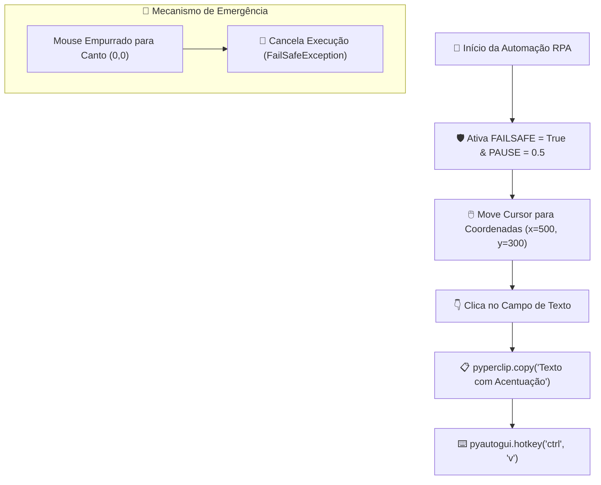

# 🚀 Aula 13 — Automação Desktop Básica com `PyAutoGUI` (Controle de Mouse, Teclado e Travão de Emergência)

> [!TUTOR] 🚀 Guia Prático de Estudo da Aula (Ciclo de 4 Passos em 1-Clique)
> 1. 📖 **Conceito Extensivo:** Leia as explicações teóricas minuciosas e tire dúvidas com a IA no **Modo Tutor**.
> 2. 👨‍💻 **Código & Prática:** Edite e desenvolva sua solução no arquivo `aula_13_exercicios_manual.py`.
> 3. ⚡ **Testar no Obsidian (1-Clique):** Clique em **Run** no bloco abaixo para validar sua solução:
> > [!EXERCICIO] 🧪 Avaliação 1-Clique dos Exercícios da IDE (Issue #13)
> > 📌 **Exercício Avaliado:** Issue #13 — PyAutoGUI Basico
> > 📁 **Arquivo de Trabalho na IDE:** `05_automacao_desktop/pratica/Aula 13 - PyAutoGUI Basico/aula_13_exercicios_manual.py`
> > ⚡ Clique no botão **Run** no canto superior direito do bloco abaixo para testar sua solução:

```python run
import sys, os, subprocess

def find_vault_root():
    curr = os.path.abspath(os.getcwd())
    while curr:
        if os.path.exists(os.path.join(curr, "avaliar_exercicio.py")):
            return curr
        parent = os.path.dirname(curr)
        if parent == curr:
            break
        curr = parent
    user_home = os.path.expanduser("~")
    for root, dirs, files in os.walk(user_home):
        if "avaliar_exercicio.py" in files:
            return root
        if root.count(os.sep) - user_home.count(os.sep) >= 4:
            dirs.clear()
    return os.path.abspath(".")

vault_root = find_vault_root()
script_path = os.path.join(vault_root, "avaliar_exercicio.py")
print("📌 [AVALIAÇÃO 1-CLIQUE] Testando Exercício da Issue #13...")
print("📁 Arquivo Alvo na IDE: 05_automacao_desktop/pratica/Aula 13 - PyAutoGUI Basico/aula_13_exercicios_manual.py")
res = subprocess.run([sys.executable, script_path, "--issue", "13"], cwd=vault_root, capture_output=True, text=True, encoding="utf-8", errors="replace")
print(res.stdout or res.stderr)
```
> 4. 🔀 **Enviar PR:** Se aprovado pela IA, envie o Pull Request no GitHub para o Tutor (@akanaul)!

---

## 💡 1. Conceito Extensivo & O Porquê

### A Analogia do Assistente Físico Invisível e do Freio de Mão de Emergência
Existem sistemas legados em empresas (programas antigos em Delphi, Java ou Desktop) que não possuem APIs de integração ou bancos de dados diretamente acessíveis. Nesses cenários, a única forma de automatizar um processo é simulando as ações reais de um ser humano operando o computador.

- **Robotic Process Automation (RPA) com `PyAutoGUI`:** É como contratar um **Assistente Físico Invisível** que se senta na sua cadeira, segura o mouse físico, move o cursor para coordenadas $(x, y)$ específicas da tela, clica em botões e digita no teclado com velocidade incrível.
- **O Freio de Mão de Emergência (`FAILSAFE = True`):** Imagine um carro autônomo sem freios. Se o robô entrar em um loop de cliques descontrolado, você perderia o controle do mouse. O PyAutoGUI possui um sistema de segurança nativo: ao empurrar o ponteiro do mouse rapidamente para o **canto superior esquerdo da tela $(0, 0)$**, o script é interrompido imediatamente via a exceção `pyautogui.FailSafeException`.

---

## ⚙️ 2. Lógica de Funcionamento Interno & Ambientes Virtuais (`venv`)

### Instalação de Dependências no Ambiente Virtual
Para desenvolver automações desktop RPA, instale o `pyautogui` e o `pyperclip` no seu `venv` ativo:

```bash
# Com o venv ativo (ex: (venv) no terminal):
pip install pyautogui pyperclip
```

---

### Sistema de Coordenadas em Pixels, Pausas de Segurança e Digitação Segura

1. **Plano Cartesiano da Tela:** O canto superior esquerdo do seu monitor é a origem de coordenadas $(x=0, y=0)$. Conforme o cursor se move para a direita, o valor de $x$ aumenta; conforme ele desce, o valor de $y$ aumenta.
2. **Pausa Global Entre Comandos (`PAUSE`):** Definir `pyautogui.PAUSE = 0.5` faz com que o robô espere automaticamente 0.5 segundos após **cada** clique ou tecla pressionada, permitindo que as janelas do sistema operacional tenham tempo de responder antes da próxima ação.
3. **Escrita sem Acentos vs Colagem com `pyperclip`:** A função `pyautogui.write()` simula o layout de teclado americano (US QWERTY). Se você tentar digitar palavras com acentos ou caracteres especiais em português (ex: `"Concluído"`), a acentuação sairá corrompida. Para digitar acentos com segurança, utilizamos a biblioteca `pyperclip` para copiar o texto formatado para a área de transferência e simulamos o atalho `Ctrl + V`.

---

## 📊 3. Diagrama Visual (Mermaid)



---

## 🖥️ 4. Sintaxe, Código Comentado & Alternativas

Abaixo, veremos como **Interagir com o Mouse, Digitar Textos com Acentos e Utilizar Atalhos do Teclado**.

### Abordagem 1: Controle Seguro de Mouse, Teclado e Segurança (Abordagem Oficial)

```python
import time
import pyautogui
import pyperclip

# 1. Configurações Globais Obrigatórias de Segurança
pyautogui.FAILSAFE = True  # Arrasta o mouse para (0,0) para cancelar o robô
pyautogui.PAUSE = 0.5       # Espera 0.5s após cada instrução

# 2. Descobrindo a resolução do monitor atual
largura, altura = pyautogui.size()
print(f"Abordagem 1 ➔ Resolução da Tela: {largura}x{altura} pixels")

# 3. Descobrindo a posição atual do cursor
x_atual, y_atual = pyautogui.position()
print(f"📍 Posição do Mouse Agora: x={x_atual}, y={y_atual}")

def digitar_texto_com_acentos(texto):
    """Copia o texto para o clipboard e cola via Ctrl+V para preservar acentos."""
    pyperclip.copy(texto)
    pyautogui.hotkey("ctrl", "v")
    print(f"⌨️ Texto digitado com segurança via Clipboard: '{texto}'")

# Exemplo de fluxo de automação seguro (Simulado)
print("⏳ Iniciando sequência em 3 segundos... (Mova o mouse para 0,0 se precisar cancelar)")
time.sleep(3)

# Mover o mouse de forma suave (duration em segundos)
pyautogui.moveTo(x=largura // 2, y=altura // 2, duration=1.0)
pyautogui.click()

# Digitando mensagem com acentuação limpa
digitar_texto_com_acentos("Automação Comercial de Sucesso — 100% OK")
```

---

### Abordagem 2: Uso de Atalhos Globais do Teclado (`hotkey`)

```python
# Simulando atalhos comuns do sistema operacional
print("\nAbordagem 2 ➔ Executando atalhos de teclado:")

# Pressiona Ctrl + A para selecionar tudo e Backspace para apagar
pyautogui.hotkey("ctrl", "a")
pyautogui.press("backspace")

# Pressiona a tecla Enter
pyautogui.press("enter")
print("  ✓ Atalhos executados com sucesso!")
```

---

## 🛠️ 5. Anatomia do Traceback & Tratamento Exaustivo de Exceções

### Analisando Erros Frequentes de PyAutoGUI no Terminal

#### 1. `pyautogui.FailSafeException: PyAutoGUI fail-safe triggered`

```text
================================ TRACEBACK REAL DO TERMINAL ================================
  File "c:/projetos/aula_13.py", line 25, in <module>
    pyautogui.moveTo(100, 100)
pyautogui.FailSafeException: PyAutoGUI fail-safe triggered from mouse moving to a corner of the screen.
============================================================================================
```

##### Causa Raiz:
O usuário empurrou o cursor do mouse rapidamente para o canto superior esquerdo da tela $(0,0)$ durante a execução do script. O mecanismo de emergência `FAILSAFE` foi ativado com sucesso para interromper o robô.

---

### Tratamento Defensivo contra Interrupções de Emergência

```python
def executar_clique_seguro(x, y):
    """Executa um clique no ponto x, y tratando a exceção FailSafeException."""
    try:
        pyautogui.click(x, y)
        print(f"✅ Clique executado em ({x}, {y}).")
        return True
    except pyautogui.FailSafeException:
        print("🚨 Interrupção de Emergência Ativada pelo Usuário! Execução do robô cancelada.")
        return False

# Testando chamada segura
print("\n--- Teste de Clique Seguro ---")
executar_clique_seguro(300, 300)
```

---

## ⚖️ 6. Guia de Decisão & Recomendações Caso a Caso

| Função / Técnica | Sintaxe | Quando Escolher |
| :--- | :--- | :--- |
| **`FAILSAFE = True`** | `pyautogui.FAILSAFE = True` | **Obrigatório em 100% dos scripts RPA** para permitir cancelamento de emergência. |
| **`moveTo(x, y)`** | `pyautogui.moveTo(500, 300, duration=1)` | Para mover o cursor visualmente permitindo acompanhar a ação na tela. |
| **`click(x, y)`** | `pyautogui.click(x, y)` | Para posicionar e clicar diretamente em um botão de formulário. |
| **`pyperclip.copy()`** | `pyperclip.copy("texto"); hotkey("ctrl", "v")` | **Obrigatório para digitar textos em português** com acentos ou ç sem erros. |

---

## ⚠️ 7. Armadilhas Comuns, Casos Extremos & PEP 8

> [!WARNING] **Cuidado com Mudanças de Resolução de Tela e Escalonamento DPI**
> 1. **Armadilha das Coordenadas Fixas:** Coordenadas de tela dependem da resolução e da posição das janelas. Se o formulário for movido de lugar ou o script rodar em um monitor com resolução diferente, o robô clicará no lugar errado!
> 2. **Escalonamento de Tela do Windows (DPI Zoom 125% / 150%):** No Windows, se o zoom da tela estiver em 125%, os pixels reais não corresponderão às coordenadas informadas pelo Python. Mantenha a tela em 100% de escala.
> 3. **PEP 8 — Organização de Scripts RPA:**
>    - Configure os parâmetros globais de segurança (`FAILSAFE` e `PAUSE`) no topo do arquivo logo após as importações.

---

## 🧠 8. Vibe Coding, Cheatsheet & Git Workflow

### Dicas de Prompt Estruturado para Automação Desktop Segura
Se precisar criar fluxos de cliques repetitivos:

> **Exemplo de Prompt Recomendado:**
> *"Atue como um Engenheiro de RPA Python. Crie um script com PyAutoGUI que abra a calculadora do Windows (pressionando tecla 'win', digitando 'calc' e dando 'enter'), espere 2 segundos, digite '125 + 75 =' e copie o resultado para a área de transferência usando `pyperclip`. Inclua `FAILSAFE = True` e tratamento defensivo `try/except FailSafeException`."*

---

### Cheatsheet Rápido de PyAutoGUI

| Comando | Exemplo | Descrição |
| :--- | :--- | :--- |
| **Segurança** | `pyautogui.FAILSAFE = True` | Ativa interrupção ao arrastar mouse para canto (0,0). |
| **Pausa** | `pyautogui.PAUSE = 0.5` | Define espera automática de 0.5s entre comandos. |
| **Clique** | `pyautogui.click(x, y)` | Clica com botão esquerdo na coordenada (x, y). |
| **Atalho** | `pyautogui.hotkey('ctrl', 'c')` | Executa combinação de teclas simultâneas. |
| **Posição** | `pyautogui.position()` | Retorna a coordenada `(x, y)` atual do mouse. |

---

### 🔀 Workflow Ativo de Git, Issue & Pull Request

Para registrar sua solução da Aula 13:

```bash
# 1. Criar branch para a Issue #13
git checkout -b feature/issue-13-pyautogui-basico

# 2. Adicionar o arquivo alterado ao staging
git add 05_automacao_desktop/pratica/Aula\ 13\ -\ PyAutoGUI\ Basico/aula_13_exercicios_manual.py

# 3. Registrar o commit
git commit -m "feat(issue-13): resolucao dos exercicios de rpa desktop com pyautogui basico"

# 4. Enviar a branch para o repositório remoto
git push origin feature/issue-13-pyautogui-basico
```

> 🚀 **Passo Final:** Abra o **Pull Request (PR)** no GitHub para revisão do Tutor (@akanaul)!

---

## 📝 Anotações Pessoais do Aluno sobre esta Aula

> [!TIP] **Criar Nota de Estudo Relacionada**  
> Quer guardar resumos ou anotações próprias sobre esta aula?  
> Pressione `Alt + N` no Templater e selecione **Template de Anotação do Aluno** para salvar automaticamente em [[meu_caderno_aluno/anotacoes_aulas/anotacoes_aulas|meu_caderno_aluno/anotacoes_aulas/]]!