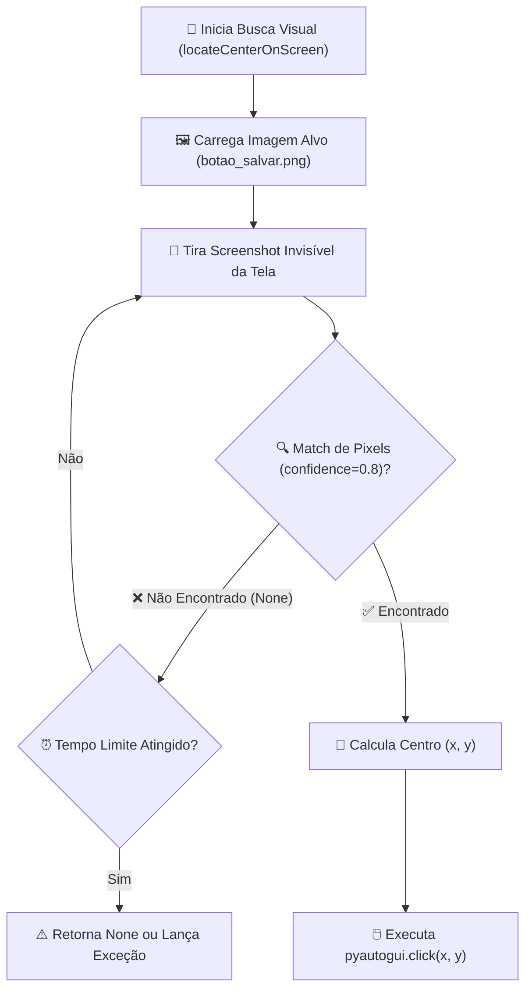

# 🚀 Aula 14 — PyAutoGUI Avançado: Visão Computacional (`locateCenterOnScreen`) e Reconhecimento de Imagens

> [!TUTOR] 🚀 Guia Prático de Estudo da Aula (Ciclo de 4 Passos em 1-Clique)
> 1. 📖 **Conceito Extensivo:** Leia as explicações teóricas minuciosas e tire dúvidas com a IA no **Modo Tutor**.
> 2. 👨‍💻 **Código & Prática:** Edite e desenvolva sua solução no arquivo `aula_14_exercicios_manual.py`.
> 3. ⚡ **Testar no Obsidian (1-Clique):** Clique em **Run** no bloco abaixo para validar sua solução:
> > [!EXERCICIO] 🧪 Avaliação 1-Clique dos Exercícios da IDE (Issue #14)
> > 📌 **Exercício Avaliado:** Issue #14 — PyAutoGUI Avancado
> > 📁 **Arquivo de Trabalho na IDE:** `05_automacao_desktop/pratica/Aula 14 - PyAutoGUI Avancado/aula_14_exercicios_manual.py`
> > ⚡ Clique no botão **Run** no canto superior direito do bloco abaixo para testar sua solução:

```python run
import sys, os, subprocess

def find_vault_root():
    curr = os.path.abspath(os.getcwd())
    while curr:
        if os.path.exists(os.path.join(curr, "avaliar_exercicio.py")):
            return curr
        parent = os.path.dirname(curr)
        if parent == curr:
            break
        curr = parent
    user_home = os.path.expanduser("~")
    for root, dirs, files in os.walk(user_home):
        if "avaliar_exercicio.py" in files:
            return root
        if root.count(os.sep) - user_home.count(os.sep) >= 4:
            dirs.clear()
    return os.path.abspath(".")

vault_root = find_vault_root()
script_path = os.path.join(vault_root, "avaliar_exercicio.py")
print("📌 [AVALIAÇÃO 1-CLIQUE] Testando Exercício da Issue #14...")
print("📁 Arquivo Alvo na IDE: 05_automacao_desktop/pratica/Aula 14 - PyAutoGUI Avancado/aula_14_exercicios_manual.py")
res = subprocess.run([sys.executable, script_path, "--issue", "14"], cwd=vault_root, capture_output=True, text=True, encoding="utf-8", errors="replace")
print(res.stdout or res.stderr)
```
> 4. 🔀 **Enviar PR:** Se aprovado pela IA, envie o Pull Request no GitHub para o Tutor (@akanaul)!

---

## 💡 1. Conceito Extensivo & O Porquê

### A Analogia dos Óculos de Reconhecimento Facial Inteligentes
Como vimos na aula anterior, utilizar coordenadas fixas em pixels (`x=500, y=300`) é uma prática frágil: se a janela de um aplicativo for arrastada 2 centímetros para o lado, o robô clicará no vazio.

Para tornar a automação desktop resiliente e imune a movimentos de tela, utilizamos o recurso de **Visão Computacional (`locateCenterOnScreen`)**:
- É como equipar o seu assistente robótico com **Óculos de Reconhecimento Visual Inteligentes**.
- Em vez de mandar o robô clicar no pixel 500x300, você tira um pequeno recorte de imagem do botão desejado (ex: `botao_salvar.png`) e diz ao robô: *"Procure este botão verde em qualquer lugar da tela atual, descubra o seu centro exato e clique nele para mim."*

---

## ⚙️ 2. Lógica de Funcionamento Interno & Ambientes Virtuais (`venv`)

### Instalação da Biblioteca `opencv-python` no Ambiente Virtual
Para que o PyAutoGUI possa utilizar o parâmetro de tolerância visual `confidence=0.8`, a biblioteca **OpenCV** deve estar instalada dentro do seu `venv` ativo:

```bash
# Com o venv ativo (ex: (venv) no terminal):
pip install opencv-python Pillow
```

---

### Algoritmo de Correspondência de Padrões (*Template Matching* com OpenCV)

1. **O Mecanismo de Screenshot e Varredura:** Ao executar `pyautogui.locateCenterOnScreen("imagem.png")`, o PyAutoGUI tira uma foto invisível da tela em tempo real e utiliza o OpenCV para comparar a matriz de pixels da tela com a matriz da imagem de referência.
2. **Nível de Tolerância / Confiança (`confidence`):** Monitores podem apresentar variações sutis de iluminação ou sombras. O parâmetro `confidence=0.8` (requer `opencv-python`) define que a imagem será considerada encontrada se houver **80% de similaridade visual**.
3. **Restrição por Região (`region`):** Varrer a tela inteira em 4K buscando um botão pequeno pode levar de 1 a 2 segundos. Se você souber que o botão fica sempre na metade direita da tela, especificar `region=(x, y, largura, altura)` limita a busca apenas àquela área, tornando o reconhecimento até 10x mais rápido.

---

## 📊 3. Diagrama Visual (Mermaid)



---

## 🖥️ 4. Sintaxe, Código Comentado & Alternativas

Abaixo, veremos como **Localizar Elementos Visuais na Tela com Resiliência e Tratar Falhas quando a Imagem não for Encontrada**.

### Abordagem 1: Localização Resiliente com `confidence`, `grayscale` e Tratamento de Exceção (Abordagem Oficial)

```python
import time
import pyautogui
from pathlib import Path

# Configurações de segurança
pyautogui.FAILSAFE = True
pyautogui.PAUSE = 0.5

PASTA_ATUAL = Path(__file__).resolve().parent
IMAGEM_BOTAO = PASTA_ATUAL / "botao_salvar_exemplo.png"

def clicar_em_imagem_seguro(caminho_imagem, tentativas=3, confianca=0.8):
    """
    Tenta localizar o centro de uma imagem na tela e clica nele.
    Retorna True se encontrou e clicou, ou False se falhou após as tentativas.
    """
    path = Path(caminho_imagem)
    if not path.exists():
        print(f"⚠️ Imagem de referência '{path.name}' não existe no disco.")
        return False
        
    print(f"🔍 Procurando por '{path.name}' na tela (confiança: {confianca * 100}%)...")
    
    for i in range(1, tentativas + 1):
        try:
            # locateCenterOnScreen busca o elemento e retorna a coordenada do centro (x, y)
            posicao = pyautogui.locateCenterOnScreen(
                str(path),
                confidence=confianca,
                grayscale=True  # Converte para escala de cinza para busca rápida
            )
            
            if posicao:
                print(f"✅ Imagem localizada no centro: x={posicao.x}, y={posicao.y}")
                pyautogui.click(posicao)
                return True
                
        except (pyautogui.ImageNotFoundException, Exception):
            pass
            
        print(f"  ⏳ Tentativa {i}/{tentativas} falhou. Aguardando 1s...")
        time.sleep(1)
        
    print(f"❌ Imagem '{path.name}' não foi encontrada na tela.")
    return False

# Testando a função com fallback de segurança
sucesso = clicar_em_imagem_seguro(IMAGEM_BOTAO, tentativas=2)
print(f"Abordagem 1 ➔ Resultado da Ação: {'Sucesso' if sucesso else 'Elemento Ausente'}")
```

---

### Abordagem 2: Varredura com Restrição por Região (`region`) para Alta Performance

```python
def buscar_em_regiao_especifica(caminho_imagem):
    """Varre apenas o canto superior direito da tela (ex: barra de ferramentas)."""
    largura_tela, altura_tela = pyautogui.size()
    
    # Define a região: (left, top, width, height) ➔ Canto superior direito
    regiao_busca = (largura_tela // 2, 0, largura_tela // 2, 300)
    
    try:
        posicao = pyautogui.locateCenterOnScreen(
            str(caminho_imagem),
            confidence=0.85,
            region=regiao_busca
        )
        return posicao
    except Exception:
        return None

print("\nAbordagem 2 ➔ Função de busca por região carregada com sucesso!")
```

---

## 🛠️ 5. Anatomia do Traceback & Tratamento Exaustivo de Exceções

### Analisando Erros Frequentes de Visão Computacional no Terminal

#### 1. `pyautogui.ImageNotFoundException: Could not locate the image`

```text
================================ TRACEBACK REAL DO TERMINAL ================================
  File "c:/projetos/aula_14.py", line 18, in <module>
    pos = pyautogui.locateCenterOnScreen("botao.png")
pyautogui.ImageNotFoundException: Could not locate the image on the screen.
============================================================================================
```

##### Causa Raiz:
A imagem de referência `'botao.png'` não está visível na tela no momento em que a função foi executada.

##### Solução:
Trate a exceção `pyautogui.ImageNotFoundException` dentro de um laço de tentativas com `time.sleep(1)`.

---

#### 2. `PyAutoGUIWASCompiledWithoutImageNotFoundException` / Erro de OpenCV Ausente

```text
================================ TRACEBACK REAL DO TERMINAL ================================
  File "c:/projetos/aula_14.py", line 12, in <module>
    pos = pyautogui.locateCenterOnScreen("botao.png", confidence=0.8)
TypeError: locateCenterOnScreen() got an unexpected keyword argument 'confidence'
============================================================================================
```

##### Causa Raiz:
O parâmetro `confidence` exige o pacote `opencv-python`. Se ele não estiver instalado no seu `venv`, o PyAutoGUI recusará o argumento `confidence`.

---

### Tratamento Defensivo contra Erros de Imagem Ausente

```python
def aguardar_imagem_com_timeout(caminho_imagem, timeout_segundos=5):
    """Aguarda uma imagem surgir na tela até o limite do timeout."""
    inicio = time.time()
    path = Path(caminho_imagem)
    
    while time.time() - inicio < timeout_segundos:
        try:
            posicao = pyautogui.locateCenterOnScreen(str(path), confidence=0.8)
            if posicao:
                return posicao
        except Exception:
            pass
        time.sleep(0.5)
        
    print(f"⚠️ Timeout de {timeout_segundos}s esgotado sem encontrar '{path.name}'.")
    return None

# Testando busca com timeout
print("\n--- Teste de Busca com Timeout ---")
aguardar_imagem_com_timeout(IMAGEM_BOTAO, timeout_segundos=2)
```

---

## ⚖️ 6. Guia de Decisão & Recomendações Caso a Caso

| Parâmetro / Recurso | Sintaxe | Função e Recomendação |
| :--- | :--- | :--- |
| **`confidence=0.8`** | `locateCenterOnScreen("img.png", confidence=0.8)` | **Obrigatório para contornar pequenas variações** de renderização (requer `opencv-python`). |
| **`grayscale=True`** | `locateCenterOnScreen("img.png", grayscale=True)` | **Recomendado para acelerar em até 30%** a velocidade de varredura da imagem na tela. |
| **`region=(x, y, w, h)`**| `locateCenterOnScreen("img.png", region=(...))` | **Ideal para telas 4K**, pois limita a busca apenas à área onde o botão realmente aparece. |

---

## ⚠️ 7. Armadilhas Comuns, Casos Extremos & PEP 8

> [!WARNING] **Cuidado com Temas Escuros / Claros e Resolução de Recortes**
> 1. **Mudança de Tema do Sistema (Dark Mode / Light Mode):** Se você recortar a imagem de um botão com o sistema em Modo Claro (`light.png`) e depois rodar a automação com o sistema em Modo Escuro (`dark mode`), o reconhecimento falhará. Mantenha os temas padronizados.
> 2. **Falta do Pacote `opencv-python`:** Se o `opencv-python` não estiver instalado no seu `venv`, o parâmetro `confidence` será ignorado.
> 3. **PEP 8 — Nomenclatura de Imagens:**
>    - Armazene os recortes de imagem em uma pasta dedicada (ex: `assets/` ou `imagens/`) e use nomes claros (ex: `btn_salvar_verde.png`).

---

## 🧠 8. Vibe Coding, Cheatsheet & Git Workflow

### Dicas de Prompt Estruturado para Reconhecimento Visual
Se precisar criar um loop de espera até que um botão apareça na tela:

> **Exemplo de Prompt Recomendado:**
> *"Atue como um Engenheiro de RPA Python. Crie uma função chamada `aguardar_imagem_aparecer(caminho, timeout=15)` que use PyAutoGUI e `locateCenterOnScreen` para verificar a cada 1 segundo se uma imagem surgiu na tela. Se ela aparecer antes do timeout de 15 segundos, retorne as coordenadas `(x, y)`; caso contrário, lance uma exceção explicativa."*

---

### Cheatsheet Rápido de Visão Computacional

| Função | Sintaxe | Descrição |
| :--- | :--- | :--- |
| **Localizar Centro**| `pyautogui.locateCenterOnScreen("a.png")` | Retorna o ponto central `(x, y)` da imagem encontrada. |
| **Localizar Caixa** | `pyautogui.locateOnScreen("a.png")` | Retorna a caixa delimitadora `(left, top, width, height)`. |
| **Confiança** | `confidence=0.8` | Define tolerância de similaridade (0.0 a 1.0). |
| **Escala Cinza** | `grayscale=True` | Ignora cores para acelerar o processamento visual. |

---

### 🔀 Workflow Ativo de Git, Issue & Pull Request

Para registrar sua solução da Aula 14:

```bash
# 1. Criar branch para a Issue #14
git checkout -b feature/issue-14-pyautogui-avancado

# 2. Adicionar o arquivo alterado ao staging
git add 05_automacao_desktop/pratica/Aula\ 14\ -\ PyAutoGUI\ Avancado/aula_14_exercicios_manual.py

# 3. Registrar o commit
git commit -m "feat(issue-14): resolucao dos exercicios de visao computacional com pyautogui"

# 4. Enviar a branch para o repositório remoto
git push origin feature/issue-14-pyautogui-avancado
```

> 🚀 **Passo Final:** Abra o **Pull Request (PR)** no GitHub para revisão do Tutor (@akanaul)!

---

## 📝 Anotações Pessoais do Aluno sobre esta Aula

> [!TIP] **Criar Nota de Estudo Relacionada**  
> Quer guardar resumos ou anotações próprias sobre esta aula?  
> Pressione `Alt + N` no Templater e selecione **Template de Anotação do Aluno** para salvar automaticamente em [[meu_caderno_aluno/anotacoes_aulas/anotacoes_aulas|meu_caderno_aluno/anotacoes_aulas/]]!