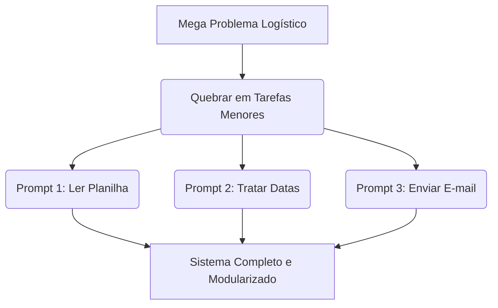

# Aula 15 — Prompt Engineering Avançado
> 💡 **O que você vai aprender:** Técnicas Few-Shot, Chain of Thought (CoT), e estruturação complexa para geração de automações robustas.
> ⏱️ **Duração estimada:** 2h | 📅 **Bloco:** 6

---

## 🎯 Objetivos da Aula
- Dominar o **Few-Shot Prompting** (dando exemplos antes de pedir).
- Usar **Chain of Thought** (pedindo para a IA pensar passo a passo).
- Dividir problemas épicos em sub-prompts.

---

## 📊 Diagrama Visual (Mermaid)

---

## 📖 Prosa de 2h (Conceito e Explicação)
Se o "Vibe Coding" é andar de bicicleta, as técnicas de hoje são o motor. Muitas vezes a IA se perde em lógicas de logística complexas (ex: "Calcular cubagem de múltiplos SKUs e comparar com limite do veículo, aplicando tolerância de 5%").
Para isso usamos o **Chain of Thought**: você diz à IA `"Let's think step by step"` ou `"Explique sua lógica passo a passo antes de escrever o código"`. E com o **Few-Shot**, você dá 2 exemplos de input/output reais do seu ERP para balizar a geração.

---

## 🔗 Conexão com os Projetos Reais
> 💼 **AutoMDFText:** A IA não entendia a bagunça do texto de um PDF de MDF-e. Foi preciso usar Few-Shot, dando 3 exemplos de textos desconfigurados e qual deveria ser a extração final.

---

## 💻 Tríade Dev+IA (Exemplos)

### Exemplo 1 — Few-Shot Prompting
"Extraia a placa do caminhão do texto.
Texto 1: 'Veículo transportador Placa XYZ1234.' -> Saída: XYZ1234
Texto 2: 'Placa do reboque: AAA-9999 (frente).' -> Saída: AAA9999
Texto 3: 'O caminhão de p.l.a.c.a BRZ1A23 chegou.' -> Saída: BRZ1A23
Texto 4: 'Motorista do cavalo placa GHQ-5B67 em pátio' -> Saída: ?"
*(A IA entende o padrão e o formato limpo, gerando o regex perfeito)*

### Exemplo 2 — Chain of Thought
"Escreva um script que leia um CSV de entregas.
Regras:
- Entregas SP: ICMS 18%
- Entregas RJ: ICMS 12%
- Outros: ICMS 7%
Antes de gerar o código Python em um bloco único, escreva em tópicos como você irá aplicar a regra e construir o if/elif/else."

---

## 🔗 Links de Código e Prática
> 📁 Arquivo de prática: N/A - Prática direto no chat da IA!

**Exercício 1:** Crie um prompt usando Few-Shot para ensinar a IA a limpar códigos de rastreio de Correios sujos com pontuações.

---

## 👣 Rodapé / Conexão com a Próxima Aula
O auge da interação Humano-IA. Na Aula 16, faremos um fechamento épico unindo todos os conhecimentos em um único mindset.
#aula #bloco-6 #python #prompt
