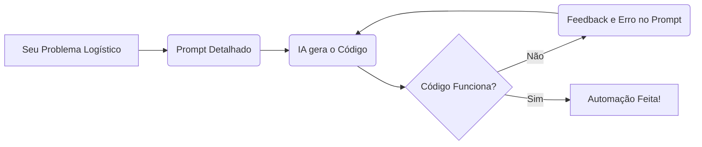

# Aula 8 — Vibe Coding e Engenharia de Prompt Básico
> 💡 **O que você vai aprender:** O que é Vibe Coding. Como guiar as IA (ChatGPT, Antigravity) para programar para você sem saber toda a sintaxe.
> ⏱️ **Duração estimada:** 2h | 📅 **Bloco:** 6

---

## 🎯 Objetivos da Aula
- Entender o fluxo do "Vibe Coding" (Code by Prompting).
- Criar prompts eficientes definindo Contexto, Tarefa, Restrições e Formato.
- Como lidar com erros da IA de maneira sistemática.

---

## 📊 Diagrama Visual (Mermaid)

---

## 📖 Prosa de 2h (Conceito e Explicação)
Você não precisa decorar a sintaxe inteira do Python. No **Vibe Coding**, você "vibra" a ideia: fala em linguagem humana clara, e a IA traduz pra código. Mas se você falar "faz um bot de logística", a IA fará um sistema genérico inútil.
O segredo está no **Prompt**. O analista de logística de hoje deve ser o gerente do dev júnior (a IA). Você passa: O Contexto ("Sou do faturamento logístico"), A Tarefa ("Extraia XML"), A Restrição ("Sem usar pandas, use pathlib e regex"). A IA fará perfeitamente!

---

## 🔗 Conexão com os Projetos Reais
> 💼 **AutoMDFText:** 70% das expressões regulares que puxam Placas e Motoristas foram sugeridas pela IA com base em prompts refinados.
> 📊 **AutoPickingPy:** A IA estruturou todo o agendamento (`schedule`) a partir do Vibe Coding.

---

## 💻 Tríade Dev+IA (Exemplos)

### Exemplo 1 — Prompt Ruim vs Bom
**Ruim:**
"Filtra esse csv."

**Bom:**
"Você é um especialista em Python e Logística. Tenho um arquivo 'rotas.csv' com colunas 'Motorista', 'Status' e 'Km'. Crie um script Python usando a biblioteca `csv` e `pathlib` que leia este arquivo, ignore as rotas com Status 'Cancelado' e crie um novo arquivo 'rotas_ativas.csv'. Adicione comentários em português."

### Exemplo 2 — Feedback de Erro
Quando o código quebrar, NUNCA tente corrigir na mão se você é iniciante.
**Prompt de Correção:**
"Rodei o código e ele deu o seguinte erro: `FileNotFoundError: [Errno 2] No such file or directory: 'rotas.csv'`. Como corrijo? Lembre que meu arquivo está na pasta 'dados/rotas.csv'."

### Exemplo 3 — Com IA (Antigravity)
> 🤖 **Prompt sugerido:**
> (Pratique os exemplos acima no Antigravity ou ChatGPT para ver a magia).

---

## 🔗 Links de Código e Prática
> 📁 Arquivo de prática: `exercicios/aula_08_exercicios.py`

**Exercício 1:** Escreva e teste um prompt longo pedindo uma calculadora de frete.

---

## 👣 Rodapé / Conexão com a Próxima Aula
A base está feita. Na Aula 15, usaremos frameworks avançados como Zero-Shot e Few-Shot para prompts complexos.
#aula #bloco-6 #python #prompt

---

## 🔀 Aprendizado Ativo de Git, Issue & Pull Request

> 📌 **Issue Oficial no GitHub:** # Issue #08
> 🔀 **Branch de Desenvolvimento:** git checkout -b feature/issue-08-prompt-engineering
> 📁 **Arquivo de Trabalho (Manual):** aula_08_exercicios_manual.py
> 🧪 **Teste Automatizado & Pré-Aprovação IA:** python avaliar_exercicio.py --issue 08
> 🚀 **Envio de Pull Request (PR):** git push origin feature/issue-08-prompt-engineering e abra o PR no GitHub para a revisão final do Tutor (@akanaul)!
