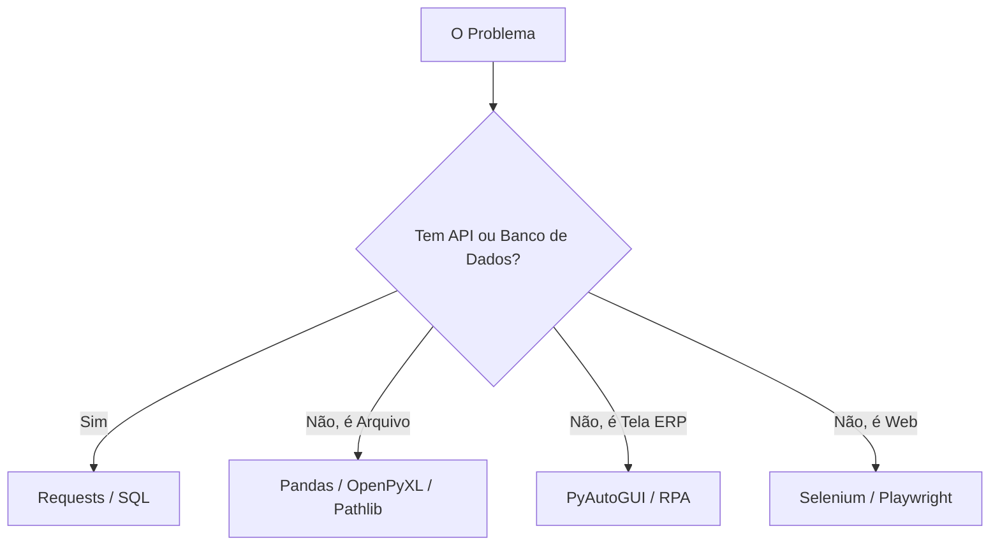

# Aula 16 — Revisão Geral e Próximos Passos
> 💡 **O que você vai aprender:** Como conectar as peças do quebra-cabeça e pensar como um Arquiteto de Automação, usando tudo do curso!
> ⏱️ **Duração estimada:** 2h | 📅 **Bloco:** 6

---

## 🎯 Objetivos da Aula
- Revisar a jornada: Variáveis ➔ POO ➔ Arquivos ➔ Automação ➔ IA.
- Entender onde cada ferramenta brilha e onde falha.
- Conhecer a "Próxima Fronteira" do mundo RPA e Dados.

---

## 📊 Diagrama Visual (Mermaid)

---

## 📖 Prosa de 2h (Conceito e Explicação)
A maior habilidade de um profissional de logística automatizada não é saber código de cor; é **arquitetura de solução**. Saber que usar PyAutoGUI para o que o Pandas faz em milissegundos é um erro. Saber usar o `pathlib` e o `zoneinfo` garante scripts que não quebram.
A união do Dev com a IA virou o novo "saber Excel". Você está na crista da onda. Mantenha o código limpo, use Módulos (Aula 9) e comente o código.

---

## 🔗 Conexão com os Projetos Reais
> 💼 **AutoMDFText e AutoPickingPy:** Eles são junções de todas essas tecnologias! Arquivos (TXT/CSV), Regras (POO/Lógica), RPA (PyAutoGUI) e E-mails automáticos. A jornada foi inteira baseada nesses produtos reais.

---

## 💻 Tríade Dev+IA (Exemplos)

### Exemplo 1 — O Framework Mestre da IA
**Prompt Arquitetural Sugerido:**
"Quero automatizar a baixa de estoque do meu armazém. Recebo um PDF com os itens diários por e-mail, e preciso lançar num ERP Web. Não escreva código ainda. Quais bibliotecas em Python você sugere para eu construir esse fluxo robusto, levando em conta tratamento de erros?"

*(Ela provavelmente vai sugerir `imaplib` ou APIs, `pdfplumber`, e **Selenium**... que é nosso bônus!)*

---

## 🔗 Links de Código e Prática
Revise todos os scripts construídos até agora. Melhore-os usando POO.

---

## 👣 Rodapé / Conexão com a Próxima Aula
Você completou o essencial. Se o seu ERP é web (via navegador), o PyAutoGUI sofre. É aí que entramos no Módulo Bônus: Selenium 4!
#aula #bloco-6 #python #revisao

---

## 🔀 Aprendizado Ativo de Git, Issue & Pull Request

> 📌 **Issue Oficial no GitHub:** # Issue #16
> 🔀 **Branch de Desenvolvimento:** git checkout -b feature/issue-16-revisao-geral
> 📁 **Arquivo de Trabalho (Manual):** aula_16_exercicios_manual.py
> 🧪 **Teste Automatizado & Pré-Aprovação IA:** python avaliar_exercicio.py --issue 16
> 🚀 **Envio de Pull Request (PR):** git push origin feature/issue-16-revisao-geral e abra o PR no GitHub para a revisão final do Tutor (@akanaul)!

---

## 📝 Anotações Pessoais do Aluno sobre esta Aula

> [!TIP] **Criar Nota de Estudo Relacionada**
> Quer guardar resumos ou anotações próprias sobre esta aula?
> Pressione Alt + N no Templater e selecione **Template de Anotação do Aluno** para salvar automaticamente em [[meu_caderno_aluno/anotacoes_aulas/anotacoes_aulas|meu_caderno_aluno/anotacoes_aulas/]]!
