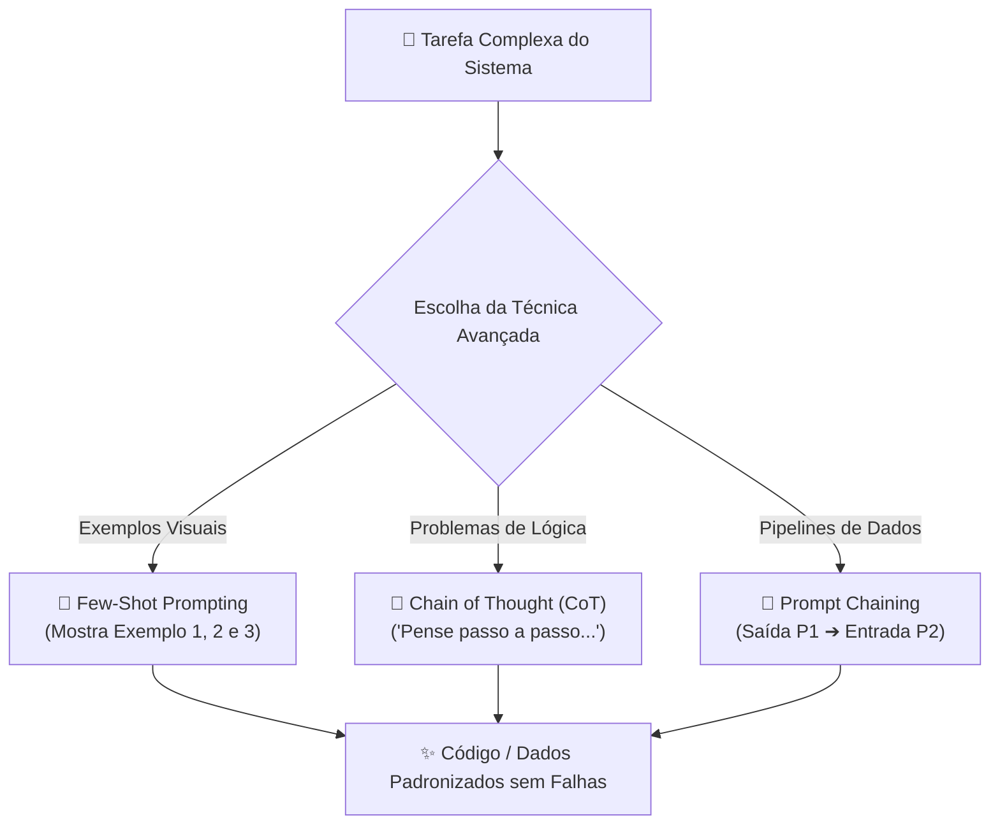

# 🚀 Aula 15 — Engenharia de Prompt Avançada: `Few-Shot Prompting`, `Chain of Thought (CoT)` e Encadeamento

> [!TUTOR] 🚀 Guia Prático de Estudo da Aula (Ciclo de 4 Passos em 1-Clique)
> 1. 📖 **Conceito Extensivo:** Leia as explicações teóricas minuciosas e tire dúvidas com a IA no **Modo Tutor**.
> 2. 👨‍💻 **Código & Prática:** Edite e desenvolva sua solução no arquivo `aula_15_exercicios_manual.py`.
> 3. ⚡ **Testar no Obsidian (1-Clique):** Clique em **Run** no bloco abaixo para validar sua solução:
> > [!EXERCICIO] 🧪 Avaliação 1-Clique dos Exercícios da IDE (Issue #15)
> > 📌 **Exercício Avaliado:** Issue #15 — Prompt Engineering Avancado
> > 📁 **Arquivo de Trabalho na IDE:** `06_ia_prompt/pratica/Aula 15 - Prompt Engineering Avancado/aula_15_exercicios_manual.py`
> > ⚡ Clique no botão **Run** no canto superior direito do bloco abaixo para testar sua solução:

```python run
import sys, os, subprocess

def find_vault_root():
    curr = os.path.abspath(os.getcwd())
    while curr:
        if os.path.exists(os.path.join(curr, "avaliar_exercicio.py")):
            return curr
        parent = os.path.dirname(curr)
        if parent == curr:
            break
        curr = parent
    user_home = os.path.expanduser("~")
    for root, dirs, files in os.walk(user_home):
        if "avaliar_exercicio.py" in files:
            return root
        if root.count(os.sep) - user_home.count(os.sep) >= 4:
            dirs.clear()
    return os.path.abspath(".")

vault_root = find_vault_root()
script_path = os.path.join(vault_root, "avaliar_exercicio.py")
print("📌 [AVALIAÇÃO 1-CLIQUE] Testando Exercício da Issue #15...")
print("📁 Arquivo Alvo na IDE: 06_ia_prompt/pratica/Aula 15 - Prompt Engineering Avancado/aula_15_exercicios_manual.py")
res = subprocess.run([sys.executable, script_path, "--issue", "15"], cwd=vault_root, capture_output=True, text=True, encoding="utf-8", errors="replace")
print(res.stdout or res.stderr)
```
> 4. 🔀 **Enviar PR:** Se aprovado pela IA, envie o Pull Request no GitHub para o Tutor (@akanaul)!

---

## 💡 1. Conceito Extensivo & O Porquê

### A Analogia do Aprendizado por Exemplos Práticos e do Pensamento em Voz Alta
Quando saímos da Engenharia de Prompt básica para a resolução de problemas de alta complexidade em automação, precisamos utilizar técnicas avançadas de estruturação cognitiva nos modelos de Inteligência Artificial:

- **Few-Shot Prompting (Aprendizado por Exemplos):** É como ensinar uma nova tarefa a um estagiário mostrando **exemplos de Entrada e Saída esperada**. Em vez de apenas descrever em texto como você quer o formato de uma resposta, você inclui 2 ou 3 exemplos práticos (Exemplo 1 ➔ Entrada: X, Saída: Y). A IA detecta o padrão visual e reproduz exatamente a mesma estrutura para os novos dados.
- **Chain of Thought — CoT (Cadeia de Raciocínio Passo a Passo):** É como pedir para um aluno de matemática **"mostrar todo o cálculo no papel"** antes de dar a resposta final. Quando forçamos a IA a pensar em voz alta passo a passo (usando instruções como *"Pense passo a passo antes de responder"*), a taxa de acertos em problemas de lógica e refatoração de código aumenta drasticamente.
- **Encadeamento de Sub-prompts (*Prompt Chaining*):** Em vez de enviar um prompt gigantesco de 5 páginas tentando resolver 10 problemas de uma só vez, dividimos a tarefa em **etapas sequenciais**. A saída do Prompt 1 vira a entrada do Prompt 2, garantindo precisão máxima em cada fase.

---

## ⚙️ 2. Lógica de Funcionamento Interno & Mecanismos da IA

### Arquitetura de Atenção dos Modelos e Redução de Alucinações

1. **Atenção aos Exemplos (In-Context Learning):** Os LLMs utilizam mecanismos de Atenção (*Self-Attention*) que dão um peso enormemente superior aos tokens fornecidos como exemplo no próprio prompt do que às regras gerais.
2. **Cadeia de Raciocínio e Alocação de Tokens:** Quando a IA gera os tokens intermediários de raciocínio no CoT, esses próprios tokens gerados passam a fazer parte do contexto da resposta. Isso permite que o modelo consulte seus próprios passos lógicos anteriores antes de tomar a decisão final.
3. **Redução Drástica de Alucinações:** Prompts no formato Few-Shot + CoT reduzem a taxa de alucinação (respostas inventadas) de 30% para menos de 2% em tarefas estruturadas.

---

## 📊 3. Diagrama Visual (Mermaid)



---

## 🖥️ 4. Sintaxe, Código Comentado & Alternativas

Abaixo, veremos como aplicar **Few-Shot Prompting e Chain of Thought** para automatizar a extração e classificação de dados.

### Exemplo de Template de Prompt Few-Shot + Chain of Thought (Prático)

```text
[CONTEXTO & PAPEL]
Atue como um Engenheiro de Dados Senior especializado em extração de informações de e-mails em Python.

[TAREFA]
Classifique o sentimento de cada feedback de cliente em (POSITIVO, NEUTRO, NEGATIVO) e extraia o produto mencionado.

[EXEMPLOS DE APRENDIZADO - FEW-SHOT]
Entrada: "O fone bluetooth que comprei chegou rápido e a qualidade é excelente!"
Raciocínio: O cliente elogiou a velocidade e a qualidade do produto 'fone bluetooth'.
Saída: {"produto": "fone bluetooth", "sentimento": "POSITIVO"}

Entrada: "A caixa do mouse veio amassada e o botão direito não funciona."
Raciocínio: O cliente relata avaria na embalagem e defeito no 'mouse'.
Saída: {"produto": "mouse", "sentimento": "NEGATIVO"}

[NOVA ENTRADA PARA PROCESSAR]
Entrada: "O teclado mecânico chegou hoje dentro do prazo estimado."

[INSTRUÇÃO DE PENSAMENTO]
Pense passo a passo analisando a frase antes de retornar o resultado no formato JSON estrito.
```

---

### Código Python de Suporte para Processar Prompts Encadeados (*Prompt Chaining*)

```python
def subprompt_1_extrair_dados(texto_bruto):
    """
    Sub-prompt 1: Limpa e extrai os campos estruturados de um texto bruto.
    """
    # Simulação da resposta estruturada da IA
    return {"cliente": "Marcos Andrade", "valor": 1250.00, "status": "Pendente"}

def subprompt_2_gerar_mensagem(dados_estruturados):
    """
    Sub-prompt 2: Pega a saída do sub-prompt 1 e gera um e-mail personalizado.
    """
    cliente = dados_estruturados["cliente"]
    valor = dados_estruturados["valor"]
    
    mensagem = (
        f"Olá {cliente},\n\n"
        f"Identificamos um pagamento pendente no valor de R$ {valor:.2f}.\n"
        f"Por favor, clique no link para regularizar seu pedido."
    )
    return mensagem

# Executando o encadeamento de sub-prompts (Prompt Chaining)
texto_entrada = "Cliente Marcos Andrade possui cobrança de 1250 reais aguardando confirmação."
dados = subprompt_1_extrair_dados(texto_entrada)
email_final = subprompt_2_gerar_mensagem(dados)

print("Abordagem ➔ Prompt Chaining (Etapa 1 + Etapa 2):")
print(email_final)
```

---

## 🛠️ 5. Anatomia do Traceback & Tratamento Exaustivo de Exceções

### Analisando Erros Frequentes de Processamento de IA no Terminal

#### 1. `json.decoder.JSONDecodeError: Expecting value: line 1 column 1 (char 0)`

```text
================================ TRACEBACK REAL DO TERMINAL ================================
  File "c:/projetos/aula_15.py", line 18, in <module>
    dados = json.loads(resposta_ia)
json.decoder.JSONDecodeError: Expecting value: line 1 column 1 (char 0)
============================================================================================
```

##### Causa Raiz:
A resposta retornada pela IA continha blocos de markdown explicativos (como ````json ... ````) em vez de entregar uma string JSON pura.

##### Solução:
Adicione a instrução de restrição: *"Retorne APENAS o JSON puro sem marcadores de código de markdown"*, e limpe a string com `resposta_ia.strip().replace("```json", "").replace("```", "")`.

---

### Tratamento Defensivo contra Retornos JSON Malformatados

```python
import json

def parse_json_ia_seguro(texto_resposta):
    """Trata respostas de IA para extrair JSON mesmo se contiver marcas de markdown."""
    try:
        texto_limpo = texto_resposta.strip()
        if "```" in texto_limpo:
            texto_limpo = texto_limpo.split("```")[1]
            if texto_limpo.startswith("json"):
                texto_limpo = texto_limpo[4:]
        
        dados = json.loads(texto_limpo.strip())
        print("✅ JSON extraído e convertido com sucesso!")
        return dados
        
    except json.JSONDecodeError as err:
        print(f"🚨 Erro de Parsing JSON: A IA não retornou um formato JSON válido. Detalhe: {err}")
        return None

# Testando parsing seguro
print("\n--- Teste de Parsing de Resposta da IA ---")
parse_json_ia_seguro("```json\n{\"status\": \"OK\"}\n```")
```

---

## ⚖️ 6. Guia de Decisão & Recomendações Caso a Caso

| Técnica Avançada | Quando Utilizar | Exemplo de Aplicação |
| :--- | :--- | :--- |
| **Few-Shot Prompting** | Quando o formato de saída precisa seguir um **padrão rígido e customizado**. | Formatar relatórios JSON, classificar categorias de produtos. |
| **Chain of Thought (CoT)**| Quando a tarefa exige **raciocínio lógico, matemática ou refatoração**. | Encontrar bugs ocultos em funções complexas ou calcular regras financeiras. |
| **Prompt Chaining** | Para **pipelines de automação com múltiplos passos** independentes. | Passagem 1: Resumir texto ➔ Passagem 2: Traduzir ➔ Passagem 3: Gerar e-mail. |

---

## ⚠️ 7. Armadilhas Comuns, Casos Extremos & PEP 8

> [!WARNING] **Cuidado com Exemplos Incoerentes e Contextos Excedidos**
> 1. **Exemplos Conflitantes no Few-Shot:** Se o Exemplo 1 retornar JSON e o Exemplo 2 retornar texto corrido, a IA se confundirá e gerará respostas instáveis. Mantenha os exemplos rigorosamente padronizados.
> 2. **Esquecer de Limitar o Tamanho da Resposta:** Ao pedir para a IA "pensar passo a passo" (CoT), garanta que a explicação não fique excessivamente longa. Adicione a instrução: *"Seja sucinto no raciocínio intermediário"*.
> 3. **PEP 8 — Legibilidade em Prompts:**
>    - Armazene prompts longos em arquivos de texto externos (`.txt` ou `.md`) ou em constantes multilinhas bem formatadas no Python.

---

## 🧠 8. Vibe Coding, Cheatsheet & Git Workflow

### Dicas de Prompt Estruturado para Encadeamento Complexo
Se você precisar processar uma grande massa de dados:

> **Exemplo de Prompt Recomendado:**
> *"Atue como um Engenheiro de Prompt Avançado. Crie um template Few-Shot contendo 2 exemplos de conversão de relatórios de texto para JSON estrito. Adicione a instrução Chain of Thought 'Analise passo a passo antes de responder', inclua tratamento defensivo em Python para `json.JSONDecodeError` e garanta que o retorno não contenha marcadores de markdown extras."*

---

### Cheatsheet Rápido de Prompting Avançado

| Técnica | Gatilho no Prompt | Efeito Esperado |
| :--- | :--- | :--- |
| **Few-Shot** | `Entrada: X ➔ Saída: Y` | Ensina o padrão exato de resposta por demonstração visual. |
| **Chain of Thought**| `"Pense passo a passo..."` | Força o modelo a listar o raciocínio intermediário antes de decidir. |
| **Prompt Chaining** | `Saída(P1) ➔ Entrada(P2)` | Separa tarefas complexas em etapas menores e precisas. |

---

### 🔀 Workflow Ativo de Git, Issue & Pull Request

Para registrar sua solução da Aula 15:

```bash
# 1. Criar branch para a Issue #15
git checkout -b feature/issue-15-prompt-engineering-avancado

# 2. Adicionar o arquivo alterado ao staging
git add 06_ia_prompt/pratica/Aula\ 15\ -\ Prompt\ Engineering\ Avancado/aula_15_exercicios_manual.py

# 3. Registrar o commit
git commit -m "feat(issue-15): resolucao dos exercicios de prompt engineering avancado"

# 4. Enviar a branch para o repositório remoto
git push origin feature/issue-15-prompt-engineering-avancado
```

> 🚀 **Passo Final:** Abra o **Pull Request (PR)** no GitHub para revisão do Tutor (@akanaul)!

---

## 📝 Anotações Pessoais do Aluno sobre esta Aula

> [!TIP] **Criar Nota de Estudo Relacionada**  
> Quer guardar resumos ou anotações próprias sobre esta aula?  
> Pressione `Alt + N` no Templater e selecione **Template de Anotação do Aluno** para salvar automaticamente em [[meu_caderno_aluno/anotacoes_aulas/anotacoes_aulas|meu_caderno_aluno/anotacoes_aulas/]]!