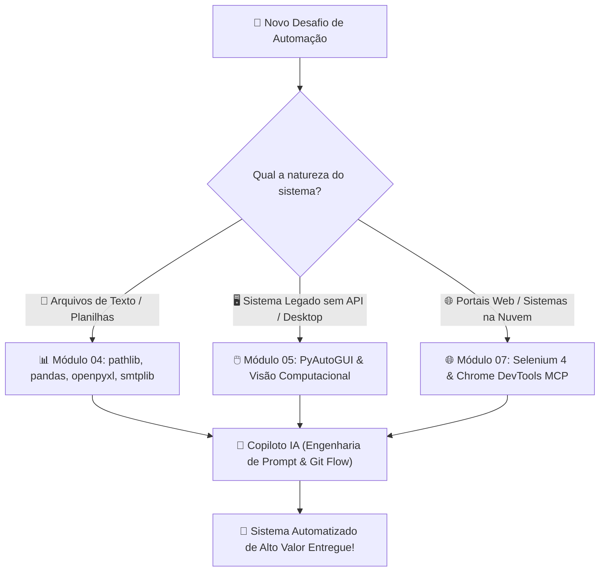

# 🚀 Aula 16 — Revisão Geral da Jornada Dev + IA, Árvore de Decisão Arquitetural e Próximos Passos

> [!TUTOR] 🚀 Guia Prático de Estudo da Aula (Ciclo de 4 Passos em 1-Clique)
> 1. 📖 **Conceito Extensivo:** Leia as explicações teóricas minuciosas e tire dúvidas com a IA no **Modo Tutor**.
> 2. 👨‍💻 **Código & Prática:** Edite e desenvolva sua solução no arquivo `aula_16_exercicios_manual.py`.
> 3. ⚡ **Testar no Obsidian (1-Clique):** Clique em **Run** no bloco abaixo para validar sua solução:
> > [!EXERCICIO] 🧪 Avaliação 1-Clique dos Exercícios da IDE (Issue #16)
> > 📌 **Exercício Avaliado:** Issue #16 — Revisao Geral e Proximos Passos
> > 📁 **Arquivo de Trabalho na IDE:** `06_ia_prompt/pratica/Aula 16 - Revisao Geral e Proximos Passos/aula_16_exercicios_manual.py`
> > ⚡ Clique no botão **Run** no canto superior direito do bloco abaixo para testar sua solução:

```python run
import sys, os, subprocess

def find_vault_root():
    curr = os.path.abspath(os.getcwd())
    while curr:
        if os.path.exists(os.path.join(curr, "avaliar_exercicio.py")):
            return curr
        parent = os.path.dirname(curr)
        if parent == curr:
            break
        curr = parent
    user_home = os.path.expanduser("~")
    for root, dirs, files in os.walk(user_home):
        if "avaliar_exercicio.py" in files:
            return root
        if root.count(os.sep) - user_home.count(os.sep) >= 4:
            dirs.clear()
    return os.path.abspath(".")

vault_root = find_vault_root()
script_path = os.path.join(vault_root, "avaliar_exercicio.py")
print("📌 [AVALIAÇÃO 1-CLIQUE] Testando Exercício da Issue #16...")
print("📁 Arquivo Alvo na IDE: 06_ia_prompt/pratica/Aula 16 - Revisao Geral e Proximos Passos/aula_16_exercicios_manual.py")
res = subprocess.run([sys.executable, script_path, "--issue", "16"], cwd=vault_root, capture_output=True, text=True, encoding="utf-8", errors="replace")
print(res.stdout or res.stderr)
```
> 4. 🔀 **Enviar PR:** Se aprovado pela IA, envie o Pull Request no GitHub para o Tutor (@akanaul)!

---

## 💡 1. Conceito Extensivo & O Porquê

### A Analogia da Construção de um Edifício Inteligente
Chegamos ao momento de consolidação de toda a nossa jornada de aprendizado em Python e Inteligência Artificial!

Imagine a construção de um **Edifício Residencial Inteligente**:
- **Módulo 01 (Fundamentos, venv & Git):** Representa o **Terreno, a Infraestrutura de Ambientes Virtuais e os Alicerces de Concreto**. Sem entender variáveis, loops, condicionais e o controle de versão com Git, o prédio não para em pé.
- **Módulo 02 & 03 (Python Essencial & POO):** Representam as **Paredes, Vigas e a Planta Arquitetônica**. As funções, classes, dicionários e coleções estruturam a engenharia da casa.
- **Módulo 04 & 05 (Arquivos, Excel, Email & RPA):** Representam a **Instalação Elétrica, Hidráulica e os Elevadores**. Eles conectam o código ao mundo real, manipulando planilhas, disparando e-mails e movendo o mouse.
- **Módulo 06 (Engenharia de Prompt & IA):** Representa a **Central de Automação Inteligente por Voz e Sensores**. O copiloto de IA atua como o cérebro que auxilia na manutenção contínua e na geração de novas funcionalidades.

---

## ⚙️ 2. Lógica de Funcionamento Interno & Árvore de Decisão

### Como Escolher a Ferramenta Certa para Cada Problema de Automação

Ao se deparar com uma nova necessidade de automação na sua empresa ou projeto pessoal, siga a **Árvore de Decisão Arquitetural**:

```text
[Novo Desafio de Automação]
         │
         ├── Há arquivos locais TXT/CSV/JSON? ➔ Usar `pathlib` + `csv`/`json` (Módulo 04)
         ├── O desafio envolve tabelas Excel (.xlsx)? ➔ Usar `pandas` (análise) + `openpyxl` (visual)
         ├── O desafio envolve sistemas sem API/Desktop? ➔ Usar `PyAutoGUI` (RPA / Visão) (Módulo 05)
         └── O desafio exige extração em sites/web? ➔ Usar `Selenium 4` + `DevTools MCP` (Módulo 07)
```

---

## 📊 3. Diagrama Visual (Mermaid)



---

## 🖥️ 4. Sintaxe, Código Comentado & Alternativas

Abaixo, veremos uma **Síntese Arquitetural** reunindo o processamento de dados, validação de regras e geração de relatórios em um único script coeso.

### Script Integrador da Jornada Dev+IA (Exemplo Completo)

```python
import json
from pathlib import Path

class GerenciadorAutomacao:
    """Classe integradora que representa a arquitetura completa aprendida no curso."""
    
    def __init__(self, nome_projeto):
        self.nome_projeto = nome_projeto
        self.pasta_projeto = Path(__file__).resolve().parent / "saida_projeto"
        self.pasta_projeto.mkdir(exist_ok=True)
        self.relatorio = []

    def adicionar_registro(self, modulo, status, detalhe):
        """Adiciona um log de status de um módulo específico."""
        self.relatorio.append({
            "modulo": modulo,
            "status": status,
            "detalhe": detalhe
        })

    def exportar_resumo_json(self):
        """Exporta o resumo consolidado da automação para arquivo JSON."""
        arquivo_saida = self.pasta_projeto / "status_arquitetura.json"
        
        dados = {
            "projeto": self.nome_projeto,
            "total_modulos": len(self.relatorio),
            "itens": self.relatorio
        }
        
        with arquivo_saida.open("w", encoding="utf-8") as f:
            json.dump(dados, f, indent=2, ensure_ascii=False)
            
        print(f"✅ Relatório arquitetural exportado para: {arquivo_saida.name}")

# Instanciando e testando o gerenciador integrador
gerenciador = GerenciadorAutomacao("Sistema de Automação Comercial Vibe Coding")
gerenciador.adicionar_registro("Módulo 01 - Fundamentos", "OK", "Bancada, venv e Git integrados")
gerenciador.adicionar_registro("Módulo 04 - Bibliotecas", "OK", "Processamento CSV/Excel ativado")
gerenciador.adicionar_registro("Módulo 05 - RPA Desktop", "OK", "PyAutoGUI e FailSafe validados")

gerenciador.exportar_resumo_json()
```

---

## 🛠️ 5. Anatomia do Traceback & Tratamento Exaustivo de Exceções

### Analisando Erros Frequentes de Arquitetura e Projetos no Terminal

#### 1. `ImportError: cannot import name 'X' from partially initialized module` (Import Cíclico)

```text
================================ TRACEBACK REAL DO TERMINAL ================================
  File "c:/projetos/modulo_a.py", line 2, in <module>
    from modulo_b import funcao_b
ImportError: cannot import name 'funcao_b' from partially initialized module 'modulo_b'
============================================================================================
```

##### Causa Raiz:
O `modulo_a` importa o `modulo_b`, e o `modulo_b` tenta importar o `modulo_a` de volta no topo do arquivo (Importação Cíclica).

##### Solução:
Reorganize as funções compartilhadas em um terceiro módulo utilitário desacoplado (ex: `utils.py`).

---

## ⚖️ 6. Guia de Decisão & Recomendações Caso a Caso

| Módulo do Curso | Principal Entrega | Quando Aplicar no Dia a Dia |
| :--- | :--- | :--- |
| **Módulo 01 & 02** | Sintaxe Python, Coleções e Git Flow | **Base em 100% das automações** que você desenvolver. |
| **Módulo 03** | Programação Orientada a Objetos | Para criar sistemas com **múltiplas entidades e regras complexas**. |
| **Módulo 04** | Processamento de Arquivos e E-mails | Para **tratar relatórios diários em Excel/CSV** e enviar avisos. |
| **Módulo 05** | Automação Desktop (RPA) | Para **sistemas antigos sem API** que exigem cliques na tela. |
| **Módulo 06** | Prompt Engineering Avançado | Para **acelerar o desenvolvimento e corrigir erros** com a IA. |
| **Módulo 07 (Bônus)**| Selenium 4 & Chrome DevTools MCP | Para **raspar dados de sites e preencher formulários web**. |

---

## ⚠️ 7. Armadilhas Comuns, Casos Extremos & PEP 8

> [!WARNING] **Cuidado com a Complexidade Desnecessária (*Overengineering*)**
> 1. **Usar PyAutoGUI quando um script de Arquivo resolveria:** Se o sistema permite exportar um arquivo CSV, prefira sempre processar o CSV diretamente com `pandas` em vez de tentar clicar em botões na tela com `PyAutoGUI`.
> 2. **Manter o Repositório Git Atualizado:** Não acumule semanas de trabalho sem realizar commits e enviar branches via Pull Request. O versionamento frequente garante a segurança do seu código.
> 3. **PEP 8 — O Código É Lido Mais Vezes do que Escrito:**
>    - Mantenha o código limpo, com nomes de variáveis significativos em português ou inglês e comentários explicativos.

---

## 🧠 8. Vibe Coding, Cheatsheet & Git Workflow

### Dicas de Prompt Estruturado para Design de Arquitetura
Se você precisar planejar uma automação do zero:

> **Exemplo de Prompt Recomendado:**
> *"Atue como um Arquiteto de Soluções Python. Preciso automatizar a leitura de um arquivo CSV diário de vendas, calcular o total faturado por categoria usando `pandas`, gerar um relatório formatado no Excel com `openpyxl` e enviar o resumo por e-mail via `smtplib`. Crie um plano de etapas modularizado usando POO e tratamento de exceções."*

---

### Cheatsheet Rápido da Jornada Dev+IA

| Etapa | Ferramenta Chave | Comando / Conceito |
| :--- | :--- | :--- |
| **Versionamento** | Git & GitHub | `git checkout -b`, `git commit`, `PR` |
| **Isolamento** | Python `venv` | `python -m venv venv`, `pip freeze` |
| **Dados em Memória**| Python 3.12 | `dict`, `list`, `set`, `class`, `def` |
| **Arquivos & Tabelas**| `pathlib`, `pandas` | `Path()`, `pd.read_excel()` |
| **Automação Desktop**| `PyAutoGUI` | `FAILSAFE = True`, `locateCenterOnScreen` |
| **Automação Web** | `Selenium 4` | `driver.get()`, `WebDriverWait` |

---

### 🔀 Workflow Ativo de Git, Issue & Pull Request

Para registrar o encerramento com sucesso do Módulo 06:

```bash
# 1. Criar branch para a Issue #16
git checkout -b feature/issue-16-revisao-geral

# 2. Adicionar o arquivo alterado ao staging
git add 06_ia_prompt/pratica/Aula\ 16\ -\ Revisao\ Geral\ e\ Proximos\ Passos/aula_16_exercicios_manual.py

# 3. Registrar o commit final da jornada
git commit -m "feat(issue-16): resolucao dos exercicios de revisao geral e sintese arquitetural"

# 4. Enviar para o repositório remoto
git push origin feature/issue-16-revisao-geral
```

> 🚀 **Passo Final:** Abra o **Pull Request (PR)** final no GitHub para homologação do Tutor (@akanaul)!

---

## 📝 Anotações Pessoais do Aluno sobre esta Aula

> [!TIP] **Criar Nota de Estudo Relacionada**  
> Quer guardar resumos ou anotações próprias sobre esta aula?  
> Pressione `Alt + N` no Templater e selecione **Template de Anotação do Aluno** para salvar automaticamente em [[meu_caderno_aluno/anotacoes_aulas/anotacoes_aulas|meu_caderno_aluno/anotacoes_aulas/]]!