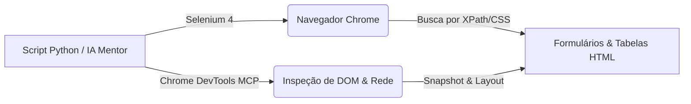

# Aula Bônus — Automação Web Dual: Selenium & Chrome DevTools MCP
> 💡 **O que você vai aprender:** Automação Web Profissional. Controlar navegadores web via Selenium tradicional e via a nova abordagem assistida por IA com Chrome DevTools MCP!
> ⏱️ **Duração estimada:** 2h | 📅 **Bloco:** 7

---

## 🎯 Objetivos da Aula
- Instalar e configurar o Selenium 4+ (Service, ChromeOptions).
- Usar `By.XPATH` e `By.CSS_SELECTOR` para localização precisa de elementos.
- Entender **Implicit / Explicit Waits** (`WebDriverWait`).
- Explorar a automação assistida por IA via **Chrome DevTools MCP** (snapshots de DOM, logs de rede e auditoria).

---

## 📊 Diagrama Visual (Mermaid)


---

## 📖 Conceitos Principais

### 1. Selenium WebDriver Tradicional
Para automações clássicas em segundo plano (modo `headless`), o Selenium é imbatível. Ele interage diretamente com os elementos HTML da página sem depender do mouse físico.

### 2. Chrome DevTools MCP (Automação Assistida por IA)
O Chrome DevTools MCP permite que o copiloto de IA inspecione a estrutura da página, capture snapshots do DOM, monitore requisições de rede e identifique erros de console em tempo real.

---

## 💻 Tríade Dev+IA (Exemplos Práticos)

### Exemplo 1 — Setup Moderno (Selenium 4)
```python
from selenium import webdriver
from selenium.webdriver.chrome.service import Service
from selenium.webdriver.chrome.options import Options

opcoes = Options()
# opcoes.add_argument("--headless=new") # Roda invisível!
opcoes.add_argument("--disable-blink-features=AutomationControlled")

servico = Service()
driver = webdriver.Chrome(service=servico, options=opcoes)

driver.get("file:///c:/Users/Lenovo/Documents/Curso%20Python%20e%20IA%20para%20automa%C3%A7%C3%A3o%20b%C3%A1sica/_dados_exemplo/web_playground.html")
print(driver.title)
driver.quit()
```

### Exemplo 2 — Extração Resiliente (DevTools MCP / BeautifulSoup)
```python
from bs4 import BeautifulSoup

def parse_playground_table(html: str):
    soup = BeautifulSoup(html, "html.parser")
    first_row = soup.find("tr")
    return first_row.get_text(strip=True) if first_row else ""
```

---

## 🏋️ Exercícios da Aula
- [ ] **Exercício 1 (Manual - Tutor):** Editando `devtools_mcp_manual.py` com suporte do `# Issue #07-B`.
- [ ] **Exercício 2 (IA One-Shot):** Analisando `devtools_mcp_ia.py`.
- [ ] **Validação:** Rodando `python avaliar_exercicio.py --issue 07`.

---

## 👣 Conexão e Próximos Passos
Com a automação desktop (PyAutoGUI), automação web (Selenium + Chrome DevTools MCP) e processamento de dados (pandas/openpyxl), você domina a suíte completa de automação em Python!
#aula #bloco-7 #python #selenium #devtools-mcp #issue-07


---

## 🔀 Aprendizado Ativo de Git, Issue & Pull Request

> 📌 **Issue Oficial no GitHub:** # Issue #bonus
> 🔀 **Branch de Desenvolvimento:** git checkout -b feature/issue-bonus-selenium-tradicional
> 📁 **Arquivo de Trabalho (Manual):** aula_bonus_selenium_exercicios_manual.py
> 🧪 **Teste Automatizado & Pré-Aprovação IA:** python avaliar_exercicio.py --issue bonus
> 🚀 **Envio de Pull Request (PR):** git push origin feature/issue-bonus-selenium-tradicional e abra o PR no GitHub para a revisão final do Tutor (@akanaul)!
