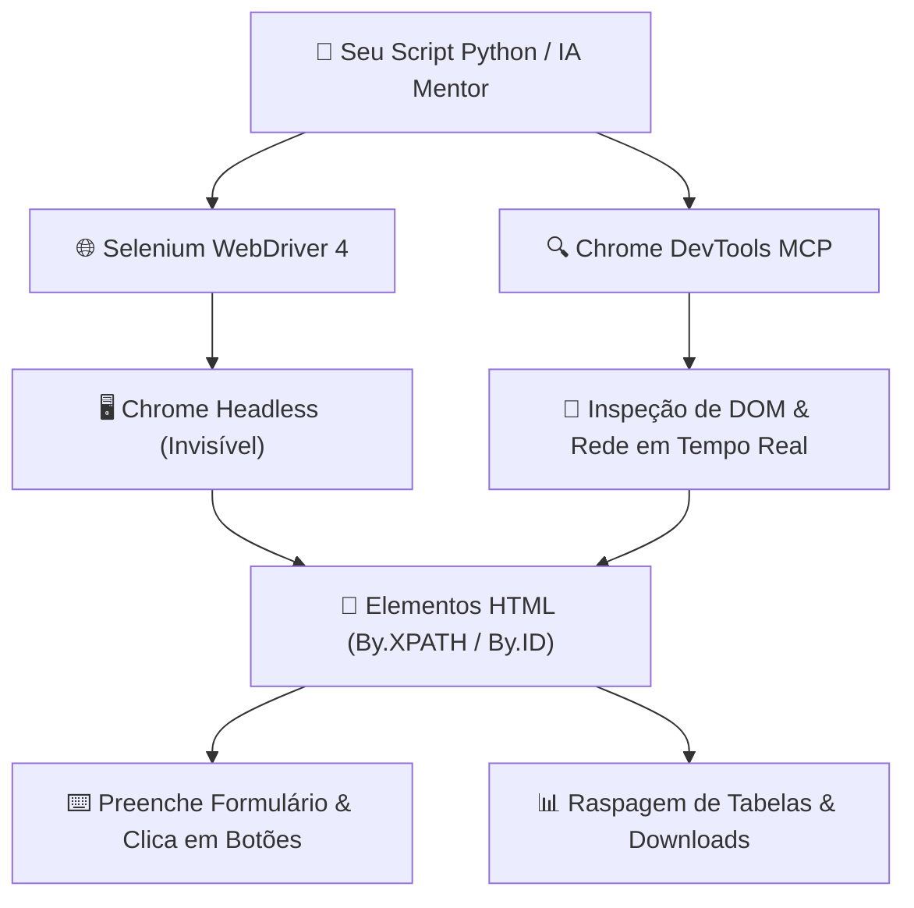

# 🚀 Aula Bônus — Automação Web Profissional com `Selenium 4` e `Chrome DevTools MCP`

> [!TUTOR] 🚀 Guia Prático de Estudo da Aula (Ciclo de 4 Passos em 1-Clique)
> 1. 📖 **Conceito Extensivo:** Leia as explicações teóricas minuciosas e tire dúvidas com a IA no **Modo Tutor**.
> 2. 👨‍💻 **Código & Prática:** Edite e desenvolva sua solução no arquivo `devtools_mcp_manual.py`.
> 3. ⚡ **Testar no Obsidian (1-Clique):** Clique em **Run** no bloco abaixo para validar sua solução:
> > [!EXERCICIO] 🧪 Avaliação 1-Clique dos Exercícios da IDE (Issue #devtools)
> > 📌 **Exercício Avaliado:** Issue #devtools — Selenium & Chrome DevTools MCP
> > 📁 **Arquivo de Trabalho na IDE:** `07_bonus_selenium/pratica/Aula Bonus - Selenium A Proxima Fronteira/devtools_mcp_manual.py`
> > ⚡ Clique no botão **Run** no canto superior direito do bloco abaixo para testar sua solução:

```python run
import sys, os, subprocess

def find_vault_root():
    curr = os.path.abspath(os.getcwd())
    while curr:
        if os.path.exists(os.path.join(curr, "avaliar_exercicio.py")):
            return curr
        parent = os.path.dirname(curr)
        if parent == curr:
            break
        curr = parent
    user_home = os.path.expanduser("~")
    for root, dirs, files in os.walk(user_home):
        if "avaliar_exercicio.py" in files:
            return root
        if root.count(os.sep) - user_home.count(os.sep) >= 4:
            dirs.clear()
    return os.path.abspath(".")

vault_root = find_vault_root()
script_path = os.path.join(vault_root, "avaliar_exercicio.py")
print("📌 [AVALIAÇÃO 1-CLIQUE] Testando Exercício da Issue #devtools...")
print("📁 Arquivo Alvo na IDE: 07_bonus_selenium/pratica/Aula Bonus - Selenium A Proxima Fronteira/devtools_mcp_manual.py")
res = subprocess.run([sys.executable, script_path, "--issue", "devtools"], cwd=vault_root, capture_output=True, text=True, encoding="utf-8", errors="replace")
print(res.stdout or res.stderr)
```
> 4. 🔀 **Enviar PR:** Se aprovado pela IA, envie o Pull Request no GitHub para o Tutor (@akanaul)!

---

## 💡 1. Conceito Extensivo & O Porquê

### A Analogia do Navegador com Piloto Automático Invisível e do Copiloto Inspecionador
Quando precisamos interagir com portais de e-commerce, sistemas web corporativos ou consultar dados online, a automação baseada em cliques de tela (PyAutoGUI) encontra limitações: se o site rolar para baixo ou a janela mudar de tamanho, os cliques podem falhar.

Para dominar a automação web profissional, utilizamos a abordagem dual:
- **Selenium 4:** É como ter um **Navegador Web controlado por Controle Remoto**. Em vez de mover o mouse físico na tela, o Selenium se comunica diretamente com o código HTML das páginas via comandos como `find_element(By.XPATH, ...)`. Ele interage com formulários, clica em botões e extrai tabelas de dados, podendo rodar em modo `headless` (totalmente invisível em segundo plano sem gastar recursos visuais).
- **Chrome DevTools MCP:** É o seu **Copiloto de IA para Inspeção Web**. Ele permite que a Inteligência Artificial navegue na estrutura do DOM da página, capture snapshots dos elementos HTML, monitore requisições de rede HTTP e identifique seletores CSS precisos sem que você precise abrir manualmente as ferramentas de desenvolvedor do browser.

---

## ⚙️ 2. Lógica de Funcionamento Interno & Ambientes Virtuais (`venv`)

### Instalação das Bibliotecas Web no Ambiente Virtual
Para rodar automações web com Selenium e BeautifulSoup4, instale os pacotes no seu `venv` ativo:

```bash
# Com o venv ativo (ex: (venv) no terminal):
pip install selenium beautifulsoup4 lxml
```

---

### Protocolo W3C WebDriver, Seletores XPath/CSS e Esperas Inteligentes (`WebDriverWait`)

1. **Protocolo W3C WebDriver no Selenium 4:** O Selenium 4 utiliza o padrão W3C nativo para se comunicar diretamente com o driver do navegador (`chromedriver`), dispensando a necessidade de gerenciadores de drivers externos antigos.
2. **Localização de Elementos (`By.XPATH` vs `By.ID` / `By.CSS_SELECTOR`):**
   - `By.ID`: A forma mais rápida e confiável de encontrar um elemento único no HTML (ex: `By.ID, "email"`).
   - `By.XPATH`: O seletor mais poderoso e flexível. Permite navegar por caminhos complexos da árvore HTML (ex: `//button[contains(text(), 'Enviar')]`).
3. **Esperas Explícitas (`WebDriverWait`):** Sites modernos utilizam carregamentos assíncronos (AJAX/React/Vue). Usar `time.sleep(5)` engessa o código ou causa falhas. O `WebDriverWait` combinado com `expected_conditions` faz o script aguardar **apenas o tempo exato necessário** até que o elemento apareça na tela.

---

## 📊 3. Diagrama Visual (Mermaid)



---

## 🖥️ 4. Sintaxe, Código Comentado & Alternativas

Abaixo, veremos como **Inicializar o Selenium 4 em Modo Headless e Aguardar Elementos com WebDriverWait**.

### Abordagem 1: Setup Moderno do Selenium 4 com `WebDriverWait` (Abordagem Oficial)

```python
from selenium import webdriver
from selenium.webdriver.common.by import By
from selenium.webdriver.chrome.service import Service
from selenium.webdriver.chrome.options import Options
from selenium.webdriver.support.ui import WebDriverWait
from selenium.webdriver.support import expected_conditions as EC

def executar_automacao_web_headless(url_alvo):
    """
    Inicializa o Chrome em modo invisível e extrai informações de um site.
    """
    # 1. Configurando opções do navegador
    chrome_options = Options()
    # chrome_options.add_argument("--headless=new")  # Descomente para rodar invisível
    chrome_options.add_argument("--disable-gpu")
    chrome_options.add_argument("--no-sandbox")
    chrome_options.add_argument("--window-size=1920,1080")

    # 2. Inicializando o serviço nativo do Selenium 4
    service = Service()
    driver = webdriver.Chrome(service=service, options=chrome_options)

    try:
        print(f"🌐 Abrindo a página web: {url_alvo}")
        driver.get(url_alvo)

        # 3. Espera inteligente de até 10 segundos até o elemento H1 estar presente
        espera = WebDriverWait(driver, timeout=10)
        titulo_element = espera.until(
            EC.presence_of_element_located((By.TAG_NAME, "h1"))
        )

        print(f"📌 Título Capturado com Sucesso: '{titulo_element.text}'")
        return driver.title

    finally:
        # 4. Encerra o navegador com segurança para libertar a memória RAM
        driver.quit()
        print("🔒 Sessão do WebDriver encerrada com sucesso.")

# Executando o teste com uma URL exemplo
titulo_pagina = executar_automacao_web_headless("https://example.com")
print(f"Abordagem 1 ➔ Título da Aba: {titulo_pagina}")
```

---

### Abordagem 2: Raspagem de Tabelas HTML com BeautifulSoup / Pandas a partir do Selenium

```python
from bs4 import BeautifulSoup
import pandas as pd

def extrair_tabela_html_selenium(driver_html):
    """Converte a estrutura HTML do Selenium em um DataFrame do Pandas."""
    soup = BeautifulSoup(driver_html, "html.parser")
    tabela = soup.find("table")
    
    if not tabela:
        return None
        
    # Pandas consegue ler tabelas HTML diretamente da string
    dfs = pd.read_html(str(tabela))
    return dfs[0] if dfs else None

print("\nAbordagem 2 ➔ Função de Extração de Tabelas HTML carregada!")
```

---

## 🛠️ 5. Anatomia do Traceback & Tratamento Exaustivo de Exceções

### Analisando Erros Frequentes de Selenium no Terminal

#### 1. `selenium.common.exceptions.TimeoutException: Message:`

```text
================================ TRACEBACK REAL DO TERMINAL ================================
  File "c:/projetos/aula_bonus.py", line 18, in <module>
    elem = WebDriverWait(driver, 5).until(EC.presence_of_element_located((By.ID, "nao_existe")))
selenium.common.exceptions.TimeoutException: Message: 
============================================================================================
```

##### Causa Raiz:
O elemento com `ID="nao_existe"` não apareceu na página dentro do tempo limite de 5 segundos definido no `WebDriverWait`.

##### Solução:
Trate a exceção `TimeoutException` e verifique se o seletor XPath/ID está correto ou se o site está dentro de um `iframe`.

---

#### 2. `selenium.common.exceptions.NoSuchElementException: Message: no such element`

```text
================================ TRACEBACK REAL DO TERMINAL ================================
  File "c:/projetos/aula_bonus.py", line 22, in <module>
    elem = driver.find_element(By.ID, "login")
selenium.common.exceptions.NoSuchElementException: Message: no such element: Unable to locate element
============================================================================================
```

##### Causa Raiz:
Você tentou fazer `find_element` diretamente sem usar `WebDriverWait`, e a página ainda não havia terminado de carregar o elemento.

---

### Tratamento Defensivo contra Erros de Elemento Web Ausente

```python
from selenium.common.exceptions import TimeoutException, NoSuchElementException

def clicar_elemento_web_seguro(driver, seletor_by, valor_seletor, timeout=10):
    """Tenta clicar em um elemento web tratando exceções de Timeout e NoSuchElement."""
    try:
        espera = WebDriverWait(driver, timeout)
        elemento = espera.until(EC.element_to_be_clickable((seletor_by, valor_seletor)))
        elemento.click()
        print(f"✅ Elemento '{valor_seletor}' clicado com sucesso!")
        return True
    except TimeoutException:
        print(f"🚨 Timeout de {timeout}s: O elemento '{valor_seletor}' não ficou clicável.")
        return False
    except NoSuchElementException:
        print(f"🚨 Elemento '{valor_seletor}' não existe no DOM da página.")
        return False

print("\n--- Função de Clique Web Seguro Carregada ---")
```

---

## ⚖️ 6. Guia de Decisão & Recomendações Caso a Caso

| Método / Recurso | Sintaxe | Função e Recomendação |
| :--- | :--- | :--- |
| **`By.ID`** | `driver.find_element(By.ID, "login")` | **Melhor seletor**, use sempre que o elemento possuir um ID único no HTML. |
| **`By.XPATH`** | `driver.find_element(By.XPATH, "//button[text()='Entrar']")` | **Mais poderoso**, ideal para buscar botões pelo texto visível ou hierarquia. |
| **`WebDriverWait`** | `WebDriverWait(driver, 10).until(...)` | **Obrigatório em 100% dos testes web** para evitar falhas por tempo de carregamento. |
| **`--headless=new`**| `options.add_argument("--headless=new")` | **Ideal para produção**, roda o navegador sem abrir janela gráfica na tela. |

---

## ⚠️ 7. Armadilhas Comuns, Casos Extremos & PEP 8

> [!WARNING] **Cuidado com Processos Zumbis do ChromeDriver e `time.sleep`**
> 1. **Processos Zumbis do `chromedriver.exe` na RAM:** Se o seu script falhar no meio e não executar `driver.quit()`, o processo do Chrome continuará aberto em segundo plano consumindo memória RAM. Use sempre o bloco `try ... finally: driver.quit()`.
> 2. **Evite `time.sleep()` Fixo:** Usar `time.sleep(5)` deixa o robô lento em conexões rápidas e falha em conexões lentas. Substitua sempre por `WebDriverWait` com `expected_conditions`.
> 3. **PEP 8 — Organização do Driver:**
>    - Encapsule a lógica de inicialização e fechamento do driver em funções ou gerenciadores de contexto.

---

## 🧠 8. Vibe Coding, Cheatsheet & Git Workflow

### Dicas de Prompt Estruturado para Automação Web Avançada
Se precisar preencher formulários web complexos:

> **Exemplo de Prompt Recomendado:**
> *"Atue como um Engenheiro de Automação Web Python. Crie um script em Python 3.12 com Selenium 4 que abra um site, aguarde o campo de texto `#usuario` estar visível com `WebDriverWait`, digite o nome de usuário, clique no botão de envio encontrado via XPath pelo texto '//button[contains(text(), \"Entrar\")]', inclua tratamento defensivo `try/except TimeoutException` e feche o driver com `try/finally`."*

---

### Cheatsheet Rápido de Selenium 4

| Operação | Sintaxe | Descrição |
| :--- | :--- | :--- |
| **Abrir Site** | `driver.get("https://...")` | Navega para o endereço web informado. |
| **Localizar por ID**| `driver.find_element(By.ID, "id")` | Busca um elemento único pelo atributo ID. |
| **Localizar por XPath**| `driver.find_element(By.XPATH, "path")` | Busca elemento por caminho relativo XPath. |
| **Espera Inteligente**| `WebDriverWait(driver, 10).until(...)`| Aguarda uma condição específica até 10 segundos. |
| **Encerrar Driver**| `driver.quit()` | Fecha o navegador e limpa os processos da RAM. |

---

### 🔀 Workflow Ativo de Git, Issue & Pull Request

Para registrar sua solução da Aula Bônus:

```bash
# 1. Criar branch para a Issue #devtools / #bonus
git checkout -b feature/issue-bonus-selenium-tradicional

# 2. Adicionar o arquivo alterado ao staging
git add 07_bonus_selenium/pratica/Aula\ Bonus\ -\ Selenium\ A\ Proxima\ Fronteira/devtools_mcp_manual.py

# 3. Registrar o commit
git commit -m "feat(issue-bonus): resolucao dos exercicios de automacao web com selenium 4 e devtools mcp"

# 4. Enviar para o repositório remoto
git push origin feature/issue-bonus-selenium-tradicional
```

> 🚀 **Passo Final:** Abra o **Pull Request (PR)** no GitHub para revisão final do Tutor (@akanaul)!

---

## 📝 Anotações Pessoais do Aluno sobre esta Aula

> [!TIP] **Criar Nota de Estudo Relacionada**  
> Quer guardar resumos ou anotações próprias sobre esta aula?  
> Pressione `Alt + N` no Templater e selecione **Template de Anotação do Aluno** para salvar automaticamente em [[meu_caderno_aluno/anotacoes_aulas/anotacoes_aulas|meu_caderno_aluno/anotacoes_aulas/]]!