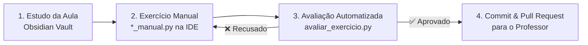

# Fluxo de Automação e Aprendizado

> [!TUTOR] Diagrama de Fluxo em 4 Passos
> Este arquivo é renderizado visualmente pelo plugin Excalidraw no Obsidian.
> Caso prefira a visualização em Markdown, o diagrama Mermaid correspondente é exibido abaixo.



---

# Text Elements
1. Estudo da Aula (Obsidian Vault) ^text1
2. Exercício Manual (*_manual.py) ^text2
3. Avaliador Git (avaliar_exercicio.py) ^text3

%%
## Element Data
```json
{
  "type": "excalidraw",
  "version": 2,
  "source": "https://excalidraw.com",
  "elements": [
    {
      "type": "rectangle",
      "version": 1,
      "versionNonce": 1,
      "isDeleted": false,
      "id": "rect1",
      "fillStyle": "hachure",
      "strokeWidth": 2,
      "strokeStyle": "solid",
      "roughness": 1,
      "opacity": 100,
      "angle": 0,
      "x": 100,
      "y": 100,
      "strokeColor": "#1e1e1e",
      "backgroundColor": "#a5d8ff",
      "width": 220,
      "height": 90,
      "seed": 100,
      "groupIds": [],
      "frameId": null,
      "roundness": null,
      "boundElements": [{"id": "text1", "type": "text"}],
      "updated": 1,
      "link": null,
      "locked": false
    },
    {
      "type": "text",
      "version": 1,
      "versionNonce": 1,
      "isDeleted": false,
      "id": "text1",
      "fillStyle": "hachure",
      "strokeWidth": 2,
      "strokeStyle": "solid",
      "roughness": 1,
      "opacity": 100,
      "angle": 0,
      "x": 110,
      "y": 125,
      "strokeColor": "#1e1e1e",
      "backgroundColor": "transparent",
      "width": 200,
      "height": 40,
      "seed": 101,
      "groupIds": [],
      "frameId": null,
      "roundness": null,
      "boundElements": [],
      "updated": 1,
      "link": null,
      "locked": false,
      "text": "1. Estudo da Aula\n(Obsidian Vault)",
      "rawText": "1. Estudo da Aula\n(Obsidian Vault)",
      "fontSize": 18,
      "fontFamily": 1,
      "textAlign": "center",
      "verticalAlign": "middle",
      "containerId": "rect1",
      "originalText": "1. Estudo da Aula\n(Obsidian Vault)"
    },
    {
      "type": "rectangle",
      "version": 1,
      "versionNonce": 1,
      "isDeleted": false,
      "id": "rect2",
      "fillStyle": "hachure",
      "strokeWidth": 2,
      "strokeStyle": "solid",
      "roughness": 1,
      "opacity": 100,
      "angle": 0,
      "x": 380,
      "y": 100,
      "strokeColor": "#1e1e1e",
      "backgroundColor": "#ffd8a8",
      "width": 220,
      "height": 90,
      "seed": 200,
      "groupIds": [],
      "frameId": null,
      "roundness": null,
      "boundElements": [{"id": "text2", "type": "text"}],
      "updated": 1,
      "link": null,
      "locked": false
    },
    {
      "type": "text",
      "version": 1,
      "versionNonce": 1,
      "isDeleted": false,
      "id": "text2",
      "fillStyle": "hachure",
      "strokeWidth": 2,
      "strokeStyle": "solid",
      "roughness": 1,
      "opacity": 100,
      "angle": 0,
      "x": 390,
      "y": 125,
      "strokeColor": "#1e1e1e",
      "backgroundColor": "transparent",
      "width": 200,
      "height": 40,
      "seed": 201,
      "groupIds": [],
      "frameId": null,
      "roundness": null,
      "boundElements": [],
      "updated": 1,
      "link": null,
      "locked": false,
      "text": "2. Exercício Manual\n(*_manual.py)",
      "rawText": "2. Exercício Manual\n(*_manual.py)",
      "fontSize": 18,
      "fontFamily": 1,
      "textAlign": "center",
      "verticalAlign": "middle",
      "containerId": "rect2",
      "originalText": "2. Exercício Manual\n(*_manual.py)"
    },
    {
      "type": "rectangle",
      "version": 1,
      "versionNonce": 1,
      "isDeleted": false,
      "id": "rect3",
      "fillStyle": "hachure",
      "strokeWidth": 2,
      "strokeStyle": "solid",
      "roughness": 1,
      "opacity": 100,
      "angle": 0,
      "x": 660,
      "y": 100,
      "strokeColor": "#1e1e1e",
      "backgroundColor": "#b2f2bb",
      "width": 220,
      "height": 90,
      "seed": 300,
      "groupIds": [],
      "frameId": null,
      "roundness": null,
      "boundElements": [{"id": "text3", "type": "text"}],
      "updated": 1,
      "link": null,
      "locked": false
    },
    {
      "type": "text",
      "version": 1,
      "versionNonce": 1,
      "isDeleted": false,
      "id": "text3",
      "fillStyle": "hachure",
      "strokeWidth": 2,
      "strokeStyle": "solid",
      "roughness": 1,
      "opacity": 100,
      "angle": 0,
      "x": 670,
      "y": 125,
      "strokeColor": "#1e1e1e",
      "backgroundColor": "transparent",
      "width": 200,
      "height": 40,
      "seed": 301,
      "groupIds": [],
      "frameId": null,
      "roundness": null,
      "boundElements": [],
      "updated": 1,
      "link": null,
      "locked": false,
      "text": "3. Avaliador Git\n(avaliar_exercicio.py)",
      "rawText": "3. Avaliador Git\n(avaliar_exercicio.py)",
      "fontSize": 18,
      "fontFamily": 1,
      "textAlign": "center",
      "verticalAlign": "middle",
      "containerId": "rect3",
      "originalText": "3. Avaliador Git\n(avaliar_exercicio.py)"
    }
  ],
  "appState": {
    "gridSize": null,
    "viewBackgroundColor": "#ffffff"
  },
  "files": {}
}
```
%%


---

## ⚡ Avaliação 1-Clique dos Exercícios da IDE

> [!EXERCICIO] 🧪 Avaliação 1-Clique dos Exercícios da IDE (Issue #all)
> 📌 **Exercício Avaliado:** Issue #all — Suíte Geral de Testes do Vault
> 📁 **Arquivo de Trabalho na IDE:** `avaliar_exercicio.py --all`
> ⚡ Clique no botão **Run** no canto superior direito do bloco abaixo para testar sua solução:

```python run
import sys, os, subprocess

def find_vault_root():
    curr = os.path.abspath(os.getcwd())
    while curr:
        if os.path.exists(os.path.join(curr, "avaliar_exercicio.py")):
            return curr
        parent = os.path.dirname(curr)
        if parent == curr:
            break
        curr = parent
    user_home = os.path.expanduser("~")
    for root, dirs, files in os.walk(user_home):
        if "avaliar_exercicio.py" in files:
            return root
        if root.count(os.sep) - user_home.count(os.sep) >= 4:
            dirs.clear()
    return os.path.abspath(".")

vault_root = find_vault_root()
script_path = os.path.join(vault_root, "avaliar_exercicio.py")
print("📌 [AVALIAÇÃO 1-CLIQUE] Testando Exercício da Issue #all...")
print("📁 Arquivo Alvo na IDE: avaliar_exercicio.py --all")
res = subprocess.run([sys.executable, script_path, "--issue", "all"], cwd=vault_root, capture_output=True, text=True, encoding="utf-8", errors="replace")
print(res.stdout or res.stderr)
```
