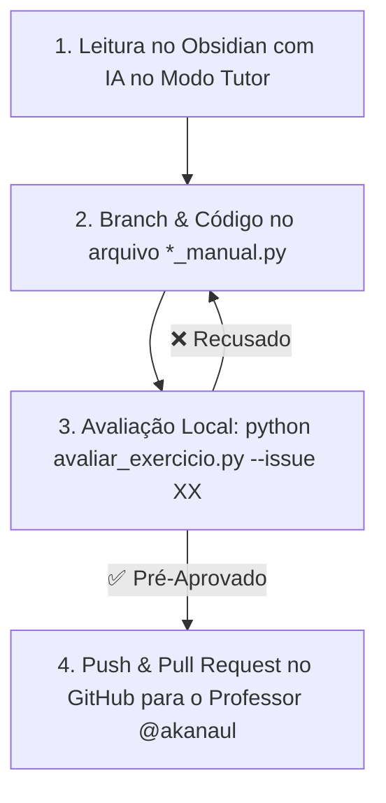

# 📘 Manual Oficial do Aluno — Curso Python + IA para Automação

Bem-vindo(a) ao **Curso Python + IA para Automação**! Este manual é o seu guia de consulta rápida. Todo o onboarding interativo e configuração de ferramentas está detalhado na [[01_fundamentos/Aula 00 - Mindset Vibe Coding Etico/Aula 00 - Mindset Vibe Coding Etico e Copilotos|Aula 00 — Onboarding & Setup]].

> [!CAUTION] 🚨 Botão de Pânico / Auto-Recuperação do Obsidian em 1 Segundo
> Se você abriu o Obsidian e os plugins parecerem desativados ou o Obsidian perguntar sobre **Modo Restrito**, execute o bloco abaixo ou rode `python setup_vault.py` no terminal:
> ```python run
> import subprocess
> res = subprocess.run(["python", "setup_vault.py"], capture_output=True, text=True)
> print(res.stdout)
> ```

---

## ⚡ Execução de Código em 1-Clique no Obsidian (`execute-code`)

Com o plugin **Execute Code**, você pode rodar testes e verificar o progresso do curso sem sair da nota no Obsidian!

Clique no botão **Run** acima do bloco de código abaixo para testar seu ambiente:
```python run
import sys
print(f"✅ Python em Execução: {sys.version.split()[0]}")
print("🚀 Seu ambiente no Obsidian está pronto!")
```

---

## 🎯 1. Visão Geral do Método Vibe Coding Ético

Neste curso, você não estuda sozinho nem perde horas travado em erros de sintaxe:
- **Copiloto de IA (Antigravity / Gemini / Cursor):** Atua como seu mentor 24/7.
- **Vibe Coding Ético:** Você desenvolve o entendimento lógico da solução, enquanto a IA ajuda a escrever, refatorar e explicar cada linha.
- **Supervisão Humana & TDD:** O código só é aceite quando passa nos testes automatizados (`python avaliar_exercicio.py`).

---

## 🔄 2. O Ciclo de Aprendizado em 4 Passos

Para cada aula e exercício do curso, siga o **Ciclo dos 4 Passos**:



### 📍 Passo 1: Estudo da Aula no Obsidian
1. Abra a nota da aula (ex: `01_fundamentos/Aula 00...`).
2. Leia os conceitos e visualize as explicações.
3. Se tiver dúvidas, pergunte à IA usando os prompts indicados.

### 📍 Passo 2: Desenvolvimento na IDE (Cursor / VSCode)
1. Abra seu terminal na pasta do projeto.
2. Crie uma branch isolada para a tarefa:
   ```bash
   git checkout -b feature/issue-07-exercicio
   ```
3. Abra o arquivo `*_manual.py` correspondente ao exercício.
4. **Modo Tutor Ativo:** A IA dará apenas dicas de lógica sem entregar o código pronto. Complete o script com a sua solução!

### 📍 Passo 3: Avaliação Automatizada de Exercícios
Rode o script avaliador no terminal ou clique no widget de execução 1-clique no topo da aula:
```bash
python avaliar_exercicio.py --issue 07
```
- **Se o teste retornar `❌ RECUSADO PELA IA`:** Leia o feedback diagnóstico, corrija a lógica em `*_manual.py` e rode novamente.
- **Se o teste retornar `🎉 ✅ PRÉ-APROVADO PELA IA!`:** Sua implementação passou 100% nos testes locais!

### 📍 Passo 4: Envio do Pull Request (PR) ao Professor
Com a solução pré-aprovada pela IA, envie seu progresso ao professor:
```bash
git add .
git commit -m "fix(issue-07): solucao pre-aprovada pela IA"
git push origin feature/issue-07-exercicio
```
Agora vá ao GitHub no seu browser e abra o **Pull Request (PR)** do seu fork para o repositório principal do professor (@akanaul)!

---

## 📓 3. Seu Caderno de Estudos (`meu_caderno_aluno/`)

Para guardar suas anotações pessoais sem alterar o material oficial:
- Pressione `Alt + N` no teclado para abrir o Templater e escolha o modelo desejado.
- Suas notas serão salvas automaticamente em [[meu_caderno_aluno/meu_caderno_aluno|meu_caderno_aluno/]].

---

## 🔰 4. Guia Rápido dos 21 Plugins do Vault

| Plugin | O que faz? | Como aproveitar? |
| :--- | :--- | :--- |
| 🪟 **Hover Editor** | Janela flutuante editável ao passar o mouse. | Passe o mouse sobre qualquer link `[[aula]]`. |
| 📊 **Data Files Editor** | Editor visual de planilhas CSV e JSON. | Clique em arquivos `.csv` em `_dados_exemplo/`. |
| ⚡ **Execute Code** | Executa blocos de código Python diretamente no Obsidian. | Clique no botão **Run** acima de qualquer bloco ` ```python run `. |
| 📁 **Make.md** | Notas de capa de pastas e navegação fluida. | Clique no nome da pasta na barra lateral para abrir a capa. |
| 📊 **Dataview** | Tabelas e barras de progresso automáticas. | Veja seus resultados em [[00 - Dashboard\|00 - Dashboard.md]]. |
| 📋 **Kanban** | Gestão visual de tarefas de estudo. | Acesse [[00_central/plano_de_estudos\|Plano de Estudos]]. |
| 📇 **SRS Flashcards** | Repetição espaçada para memorização. | Pressione `Ctrl+P` e busque *Spaced Repetition*. |
