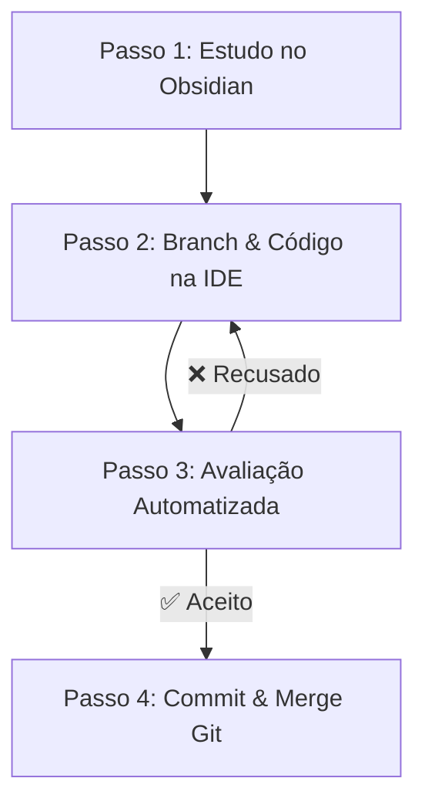

# 📘 Manual Oficial do Aluno — Curso Python + IA para Automação

Bem-vindo(a) ao **Curso Python + IA para Automação**! Este manual foi criado para ser o seu guia definitivo de aprendizado, mostrando exatamente como estudar, praticar código, usar o copiloto de IA com segurança e validar seus exercícios através do Git e de testes automatizados.

---

## 🎯 1. Visão Geral do Método Vibe Coding Ético

Neste curso, você não estuda sozinho nem perde horas travado em erros de sintaxe:
- **Copiloto de IA (Antigravity / Gemini / Cursor):** Atua como seu mentor 24/7.
- **Vibe Coding Ético:** Você desenvolve o entendimento lógico da solução, enquanto a IA ajuda a escrever, refatorar e explicar cada linha.
- **Supervisão Humana & TDD:** O código só é aceito quando passa nos testes automatizados (`python avaliar_exercicio.py`).

---

## 🔄 2. O Ciclo de Aprendizado em 4 Passos

Para cada aula e exercício do curso, siga o **Ciclo dos 4 Passos**:



### 📍 Passo 1: Estudo da Aula no Obsidian
1. Abra a nota da aula (ex: `01_fundamentos/Aula 01...`).
2. Leia os conceitos e visualize as explicações.
3. Se tiver dúvidas, pergunte à IA usando os prompts indicados.

### 📍 Passo 2: Desenvolvimento na IDE (Cursor / VSCode)
1. Abra seu terminal na pasta do projeto.
2. Crie uma branch isolada para a tarefa:
   ```bash
   git checkout -b feature/issue-07-exercicio
   ```
3. Abra o arquivo `*_manual.py` correspondente ao exercício.
4. **Modo Tutor Ativo:** A IA dará apenas dicas de lógica sem entregar o código pronto. Complete o script com a sua solução!

### 📍 Passo 3: Avaliação Automatizada de Exercícios
Rode o script avaliador no terminal:
```bash
python avaliar_exercicio.py --issue 07
```
- **Se o teste retornar `❌ SOLUÇÃO RECUSADA`:** Leia o feedback diagnósticos, corrija a lógica e rode novamente.
- **Se o teste retornar `✅ SOLUÇÃO ACEITA`:** Seu código atendeu 100% dos requisitos!

### 📍 Passo 4: Commit & Merge no Git
Com a solução aprovada, salve seu progresso no Git:
```bash
git add .
git commit -m "fix(issue-07): solucao aceita em automacao web"
git checkout main
git merge feature/issue-07-exercicio
```

---

## 🛡️ 3. Proteção e Recuperação do Obsidian em 1 Segundo

Se por qualquer motivo o Obsidian for aberto pela primeira vez e perguntar sobre **Modo Restrito** ou se os plugins parecerem desativados, **NÃO SE PREOCUPE**!

O repositório conta com um mecanismo de auto-recuperação:
```bash
python setup_vault.py
```
Esse comando força o Modo Restrito para **DESATIVADO** e restaura instantaneamente as configurações de todos os 19 plugins a partir do backup seguro `_obsidian_backup/`.

---

## 🤖 4. Regras de Ouro de Interação com a IA

| Arquivo em Edição | Comportamento da IA | O que esperar? |
| :--- | :--- | :--- |
| `*_manual.py` | 👨‍🏫 **Modo Tutor** | Dicas de lógica, scaffolding e explicações. NUNCA entrega a resposta pronta. |
| `*_ia.py` | ⚡ **Modo One-Shot** | Solução 100% otimizada para comparação didática. |
| Notas `.md` | 🛡️ **Proteção de Vault** | A IA não altera o conteúdo das aulas sem solicitação explícita. |

---

## ❓ Perguntas Frequentes (FAQ)

### O que fazer se um comando do terminal der erro de permissão?
Rode o terminal como Administrador ou verifique se o caminho da pasta não está bloqueado por outro processo.

### Posso usar o curso sem o Streamlit?
Sim! Todo o framework de aprendizado, testes e relatórios funciona **100% nativamente** pelo terminal e dentro do Obsidian (`00 - Dashboard.md`).

---

> [!PRATICA] Bons Estudos!
> Agora você possui toda a estrutura pronta para automatizar rotinas do dia a dia com autonomia e segurança!
