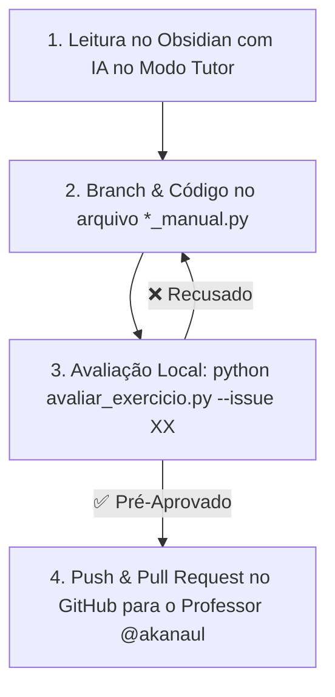

# 📘 Manual Oficial do Aluno — Curso Python + IA para Automação

Bem-vindo(a) ao **Curso Python + IA para Automação**! Este manual foi criado para ser o seu guia definitivo de aprendizado, mostrando exatamente como estudar, praticar código, usar o copiloto de IA com segurança e validar seus exercícios através do Git e de testes automatizados.

> [!CAUTION] 🚨 Botão de Pânico / Auto-Recuperação do Obsidian em 1 Segundo
> Se você abriu o Obsidian e os plugins parecerem desativados ou o Obsidian perguntar sobre **Modo Restrito**, rode no terminal:
> ```bash
> python setup_vault.py
> ```
> Esse comando reativa instantaneamente todos os **18 plugins pré-configurados**!

---

## 🎯 1. Visão Geral do Método Vibe Coding Ético

Neste curso, você não estuda sozinho nem perde horas travado em erros de sintaxe:
- **Copiloto de IA (Antigravity / Gemini / Cursor):** Atua como seu mentor 24/7.
- **Vibe Coding Ético:** Você desenvolve o entendimento lógico da solução, enquanto a IA ajuda a escrever, refatorar e explicar cada linha.
- **Supervisão Humana & TDD:** O código só é aceite quando passa nos testes automatizados (`python avaliar_exercicio.py`).

---

## 🔄 2. O Ciclo de Aprendizado em 4 Passos

Para cada aula e exercício do curso, siga o **Ciclo dos 4 Passos**:



### 📍 Passo 1: Estudo da Aula no Obsidian
1. Abra a nota da aula (ex: `01_fundamentos/Aula 01...`).
2. Leia os conceitos e visualize as explicações.
3. Se tiver dúvidas, pergunte à IA usando os prompts indicados.

### 📍 Passo 2: Desenvolvimento na IDE (Cursor / VSCode)
1. Abra seu terminal na pasta do projeto.
2. Crie uma branch isolada para a tarefa:
   ```bash
   git checkout -b feature/issue-07-exercicio
   ```
3. Abra o arquivo `*_manual.py` correspondente ao exercício.
4. **Modo Tutor Ativo:** A IA dará apenas dicas de lógica sem entregar o código pronto. Complete o script com a sua solução!

### 📍 Passo 3: Avaliação Automatizada de Exercícios
Rode o script avaliador no terminal:
```bash
python avaliar_exercicio.py --issue 07
```
- **Se o teste retornar `❌ RECUSADO PELA IA`:** Leia o feedback diagnóstico, corrija a lógica em `*_manual.py` e rode novamente.
- **Se o teste retornar `🎉 ✅ PRÉ-APROVADO PELA IA!`:** Sua implementação passou 100% nos testes locais!

### 📍 Passo 4: Envio do Pull Request (PR) ao Professor
Com a solução pré-aprovada pela IA, envie seu progresso ao professor:
```bash
git add .
git commit -m "fix(issue-07): solucao pre-aprovada pela IA"
git push origin feature/issue-07-exercicio
```
Agora vá ao GitHub no seu browser e abra o **Pull Request (PR)** do seu fork para o repositório principal do professor (@akanaul)!

---

## 🔰 3. Guia Rápido dos 18 Plugins do Vault

| Plugin | O que faz? | Como aproveitar? |
| :--- | :--- | :--- |
| 📁 **Make.md** | Notas de capa de pastas e navegação fluida. | Clique no nome da pasta na barra lateral para abrir a capa. |
| 📊 **Dataview** | Tabelas e barras de progresso automáticas. | Veja seus resultados em [[00_dashboard\|00_dashboard.md]]. |
| 📋 **Kanban** | Gestão visual de tarefas de estudo. | Acesse [[00_central/plano_de_estudos\|Plano de Estudos]]. |
| 📇 **SRS Flashcards** | Repetição espaçada para memorização. | Pressione `Ctrl+P` e busque *Spaced Repetition*. |
| ⚡ **Various Complements** | Autocompletar palavras e trechos de código. | Comece a digitar `python` e aperte `Tab`. |

---

## 🤖 4. Regras de Ouro de Interação com a IA

| Arquivo em Edição | Comportamento da IA | O que esperar? |
| :--- | :--- | :--- |
| `*_manual.py` | 👨‍🏫 **Modo Tutor** | Dicas de lógica, scaffolding e explicações. NUNCA entrega a resposta pronta. |
| `*_ia.py` | ⚡ **Modo One-Shot** | Solução 100% otimizada para comparação didática. |
| Notas `.md` | 🛡️ **Proteção de Vault** | A IA não altera o conteúdo das aulas sem solicitação explícita. |

---

> [!PRATICA] Bons Estudos!
> Agora você possui toda a estrutura pronta para automatizar rotinas do dia a dia com autonomia e segurança!
