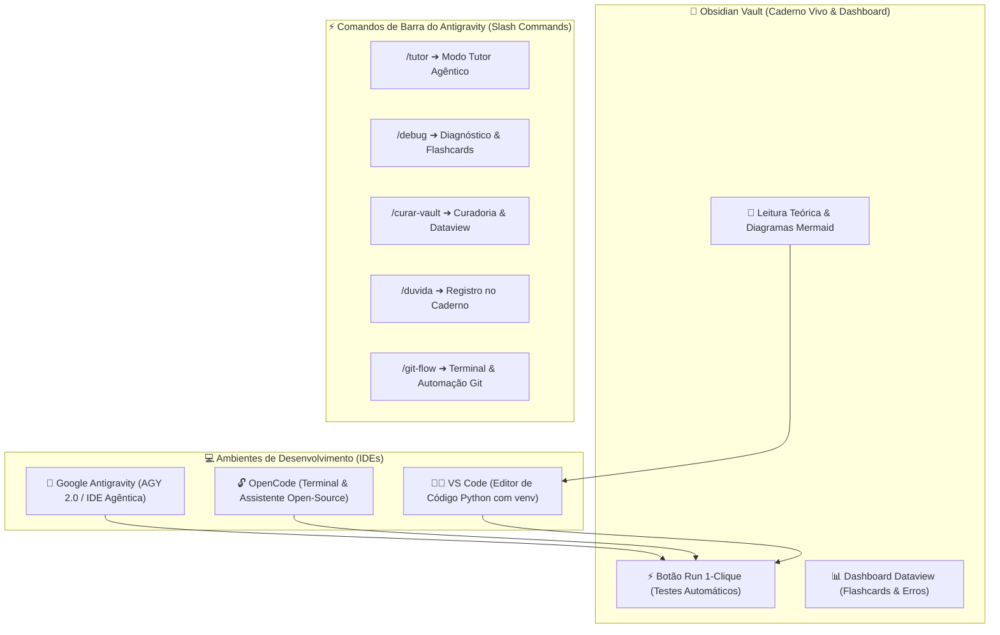

# 📘 Manual Oficial do Aluno — Curso Python + IA para Automação

Bem-vindo(a) ao **Curso Python + IA para Automação**! Este manual é o seu guia de consulta rápida sobre a arquitetura pedagógica, ferramentas do ecossistema agêntico e os atalhos de prompt no Antigravity e OpenCode.

---

## 🧩 O Ecossistema Agêntico: Antigravity, OpenCode, VS Code & Obsidian Vault

O curso utiliza um ecossistema integrado que combina ferramentas de desenvolvimento e inteligência artificial para maximizar seu aprendizado prático:



### 1. 🤖 Google Antigravity (AGY 2.0) & OpenCode
- **Antigravity:** É a IDE Agêntica primária desenvolvida pelo Google DeepMind team. Permite interagir com copilotos inteligentes, executar slash commands (`/`), depurar erros e gerenciar o ciclo de vida do código em linguagem natural.
- **OpenCode:** Ferramenta open-source alternativa para interação com modelos e desenvolvimento assistido no terminal.

### 2. 👨‍💻 VS Code (Visual Studio Code)
- Editor de código tradicional onde você configura seu ambiente virtual (`venv`), gerencia extensões Python e edita os arquivos manuais da pasta `pratica/` (ex: `aula_00_exercicios_manual.py`).

### 3. 📓 Obsidian Vault (Seu Caderno Vivo & Dashboard)
- Central de estudos e dashboard visual. Executa a avaliação automatizada `avaliar_exercicio.py` através dos botões **Run 1-Clique** diretamente nas notas do curso.

---

## ⚡ Comandos Rápidos com Barra (`/`) no Antigravity

Você pode acionar estes comandos diretamente no chat do Antigravity para apoiar seus estudos desde a Aula 00:

| Comando | Função no Antigravity | O que faz no Vault? |
| :--- | :--- | :--- |
| `/tutor` | **Modo Tutor Agêntico** | Guia seu raciocínio sem spoilers de código e sugere anotações de estudo em `meu_caderno_aluno/anotacoes_aulas/`. |
| `/debug` | **Diagnóstico de Erros** | Analisa tracebacks do terminal, indica a causa do erro e cria notas em `meu_caderno_aluno/diagnostico_erros/` com flashcards. |
| `/curar-vault` | **Curadoria & Progresso** | Roda os testes unitários, registra o progresso em `meu_caderno_aluno/progresso/` e atualiza o Dataview do Dashboard. |
| `/duvida` | **Registro de Dúvidas** | Responde suas perguntas e salva uma nota explicativa em `meu_caderno_aluno/duvidas/` com o template oficial. |
| `/git-flow` | **Terminal & Git Flow** | Exibe o tutorial de comandos do terminal (`git checkout`, `git commit`, `git push`) e oferece automação de commit/PR. |

---

## 🔄 O Ciclo de Aprendizado em 4 Passos

1. 📖 **Passo 1 (Leitura no Obsidian):** Leia a aula teórica no Obsidian (`Aula X.md`).
2. 👨‍💻 **Passo 2 (Desenvolvimento no VS Code / Antigravity):** Abra o arquivo da aula na IDE (`aula_X_exercicios_manual.py`) e programe sua solução.
3. ⚡ **Passo 3 (Validação 1-Clique no Obsidian):** Clique no botão **Run** no bloco 1-Clique do Obsidian para testar o código.
4. 🔀 **Passo 4 (Git & PR):** Siga as instruções do `/git-flow` no terminal e abra o Pull Request no GitHub para o Tutor!

---

## 🚨 Botão de Pânico / Auto-Recuperação do Obsidian

Se você abrir o Obsidian e os plugins parecerem desativados ou o Obsidian perguntar sobre **Modo Restrito**, execute o bloco abaixo ou rode `python setup_vault.py` no terminal:

> [!EXERCICIO] 🧪 Avaliação 1-Clique dos Exercícios da IDE (Issue #all)
> 📌 **Exercício Avaliado:** Issue #all — Suíte Geral de Testes do Vault
> 📁 **Arquivo de Trabalho na IDE:** `avaliar_exercicio.py --all`
> ⚡ Clique no botão **Run** no canto superior direito do bloco abaixo para testar sua solução:

```python run
import sys, os, subprocess

def find_vault_root():
    curr = os.path.abspath(os.getcwd())
    while curr:
        if os.path.exists(os.path.join(curr, "avaliar_exercicio.py")):
            return curr
        parent = os.path.dirname(curr)
        if parent == curr:
            break
        curr = parent
    user_home = os.path.expanduser("~")
    for root, dirs, files in os.walk(user_home):
        if "avaliar_exercicio.py" in files:
            return root
        if root.count(os.sep) - user_home.count(os.sep) >= 4:
            dirs.clear()
    return os.path.abspath(".")

vault_root = find_vault_root()
script_path = os.path.join(vault_root, "avaliar_exercicio.py")
print("📌 [AVALIAÇÃO 1-CLIQUE] Testando Exercício da Issue #all...")
print("📁 Arquivo Alvo na IDE: avaliar_exercicio.py --all")
res = subprocess.run([sys.executable, script_path, "--issue", "all"], cwd=vault_root, capture_output=True, text=True, encoding="utf-8", errors="replace")
print(res.stdout or res.stderr)
```
